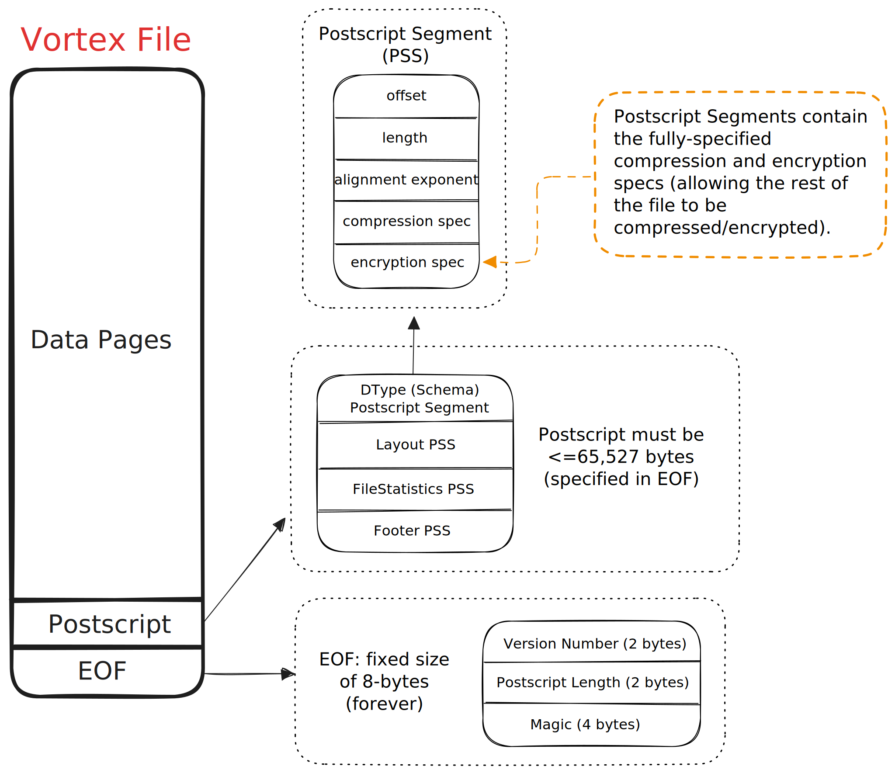
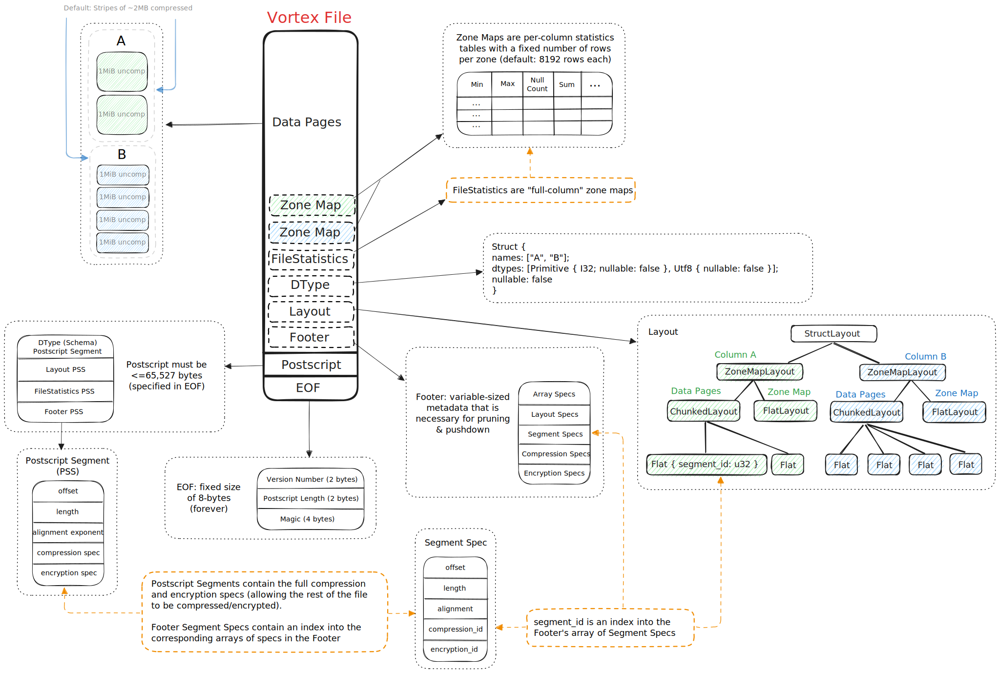

# File Format

:::{important}
The Vortex File Format has been considered stable since the release of version 0.36.0. That means that you can expect all
future versions of the Vortex library to be able to read files written by version 0.36.0 or later (up to and including
the version doing the reading).
:::

:::{seealso}
The majority of the complexity of the Vortex file format is encapsulated in [Vortex Layouts](/concepts/layouts).
Unless you are interested in the specific byte layout of the file, you are probably looking for that documentation!
:::

Recall that [Vortex Layouts](/concepts/layouts) provide a mechanism to efficiently query large serialized Vortex
arrays. The _Vortex File Format_ is designed to provide a container for these serialized arrays, as well as footer
definition that allows efficiently querying the layout.

Other considerations for the Vortex file format include:

* Backwards compatibility, and (coming soon) forwards compatibility.
* Fine-grained encryption.
* Efficient access for both local disk and cloud storage.
* Minimal overhead reading few columns or rows from wide or long arrays.

## File Specification

The Vortex file format has a very small definition, with much of the complexity encapsulated
in [Vortex Layouts](/concepts/layouts).

```
<4 bytes>  magic number 'VTXF'
...        segments of binary data, optionally with inter-segment padding
...        postscript data
<2 bytes>  u16 version tag
<2 bytes>  u16 postscript length
<4 bytes>  magic number 'VTXF'
```

The file format begins and ends with the 4-byte magic number `VTXF`.
Immediately prior to the trailing magic number are two 16-bit integers: the version tag and the length of the postscript.

Notably, this minimal notion of a Vortex file effectively includes only the byte ranges, alignment, encryption, and compression
configurations for other pieces of metadata.



## Postscript

The postscript contains the locations of:

1. a `dtype` segment representing the top-level logical data type (i.e., schema)
2. a `layout` segment containing the root `Layout`
3. a `statistics` segment containing file-level per-field statistics (e.g., minima and maxima of each field/column, for whole-file pruning)
4. a `footer` segment containing a dictionary-encoded _segment map_, and other shared configuration such as compression and encryption schemes

:::{literalinclude} ../../vortex-flatbuffers/flatbuffers/vortex-file/footer.fbs
:start-after: [postscript]
:end-before: [postscript]
:::

## Data Type

Both viewed arrays and viewed layouts require an external `DType` to instantiate them. This helps us to avoid
redundancy in the serialized format since it is very common for a child array or layout to inherit or infer its data
type from the parent type.

The root `DType` segment is a flat buffer serialized `DType` object. See [DType Format](/specs/dtype-format) for more
information.

:::{note}
Unlike many columnar formats, the `DType` of a Vortex file is not required to be a `StructDType`. It is perfectly
valid to store a `Float64` array, a `Boolean` array, or any other root data type.
:::

## Footer

The footer is a flat buffer serialized `Footer` object. This object contains all the information required to
load the root `Layout` object into a usable `LayoutReader`).
For example, it contains the locations, compression schemes, encryption schemes, and required alignment of all segments in the file.

:::{literalinclude} ../../vortex-flatbuffers/flatbuffers/vortex-file/footer.fbs
:start-after: [footer]
:end-before: [footer]
:::

The footer is separated from the Data Type such that large schemas can be omitted from the file if they can be
shared or fetched from an external source.

## Reified File Example

Since Vortex files are largely self-describing, many mainstays of other columnar file formats (e.g., whether or not to
have row groups) are decided by the **writer**, rather than being a rigid part of the specification. To build intuition,
consider an example Vortex file with two non-nullable columns, "A" of type i32, and "B" of type UTF-8. Using the defaults
as of June 2025, it might look as follows.



## Backward Compatibility

Backward compatibility guarantees that any **older** Vortex file can be read by **newer** versions of the Vortex library,
and is expected from all releases of Vortex from version 0.36.0 onwards.

## Forward Compatibility

:::{warning}
Forward compatibility is not yet implemented, but is planned to ship prior to the 1.0 release.
:::

Forward compatibility extends the preceding stability guarantee such that **newer** Vortex files can be read by
**older** versions of the Vortex library.

The intent of this work is to allow us to continue to evolve the Vortex File Format, avoiding calcification
and remaining up-to-date with new compression codecs and layout optimizations -- without breaking existing
readers or requiring lockstep upgrades.

The plan is that at write-time, a minimum supported reader version is declared. Any encodings or layouts added after that minimum
reader version can then be embedded into the file with WebAssembly decompression logic. Old readers are able to decompress new
data (slower than native code, but still with SIMD acceleration) and read the file. New readers are able to make the best use of
these encodings with native decompression logic and additional push-down compute functions (which also provides an incentive to upgrade).
