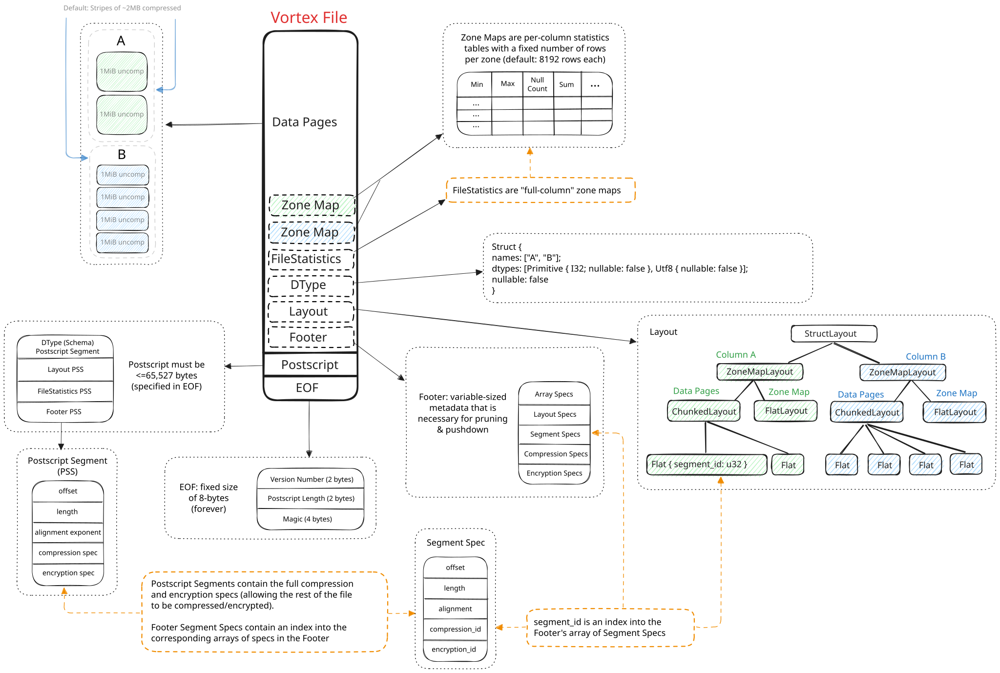

# File Format

:::{important}
The Vortex file format's stability guarantee starts with version `0.36.0` of the Vortex Rust crates
and edition `core2025.05.0`. Later versions of those crates retain read support for the components
in frozen editions.
[Versioning](/specs/versioning) explains the guarantee and the requirements for draft and custom
components.
:::

:::{seealso}
The majority of the complexity of the Vortex file format is encapsulated in [Vortex Layouts](/concepts/layouts).
Unless you are interested in the specific byte layout of the file, you are probably looking for that documentation!
:::

Recall that [Vortex Layouts](/concepts/layouts) provide a mechanism to efficiently query large serialized Vortex
arrays. The _Vortex File Format_ is designed to provide a container for these serialized arrays, as well as footer
definition that allows efficiently querying the layout.

Other considerations for the Vortex file format include:

* File compatibility. Editions constrain which serialized components a writer can use. A writer
  built with newer Vortex crates can target an older edition that its intended readers support.
* Fine-grained encryption.
* Efficient access for both local disk and cloud storage.
* Minimal overhead reading few columns or rows from wide or long arrays.

## File Specification

The Vortex file format has a very small definition, with much of the complexity encapsulated
in [Vortex Layouts](/concepts/layouts).

```
<4 bytes>  magic number 'VTXF'
...        segments of binary data, optionally with inter-segment padding
...        postscript data
<2 bytes>  u16 version tag
<2 bytes>  u16 postscript length
<4 bytes>  magic number 'VTXF'
```

The file format begins and ends with the 4-byte magic number `VTXF`.
Immediately prior to the trailing magic number are two 16-bit integers: the version tag and the length of the postscript.

Notably, this minimal notion of a Vortex file effectively includes only the byte ranges, alignment, encryption, and compression
configurations for other pieces of metadata.


## Postscript

The postscript contains the locations of:

1. a `dtype` segment representing the top-level logical data type (i.e., schema)
2. a `layout` segment containing the root `Layout`
3. a `statistics` segment containing file-level per-field statistics (e.g., minima and maxima of each field/column, for whole-file pruning)
4. a `footer` segment containing a dictionary-encoded _segment map_, and other shared configuration such as compression and encryption schemes
5. up to 16 user-defined `metadata` segments, each identified by a unique, non-empty UTF-8 key of at most 64 bytes

The postscript carries a locator (offset, length, and alignment) for each metadata segment that is
present; a file written without user metadata (and any file predating this feature) carries none.
Readers do not load the opaque metadata values by default. Opt-in metadata reads resolve each
locator separately, allowing values outside the initial file-tail read to be fetched without reading
the intervening file contents.

:::{literalinclude} ../../vortex-file/flatbuffers/vortex-file/footer.fbs
:start-after: [postscript]
:end-before: [postscript]
:::

## Data Type

Both viewed arrays and viewed layouts require an external `DType` to instantiate them. This helps us to avoid
redundancy in the serialized format since it is very common for a child array or layout to inherit or infer its data
type from the parent type.

The root `DType` segment is a flat buffer serialized `DType` object. See [DType Format](/specs/dtype-format) for more
information.

:::{note}
Unlike many columnar formats, the `DType` of a Vortex file is not required to be a `StructDType`. It is perfectly
valid to store a `Float64` array, a `Boolean` array, or any other root data type.
:::

## Footer

The footer is a flat buffer serialized `Footer` object. This object contains all the information required to
load the root `Layout` object into a usable `LayoutReader`).
For example, it contains the locations, compression schemes, encryption schemes, and required alignment of all segments in the file.

:::{literalinclude} ../../vortex-file/flatbuffers/vortex-file/footer.fbs
:start-after: [footer]
:end-before: [footer]
:::

The footer is separated from the Data Type such that large schemas can be omitted from the file if they can be
shared or fetched from an external source.

## Reified File Example

Since Vortex files are largely self-describing, many mainstays of other columnar file formats (e.g., whether or not to
have row groups) are decided by the **writer**, rather than being a rigid part of the specification. To build intuition,
consider an example Vortex file with two non-nullable columns, "A" of type i32, and "B" of type UTF-8. Using the defaults
as of June 2025, it might look as follows.



## Backward Compatibility

Later Vortex library versions retain read support for frozen formats, beginning with the formats in
`core2025.05.0`, supported from version `0.36.0`. The reader must retain the required component
implementations, including optional plugins. See [Versioning](versioning.md) for the guarantee and
its boundaries.

## Forward Compatibility

Newer writers can already produce files for older readers by
[selecting editions](versioning/using-editions.md) whose formats those readers support. That allows
applications to upgrade independently while continuing to exchange files in supported formats.

Reading a newly introduced format with an older reader is a separate capability. A proposed approach
embeds WebAssembly decoding logic for new encodings and layouts in the file. An older reader with
the required execution support could then interpret them without a native implementation. This
approach is not implemented and is not part of the edition compatibility guarantee.
