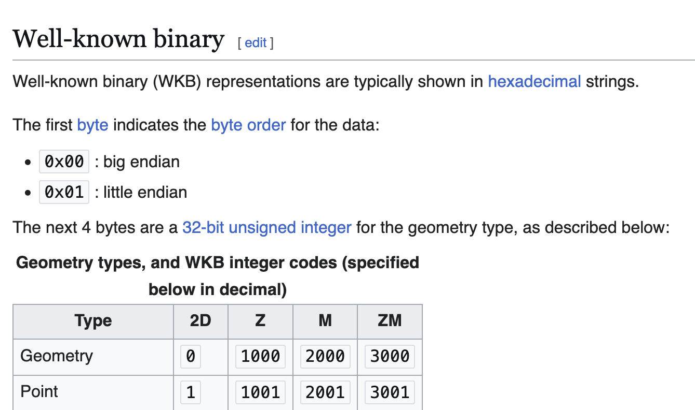
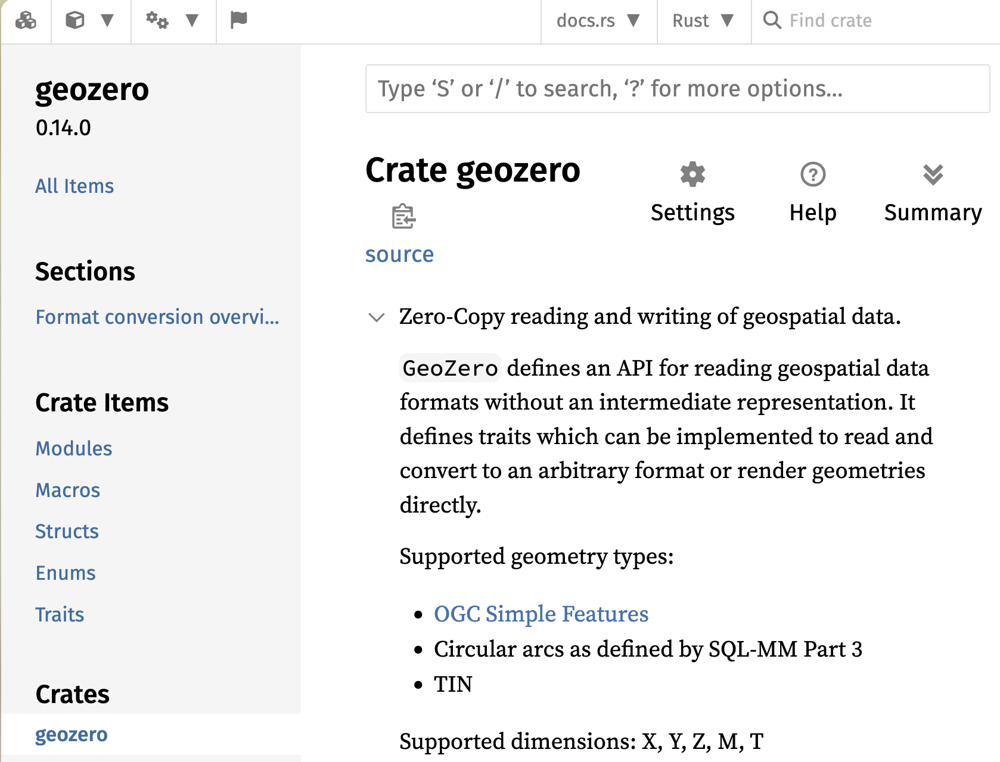
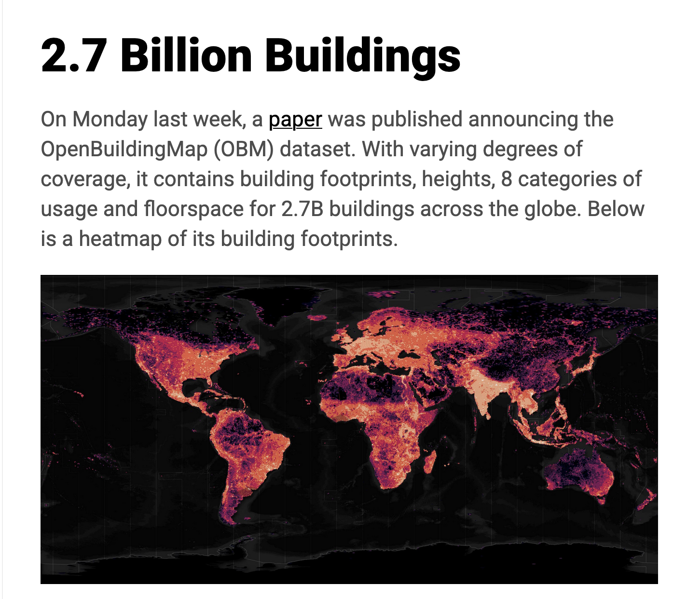
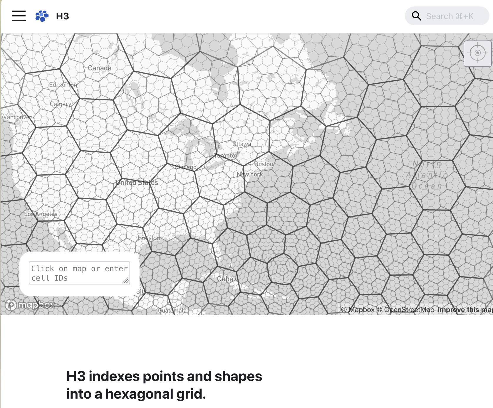
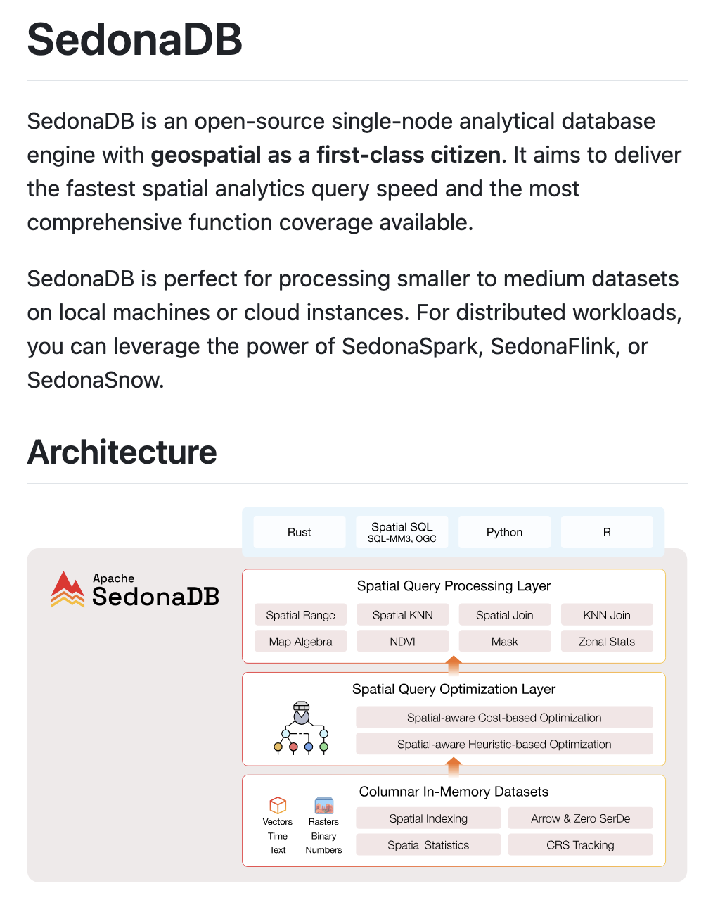
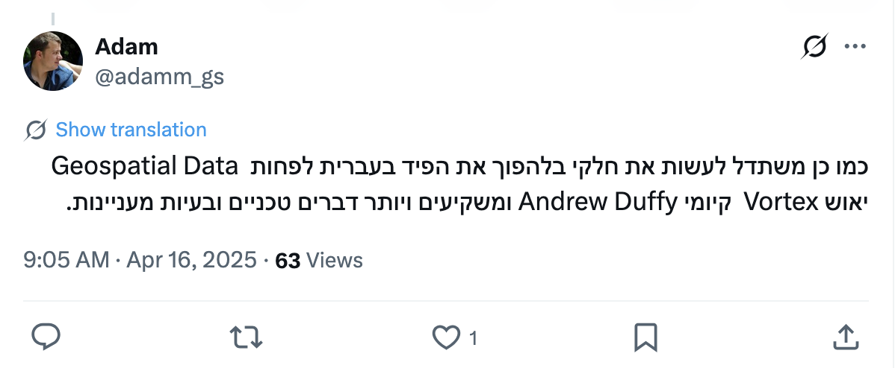

# Background

* Vortex puts pluggability front and center
    * Layouts
    * Encodings
    * Expressions
* It would be fun to apply Vortex to new domains that we
  don't have a lot of prebuilt demos for
* I like mapping data


<!-- end_slide -->

# Background: Spatial data

*all of this is about vector data, not raster

* Encode _geometry_ alongside some set of _properties_
* Query patterns: filtered scans (`ST_Contains`, `ST_Intersects`), aggregates
* Different encoding schems, GeoParquet uses WKB to be compact



* Lean on Rust geo ecosystem



<!-- end_slide -->


# Background: The Dataset

* Microsoft OpenBuildings



* Global coverage of the world


<!-- end_slide -->

# Plan: Indexing

* Implement a new `GeoLayout`, like ZonedLayout but for spatial indexing

* For each 8K row chunk, build a bloom filter of *H3 Cell IDs*



* Can treat cell IDs like `u64` and insert into bloom filter

<!-- end_slide -->

# Plan: Layouts


* Implement an `ST_Contains` expression, implement pruning for it in our new layout
* Implement new strategy to write compact files with the custom index structure

```rust
/// Make a strategy which has special handling for DType::Binary chunks named "geometry".
fn make_rtree_strategy() -> Arc<dyn LayoutStrategy> {
    let validity = Arc::new(FlatLayoutStrategy::default());
    let fallback = WriteStrategyBuilder::new()
        .with_compressor(CompactCompressor::default())
        .build();

    // override the handling of the "geometry" column
    let leaf_writers = HashMap::from_iter([(
        FieldPath::from_name(FieldName::from("geometry")),
        geometry_writer(),
    )]);

    Arc::new(PathStrategy::new(leaf_writers, validity, fallback))
}
```

* (Bonus: built new strategy that allows you to override the writer for leaf columns by fieldpath)

<!-- end_slide -->

# How'd we do

Source GeoParquet file:

> 1.2 GB

Vortex File with H3 Bloom Filter Index:

> 0.9 GB!

**~22% smaller!**

<!-- end_slide -->

## Follow up work:

* Improve write performance
* Add BBOX for coarse filtering
* Implement more geospatial functions with pushdown
    * `to_geojson(col("geom"))`
    * `ST_Area`, `ST_Intersect`, see [geodatafusion](https://github.com/datafusion-contrib/geodatafusion)
* Integrate into SedonaDB



<!-- end_slide -->

# What People are Saying


<!-- pause -->


<!-- pause -->




<!-- end_slide -->

# Demo
