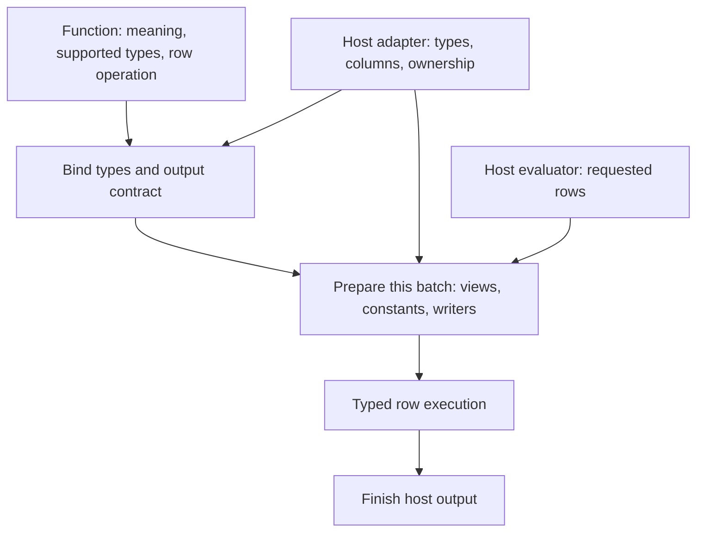

<!-- SPDX-License-Identifier: Apache-2.0 -->
<!-- SPDX-FileCopyrightText: Copyright the Vortex contributors -->

# Proposed library design

[Overview](README.md)

Share function semantics and typed execution. Let each host bind its types, provide input views,
and construct its output. This targets one function definition with separately compiled adapters.
A binary that loads into every engine needs a separate ABI and distribution contract.

The design below is a recommendation. The [small Rust proof](type-system/compiled-proof.md)
establishes generic dispatch and borrowing, but does not implement this library.

## Execution boundary

| Responsibility | Owns |
| --- | --- |
| Function | Accepted semantics, options, output inference, preparation, and the typed operation. |
| Shared executor | Constant addressing, traversal, selected rows, deferred evidence, and output completion. |
| Host adapter | Types, decoding, validity access, allocation, output metadata, error conversion, and registration. |
| Host evaluator | Child evaluation, demand propagation, expression caching, cancellation, and optimizer rules. |

These boundaries do not require one public trait or crate for every row in the table. The first
prototype needs a small core, a Vortex adapter, and an adapter with no Vortex array dependency.
The [extraction notes](current-system/engine-boundary.md) cover concrete trait and dependency choices.

## Bind types once, prepare each batch

Function binding selects a signature and output contract from types, options, and relevant host
configuration. It can retain timezone rules, decimal parameters, or tensor shape across compatible
batches. A literal that determines output type needs an explicit place in this binding.

Batch preparation handles encodings, row counts, constants, ownership, validity, and demand.
Prepared state that borrows a batch must stay within that batch. A constant argument can change
between calls, so constant-derived preparation cannot silently become permanent binding state.

Current RowFn dispatch runs during both planning and execution. Execution must reproduce the plan.
A retained bound call can avoid repeated dispatch only if it preserves that contract and validates
changing batch facts. A cache key needs every semantic option and relevant host setting.

The runtime registry can erase a function behind a batch entry point. Inside that entry point,
typed views and writers keep the row loop statically dispatched. Generated code and measurements
must establish the resulting cost. Generic traits alone do not establish it.

## Use a small semantic vocabulary with explicit capabilities

Two API shapes are useful. A host trait with associated types makes extraction concrete. Semantic
capabilities let functions state the domains that they understand without requiring every host type.

| Choice | Benefit | Constraint |
| --- | --- | --- |
| `Engine` plus `TypeSystem`, with a closed built-in vocabulary. | A direct migration from current traits and common primitive implementations. | An opaque host type alone cannot support shared overload selection. A closed vocabulary needs an extension path. |
| Typed semantic capabilities with host bindings. | Functions require only supported domains. New domains can live outside the core. | Capability laws, registration, and lifetime proofs need precise definitions. |

The recommendation combines these ideas: associated host types, a small common vocabulary, and
typed bindings for the selected signature. Host-specific functions can still inspect native types.
The exact trait layout remains open until the prototype demonstrates both paths.

A host must not promise every built-in type to execute one supported function. Missing types return
a binding error. This matters for unsigned integers, half precision, and fixed-size lists.

Semantic support also exceeds storage compatibility. Timestamp units and timezone rules affect
behavior. Decimal precision, scale, and overflow rules affect results. Geometry extensions need
their own identity and metadata contract. Matching physical widths cannot authorize these mappings.
The [type alternatives](type-system/alternatives.md) retain the detailed tradeoffs.

## Separate outer nullability without losing nested constraints

The core can represent a type use as a semantic type plus outer nullability. The Vortex adapter
splits and restores `DType`. Arrow needs the complete `Field` to preserve nullability and extensions.

Child nullability remains part of a nested type's contract. Current `eq_ignore_nullability` ignores
nullability recursively. It cannot replace a comparison that relaxes only the outer level.
`DType::Null` also needs an explicit binding rule because it has no non-nullable form.

An output label can preserve a semantic interpretation over compatible storage. It cannot stand
in for a conversion. Timestamp rescaling, decimal rescaling, and offset-width changes need explicit
operations, with their own possible errors. Empty and all-null outputs still need the planned type.
The [mapping examples](type-system/mappings.md) show these boundaries.

## Keep errors and safety as separate contracts

Current `RowFn::INFALLIBLE` describes semantic row errors. `InputElement::DECODE_INFALLIBLE`
describes decoder errors. `DENSE_SAFE` describes access to null payloads. None of these flags alone
authorizes execution outside caller demand.

The portable boundary needs binding errors, row-local errors, and infrastructure errors. Compact
failure evidence can stay in the row loop. Rich host errors belong at the point that a failure
becomes observable. Selected replay must preserve the host's error policy.

Input owners must outlive their views. Output writers must preserve row identity and initialization
proofs. Skipped rows need safe storage before export. These obligations survive every trait and
crate boundary. The [safety inventory](current-system/contracts.md) records the current contracts.

## Pass demand explicitly and retain completion when needed

For a strict function, the active rows are caller demand intersected with input validity.
Requested null rows are complete without a row callback. On success, every requested row has a
value or a null result.

An ordinary call can carry completion implicitly through its known demand. A cached partial result
needs coverage metadata. Null placeholders can make storage safe, but cannot replace that metadata
or silently widen a non-nullable function result.

Start with exact selected execution or compact batches. Dense speculation needs additional proofs
about safe access, effects, and suppressed errors. Demand must reach decoding and child evaluation.
The [demand contract](definedness/contract.md) and [API choices](definedness/design-options.md)
explain the implications for Vortex conditionals.

## Preserve host registration and batch implementations

Explicit wrappers such as `VortexRowFn<F>` keep registration, persistence, and optimizer hooks in
the adapter. A separate adapter crate cannot blanket-implement a foreign host trait for a bare
generic function type. The wrapper also permits custom host hooks alongside a shared row kernel.

A batch implementation can reuse buffers or operate on dictionary values under the same function
semantics. The row implementation remains a general fallback. The extraction does not promise
expression fusion, in-place reuse, aggregates, asynchronous calls, or device execution.

The [next steps](next-steps.md) separate this extraction from performance fixes and wider UDF support.
