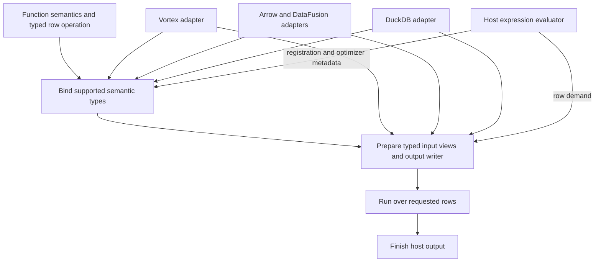

<!-- SPDX-License-Identifier: Apache-2.0 -->
<!-- SPDX-FileCopyrightText: Copyright the Vortex contributors -->

# A portable row-function library

[Research overview](README.md)

**Proposal:** share the function definition and typed execution machinery. Keep host types, column
ownership, query planning, and registration in adapters.

The core needs a type contract. It does not need to own every host's type system. A function can
declare the semantic types and input/output capabilities that it understands. An adapter can either
establish those capabilities or reject the binding.

This design targets ordinary CPU scalar functions. It does not turn a scalar row callback into an
aggregate, a table function, or a query engine.

## Three different portability goals

| Goal | Meaning | Assessment |
| --- | --- | --- |
| Shared function source | One function defines its semantics and row operation for several hosts. | Feasible with common semantic contracts and host adapters. |
| Shared execution machinery | Hosts reuse typed loops, constant handling, error reduction, and selection logic. | Feasible after separating input/output access from Vortex. |
| Shared executable binary | One compiled artifact loads into every host. | A separate ABI and distribution problem. Rust generics do not provide this guarantee. |

The first experiment can demonstrate the first two goals. The
[host integration notes](integrations/README.md) describe the separate C and C++ boundaries.

## Proposed responsibilities

These are responsibility boundaries, not a requirement for six public crates.

| Component | Owns | Does not decide |
| --- | --- | --- |
| Function definition | Supported signatures, result semantics, options, row operation, null/error policy. | Host casts, storage layout, registration names. |
| Semantic type support | Identity, parameters, and capabilities for supported type domains. | Every host's complete catalog of types. |
| Typed executor | Traversal, constant specialization, selected rows, deferred errors, output completion. | SQL coercion rules or query rewrites. |
| Host adapter | Type binding, decoding, borrowed views, allocation, output construction, host errors. | Whether distinct logical types have equivalent semantics without an explicit contract. |
| Host evaluator | Child evaluation, row demand propagation, caching, cancellation, optimizer integration. | Access to undefined results. |

The [type-system analysis](type-system/README.md) compares designs for the semantic boundary.
The [dependency inventory](current-system/README.md) maps current Vortex code to these components.

## Bind once, prepare each batch, execute typed loops

Binding takes the function options and host argument types. It resolves a concrete signature, result
type, and semantic policy. It also chooses input readers and an output constructor that support that
signature.

A bound function can retain type-derived state. Examples include timestamp units, decimal precision,
and the identity of an extension type. It must not retain borrows into a previous input batch.

Batch preparation handles facts that can change between invocations: encoding, constants, row count,
input ownership, validity, and requested rows. Prepared state derived from a batch constant belongs
to that batch unless a separate lifetime and cache contract permits reuse.

The row loop receives concrete views and a concrete operation. A registry can erase the function
type at the batch boundary. Erasing each row value or invoking a virtual function per cell adds a
different cost model.

This is a design target, not a code-generation result. Inlining, vectorization, code size, and batch
dispatch still need measurements. The [performance notes](performance/README.md) define those checks.

Current RowFn invokes the same generic dispatch during planning and execution. Its documentation
requires both visits to depend only on options and argument types. An extracted binder can retain
the selected signature instead of repeating that work. That change still needs a concrete lifetime
and invalidation design. See the current
[dispatch contract](https://github.com/vortex-data/vortex/blob/96bd521eb0565555def2af7b8e97e96891728da6/vortex-array/src/scalar_fn/unstable/row/row_fn.rs#L81-L91).

A literal argument can also determine an output type. Such a value needs an explicit place in the
binding contract. A batch constant can change between calls, so it cannot silently change a retained
output schema. Current RowFn dispatch receives types and options, not arbitrary argument values.

## Preserve semantics before selecting storage

Consider a function that truncates a timestamp to a minute. Its result contract includes the unit,
timezone interpretation, overflow behavior, and treatment of values before the epoch. An `i64`
reader alone proves none of these properties.

The function first binds a supported timestamp meaning. The adapter then supplies an appropriate
reader and output constructor. The constructor must preserve the semantic result type even for an
empty or all-null batch.

An extension identifier and storage type do not prove that two extensions mean the same thing. A
geometry function also needs a contract for its coordinate system, geometry representation, and
invalid-input behavior. Unsupported mappings must return binding errors.

Coercion belongs in an explicit policy. A host can insert a cast before a RowFn call, but that cast
must preserve the function's declared semantics. Silent loss of precision is not type compatibility.

## Keep demand separate from execution strategy

Demand states which results the caller needs. Validity states which completed results are non-null.
The executor can choose dense, indexed, or compact execution without changing either meaning.

A pure, total operation can compute extra rows when its readers and writers permit that work.
A fallible operation must not expose errors from undemanded rows. Decode and preparation errors need
the same classification. Allocation and whole-column structural failures remain separate concerns.

Every output needs a completion guarantee. A host that accepts only ordinary total arrays needs
safe storage at export. Filling undemanded slots does not make those slots semantically defined.

The [definedness proposal](definedness/README.md) specifies row domains, partial results, errors,
and nested values. It is an extension to the evaluator as well as the RowFn boundary.

## Retain a batch-level escape path

A row callback is a useful authoring interface, but some functions naturally operate on whole
columns. An identity function can return its input. A list operation can reuse offsets or child
buffers. An encoding-aware function can transform dictionary values without expanding every row.

The library needs an optional batch implementation under the same semantic function identity.
The adapter selects it only when its preconditions hold. The row implementation supplies the
general fallback and the reference behavior.

This does not require compressed encodings in the portable core. A Vortex adapter can retain its
encoding rules. The [prior-art comparison](prior-art.md) explains the corresponding limit of
Velox's simple-function interface.

Expression fusion is another independent question. A sequence of array-to-array calls can allocate
intermediate columns even when each individual row loop is efficient. Retaining a typed operation
separately from its host wrapper leaves room for later composition. The initial extraction does not
promise cross-function fusion. A fused native baseline and separate RowFn calls measure this
materialization difference as well as invocation costs.

## Contracts that need explicit decisions

- **Function effects:** specify determinism, side effects, and permitted reevaluation. Dense retries
  and constant folding depend on these properties.
- **Errors:** distinguish binding errors, row-local semantic errors, and infrastructure errors.
  Specify whether error position and order are observable.
- **Identity:** define a function namespace and semantic version. A registration name alone does
  not establish equivalent behavior across hosts.
- **Memory:** specify alignment, ownership, buffer lifetimes, and writer completion. A foreign
  allocator requires a compatible release path.
- **Extensions:** define capability registration and unsupported-type behavior. Keep opaque type
  transport separate from the ability to execute an operation on that type.
- **Caching:** include semantic options and relevant host context in binding keys. Bind caches and
  partial-result caches need different keys and invalidation rules.

Current RowFn already prohibits side effects and panics in row callbacks. Those requirements make
dense execution and retry possible. They need to survive extraction as public contracts, rather
than disappearing behind a generic trait. See the
[visitor requirements](https://github.com/vortex-data/vortex/blob/96bd521eb0565555def2af7b8e97e96891728da6/vortex-array/src/scalar_fn/unstable/row/visitor/row_visitor.rs#L80-L85)
and [sink callback requirements](https://github.com/vortex-data/vortex/blob/96bd521eb0565555def2af7b8e97e96891728da6/vortex-array/src/scalar_fn/unstable/row/visitor/row_visitor.rs#L165-L174).
