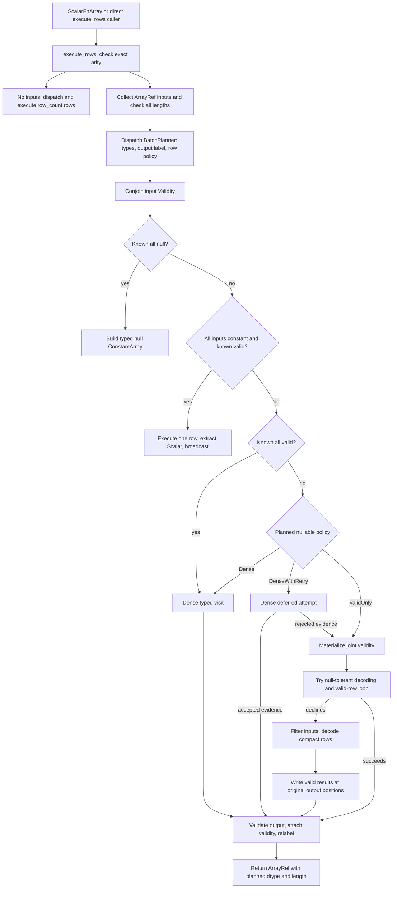

<!-- SPDX-License-Identifier: Apache-2.0 -->
<!-- SPDX-FileCopyrightText: Copyright the Vortex contributors -->

# Execution from a call to a column

One RowFn call has a planning phase, one or more typed execution visits, and a final output phase.
The row callback is only the inner loop. The surrounding code selects which rows reach it and how
their outputs become a column.

## Call graph

This graph describes the current call path. The left side belongs to the Vortex scalar-function
adapter. The central policy and typed loops are candidates for extraction.

The graph omits the terminal all-valid error and all-null success cases after a rejected dense
attempt. Those cases do not retry.
[Sources: entry point][entry], [batch construction][construct], [batch routing][route],
[retry resolution][retry].

## 1. Validate and plan before row execution

`execute_rows` checks exact arity before dispatch. Nullary functions bypass batch constants and
validity, then execute for `args.row_count()` rows. Non-nullary calls collect every input into a
`SmallVec<[ArrayRef; 4]>` and require each length to equal the declared row count.
[Sources: entry point][entry], [batch construction][construct].

The planning visitor validates the selected element tuple and output capability. It records the
storage dtype, an optional extension label, and a nullable execution policy. A later execution
dispatch repeats validation and must reproduce that plan. Dispatch must depend only on options and
input dtypes.
[Sources: dispatch contract][dispatch], [plan][plan], [execution revalidation][revalidate].

The batch then conjoins every input validity. This can construct a lazy Boolean expression instead
of a bitmap. With two array-backed validities, `Validity::and` builds and optimizes a Boolean
`Binary` array. The portable equivalent therefore needs both cheap validity facts and optional
materialization.
[Sources: batch construction][construct], [validity conjunction][validity-and].

## 2. Handle constants and empty domains

A known all-null batch returns a typed null `ConstantArray` without a row callback. This follows
planning, input collection, and input validity derivation. It does not bypass those operations.
[Sources: batch routing][route], [null output][output].

When every input is constant and validity is definitely all-valid, the framework executes one row.
It validates that output, extracts one Vortex `Scalar`, and broadcasts a `ConstantArray` to the
original length. Constant recognition handles a direct constant, a masked constant child, or an
extension with constant storage. It does not discover all semantically constant arrays.
[Sources: constant execution][constant], [constant recognition][batch-const].

An empty input has no constant value to decode. The generic route can still decode empty columns,
prepare state, construct an empty output, and validate it. A deferred callback reducer receives its
default success evidence. Nullary execution preserves the requested row count and avoids vacuous
all-constant folding.
[Sources: argument decoding][batch-const], [owned execution][owned], [nullary execution][entry].

## 3. Select a nullable policy

These policies apply after the known-all-valid fast path. That fast path uses ordinary execution
even for a signature whose nullable policy is `ValidOnly`.

| Visit | Preconditions for dense nullable execution | Otherwise |
| --- | --- | --- |
| Infallible owned value. | Every input has `DENSE_SAFE = true` and `DECODE_INFALLIBLE = true`. | `ValidOnly`. |
| Owned value plus deferred evidence. | The same input conditions. | `ValidOnly`. |
| Sink output. | The same input conditions and an infallible `SinkResult`. | `ValidOnly`. |

The deferred owned case selects `DenseWithRetry`. The other qualifying cases select `Dense`.
`RowFn::INFALLIBLE` is a separate semantic declaration. It does not alone choose the row policy.
[Sources: policy selection][policy], [row-result checks][visit-checks].

Dense execution evaluates all stored payloads and attaches the original validity afterward.
Successful dense execution can retain a lazy validity array. It need not discover every null first.
[Source: dense execution][dense].

A deferred dense loop combines compact failure evidence with bitwise OR. If the final reducer
rejects that evidence, the framework discards the values and resolves validity. All-valid input
keeps the error. All-null input suppresses it. Partially valid input executes the observable rows
again. Decode and preparation occur again during the retry.
[Sources: dense attempt][attempt], [retry resolution][retry], [deferred visitor contract][deferred].

## 4. Execute only valid rows

Direct valid-row execution first asks whether every input supports null-tolerant decoding. If any
input declines, the tuple returns `None`. A decline selects the filtered input path. A decoding
error remains an invocation error.
[Source: tuple decoding][tuple-decode].

The direct path decodes the original columns, initializes a full-length output, and traverses the
joint validity bits. The filtered path filters every input first. It then reads compact row `j`
and writes its result to the corresponding original position `i`. Both paths preserve output row
positions. Neither produces a compact result that needs a later array scatter.
[Sources: owned valid and filtered loops][owned], [sink loops][sink-loops], [input filtering][filtered].

These input filters are Vortex array operations. Their later execution can materialize a compressed
or nested representation. A filter wrapper is not a general promise that every upstream expression
evaluates only selected rows.
[Sources: filtered-path scope][filtered], [filter execution][filter-execute].

## 5. Publish the output

Before attaching input validity, the framework requires the kernel output to have the expected
length, matching storage dtype, and no null rows. It then applies the mask, attaches any extension
label, and reconciles outer nullability.
[Source: output validation][output].

Output relabeling supports only the storage dtype itself or an extension whose storage matches
exactly. It wraps the output rather than converting values. This is a host representation rule,
even after type dispatch becomes generic.
[Source: output label][label].

[Back to the overview](README.md).

[entry]: https://github.com/vortex-data/vortex/blob/96bd521eb0565555def2af7b8e97e96891728da6/vortex-array/src/scalar_fn/unstable/row/vtable.rs#L105-L151
[construct]: https://github.com/vortex-data/vortex/blob/96bd521eb0565555def2af7b8e97e96891728da6/vortex-array/src/scalar_fn/unstable/row/batch/planning.rs#L17-L59
[route]: https://github.com/vortex-data/vortex/blob/96bd521eb0565555def2af7b8e97e96891728da6/vortex-array/src/scalar_fn/unstable/row/batch/execute/mod.rs#L55-L95
[dispatch]: https://github.com/vortex-data/vortex/blob/96bd521eb0565555def2af7b8e97e96891728da6/vortex-array/src/scalar_fn/unstable/row/row_fn.rs#L81-L90
[plan]: https://github.com/vortex-data/vortex/blob/96bd521eb0565555def2af7b8e97e96891728da6/vortex-array/src/scalar_fn/unstable/row/visitor/plan.rs#L61-L166
[revalidate]: https://github.com/vortex-data/vortex/blob/96bd521eb0565555def2af7b8e97e96891728da6/vortex-array/src/scalar_fn/unstable/row/visitor/execute.rs#L97-L156
[validity-and]: https://github.com/vortex-data/vortex/blob/96bd521eb0565555def2af7b8e97e96891728da6/vortex-array/src/validity.rs#L312-L335
[constant]: https://github.com/vortex-data/vortex/blob/96bd521eb0565555def2af7b8e97e96891728da6/vortex-array/src/scalar_fn/unstable/row/batch/execute/constant.rs#L13-L29
[batch-const]: https://github.com/vortex-data/vortex/blob/96bd521eb0565555def2af7b8e97e96891728da6/vortex-array/src/scalar_fn/unstable/row/types/element/tuple/element_tuple.rs#L38-L134
[policy]: https://github.com/vortex-data/vortex/blob/96bd521eb0565555def2af7b8e97e96891728da6/vortex-array/src/scalar_fn/unstable/row/visitor/plan.rs#L278-L318
[visit-checks]: https://github.com/vortex-data/vortex/blob/96bd521eb0565555def2af7b8e97e96891728da6/vortex-array/src/scalar_fn/unstable/row/visitor/check.rs#L23-L76
[dense]: https://github.com/vortex-data/vortex/blob/96bd521eb0565555def2af7b8e97e96891728da6/vortex-array/src/scalar_fn/unstable/row/batch/execute/dense.rs#L17-L60
[retry]: https://github.com/vortex-data/vortex/blob/96bd521eb0565555def2af7b8e97e96891728da6/vortex-array/src/scalar_fn/unstable/row/batch/execute/dense.rs#L63-L114
[attempt]: https://github.com/vortex-data/vortex/blob/96bd521eb0565555def2af7b8e97e96891728da6/vortex-array/src/scalar_fn/unstable/row/execute/retry.rs#L38-L112
[deferred]: https://github.com/vortex-data/vortex/blob/96bd521eb0565555def2af7b8e97e96891728da6/vortex-array/src/scalar_fn/unstable/row/visitor/row_visitor.rs#L257-L272
[tuple-decode]: https://github.com/vortex-data/vortex/blob/96bd521eb0565555def2af7b8e97e96891728da6/vortex-array/src/scalar_fn/unstable/row/types/element/tuple/element_tuple.rs#L326-L353
[owned]: https://github.com/vortex-data/vortex/blob/96bd521eb0565555def2af7b8e97e96891728da6/vortex-array/src/scalar_fn/unstable/row/execute/owned.rs#L38-L295
[sink-loops]: https://github.com/vortex-data/vortex/blob/96bd521eb0565555def2af7b8e97e96891728da6/vortex-array/src/scalar_fn/unstable/row/execute/sink.rs#L97-L271
[filtered]: https://github.com/vortex-data/vortex/blob/96bd521eb0565555def2af7b8e97e96891728da6/vortex-array/src/scalar_fn/unstable/row/batch/execute/filtered.rs#L4-L60
[filter-execute]: https://github.com/vortex-data/vortex/blob/96bd521eb0565555def2af7b8e97e96891728da6/vortex-array/src/arrays/filter/vtable.rs#L165-L184
[output]: https://github.com/vortex-data/vortex/blob/96bd521eb0565555def2af7b8e97e96891728da6/vortex-array/src/scalar_fn/unstable/row/batch/execute/output.rs#L18-L111
[label]: https://github.com/vortex-data/vortex/blob/96bd521eb0565555def2af7b8e97e96891728da6/vortex-array/src/scalar_fn/unstable/row/visitor/plan.rs#L187-L275
