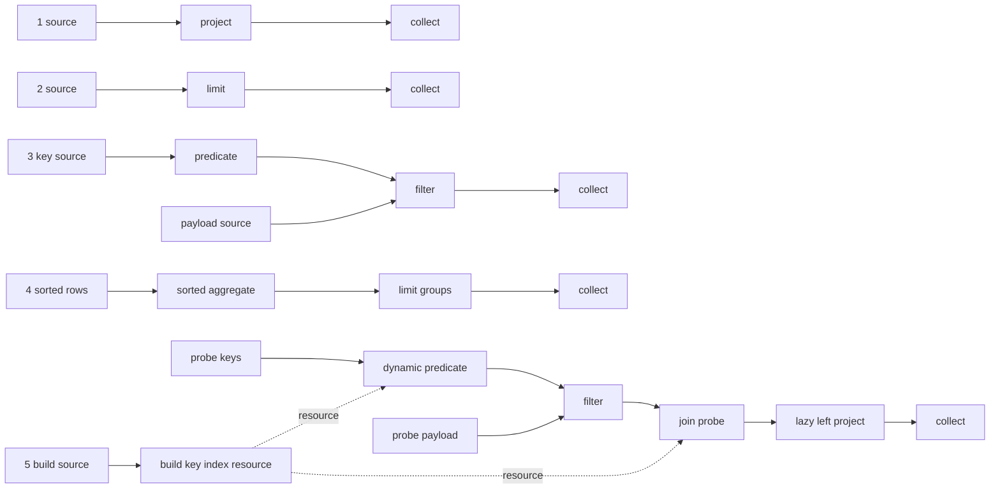
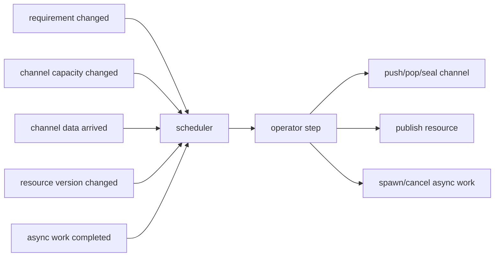

# Evaluate back-propagation design

> I want you to take a look at the proposal-witness-back-propagation.
>
> The idea is that perhaps we don't need task-level selections, demand, witness stores. And in fact, we can achieve everything we want via back-propagating demand signals through the pipeline nodes.
>
> I don't think the doc has fully been updated to reflect this. you should fix it up if that's the case.
>
> But then provide a full evaluation of this design, vs the current design the engine is oriented around.

<details><summary>8 previous messages</summary>

> <details><summary>Explored 3 files</summary>
>
> - Read `~/.codex/plugins/cache/openai-curated/superpowers/c5debd62/skills/brainstorming/SKILL.md`
> - Read `~/.codex/plugins/cache/openai-curated/superpowers/c5debd62/skills/using-superpowers/SKILL.md`
> - Read `~/.codex/plugins/cache/openai-curated/superpowers/c5debd62/skills/writing-plans/SKILL.md`
>
> </details>
>
> I’m using the Superpowers workflow checks to keep the design-doc pass disciplined. I’m going to first locate the proposal and related accepted docs, then I’ll update the proposal only where the text still assumes task-level selections/demand/witness stores and finish with a direct design evaluation.
>
> <details><summary>Explored 2 searches, 1 list, ran 1 command</summary>
>
> <details><summary>Explored 2 searches, 1 list</summary>
>
> - Listed files in `docs`
> - Searched for `proposal|witness|demand|selection|relation|runtime|architecture`
> - Searched for `proposal-witness-back-propagation|witness back|back-propagat|task-level|Selection|Demand|witness store|witness` in `docs`
>
> </details>
>
> - Ran `git status --short`
>
> </details>
>
> The proposal file is currently untracked, and the worktree already has a broad set of unrelated edits. I’ll treat those as existing user work and keep my changes scoped to the proposal unless the proposal requires a small link/status update elsewhere.
>
> <details><summary>Explored 4 files</summary>
>
> - Read `./docs/design/proposal-witness-back-propagation.md`
> - Read `./docs/design/proposal-witness-back-propagation.md`
> - Read `./docs/design/relations-selections-demand.md`
> - Read `./docs/design/relation-witnesses.md`
>
> </details>
>
> The proposal already points toward “witnesses plus back-propagated demand,” but it still has leftover task-store language: domain demand stores, shared witness-store peer reads, and an open question about multi-publisher filter witnesses that contradicts the later `And` model. I’m going to tighten the proposal around operator-local witnesses and edge-propagated signals.
>
> <details><summary>Explored 11 files, 4 searches, 1 list, ran 1 command</summary>
>
> <details><summary>Explored 4 files</summary>
>
> - Read `./docs/diagrams/proposal-three-signals.mmd`
> - Read `./docs/design/pipeline-runtime.md`
> - Read `./docs/design/execution-model.md`
> - Read `./docs/design/physical-plan-api.md`
>
> </details>
>
> - Ran `which mmdc`
>
> <details><summary>Explored 8 files, 4 searches, 1 list</summary>
>
> - Searched for `proposal-three-signals|proposal-witness|witness-based runtime` in `SUMMARY.md`
> - Searched for `DemandView|DemandPublisher|demand store|witness store|shared relation|Selection|selection|task-level|task-owned|multi-publisher|Forward witness|peer|publishers` in `proposal-witness-back-propagation.md`
> - Read `./docs/SUMMARY.md`
> - Listed files
> - Searched for `(^|/)package\.json$|pnpm-lock|yarn.lock|package-lock|Cargo.toml|mdbook|mermaid`
> - Read `./docs/README.md`
> - Read `./docs/README.md`
> - Read `./docs/diagrams/proposal-filter-limit.mmd`
> - Read `./docs/diagrams/proposal-hash-join-dynamic-filter.mmd`
> - Read `./docs/diagrams/proposal-predicate-stream-payload.mmd`
> - Read `./docs/diagrams/proposal-sorted-agg-limit.mmd`
> - Read `./docs/diagrams/proposal-hash-agg-limit.mmd`
> - Searched for `peer read|Forward|witness|Relation|DemandView|DemandPublisher|Selection|shared|multi-publisher|store` in `proposal-*.mmd`
>
> </details>
>
> </details>
>
> <details><summary>Plan</summary>
>
> I found several stale assumptions in the proposal: task demand stores, shared witness-store peer reads, and a multi-publisher filter witness open question. I’m narrowing the proposal to operator-local witnesses plus backward demand edges, then I’ll check the doc for leftover vocabulary.
>
> - [x] Read proposal and accepted docs
> - [ ] Rewrite proposal around edge demand propagation
> - [ ] Update proposal diagrams/source references
> - [ ] Verify doc consistency and summarize evaluation
>
> </details>
</details>

I’m about to rewrite the proposal as a coherent alternative: `Selection` disappears, `Demand` becomes edge-local backward signals rather than a task resource, and relation witnesses become operator-owned state used for forward output and demand translation. I’ll also add an explicit evaluation section so the proposal itself records where it is stronger or weaker than the accepted V1 model.

> Ok, don't update it. I have done so. Now I just want you to evaluate it.

<details><summary>5 previous messages</summary>

> Understood. I’ll leave the files alone and evaluate the proposal as it stands now, against the accepted V1 direction in the docs.
>
> <details><summary>Explored 4 files</summary>
>
> - Read `./docs/design/proposal-witness-back-propagation.md`
> - Read `./docs/design/proposal-witness-back-propagation.md`
> - Read `./docs/design/relations-selections-demand.md`
> - Read `./docs/design/relation-witnesses.md`
>
> </details>
>
> The updated proposal is materially different from the earlier one: it now removes peer-read shared witnesses and treats forward cross-operator mappings as batch data. I’m checking the remaining open questions and accepted runtime docs now, because the main risk is whether the proposal still secretly depends on task-level demand stores.
>
> <details><summary>Explored 10 files, 1 search, ran 1 command</summary>
>
> <details><summary>Explored 6 files, 1 search</summary>
>
> - Read `./docs/design/proposal-witness-back-propagation.md`
> - Read `./docs/design/pipeline-runtime.md`
> - Read `./docs/design/physical-plan-api.md`
> - Read `./docs/design/execution-model.md`
> - Read `./docs/diagrams/proposal-hash-join-dynamic-filter.mmd`
> - Read `./docs/diagrams/proposal-three-signals.mmd`
> - Searched for `peer-read|peer read|shared-witness|shared witness|Selection|SelectionView|SelectionPublisher|Refinement|DemandOnDomain|demand store|task-level|task-owned|witness store|runtime resource|DemandPublisher|DemandView` in `proposal-witness-back-propagation.md`
>
> </details>
>
> - Ran `git diff -- docs/design/proposal-witness-back-propagation.md docs/diagrams/proposal-three-signals.mmd docs/diagrams/proposal-hash-join-dynamic-filter.mmd`
>
> <details><summary>Explored 4 files</summary>
>
> - Read `./docs/design/row-domains.md`
> - Read `./docs/design/operator-abi.md`
> - Read `./docs/design/operators/predicate-stream.md`
> - Read `./docs/design/operators/mask-filter.md`
>
> </details>
>
> </details>
>
> <details><summary>Plan</summary>
>
> I’ve finished the read-only comparison. I’m going to give a verdict plus the concrete risks that would need resolving before this could replace the accepted V1 model.
>
> - [x] Re-read updated proposal
> - [x] Compare against accepted V1 docs
> - [ ] Deliver design evaluation
>
> </details>
</details>

I did not update files.

**Verdict:** the proposal is a strong direction, but I would not replace the current V1 model with it as written. I would adopt it as a narrowing of the architecture: remove public `Selection`, make filters/domain-changing predicate composition explicit, add operator-local `propagate_demand`, and allow inline mapping columns for single-consumer cases. I would keep `Demand` as an explicit runtime resource, and keep shared relation witnesses as an optional tool when multiple operators need the same mapping.

The proposal cleanly fixes the weakest part of the current design: `Selection` is doing too much. Treating predicate output as boolean streams plus `Filter(D_in -> D_filt)` is more implementable than a merged selection overlay, especially for cheap-predicate/run-ahead patterns. The lateral demand examples for `Filter` and `And` are also the clearest explanation so far of how to skip expensive work without inventing global refinement state.

The biggest issue is that the proposal still has a demand store: `DemandOnDomain`, `DemandView`, `DemandPublisher`, and “domain demand store” remain in [proposal-witness-back-propagation.md](./docs/design/proposal-witness-back-propagation.md:94) and [proposal-witness-back-propagation.md](./docs/design/proposal-witness-back-propagation.md:546). That is probably not just accidental. Some demand aggregation object is necessary at fanout points, source scheduling boundaries, and multi-consumer merges. You can make it operator-local or edge-local rather than task-semantic, but you cannot eliminate the composition problem.

The second issue is API placement. `propagate_demand(&self, ...)` on submitted `Operator` is too high-level if the witness is runtime state. The actual hook likely belongs on lowered runtime nodes or an operator-local resource created during lowering. Otherwise lane-local state, mutable witness updates, coalescing, and re-translation after witness growth are not well-defined.

Compared with the accepted V1 docs, the proposal is better at locality and category boundaries. Current V1 has clearer correctness machinery: task-owned selection/demand merge state, stale-safe views, witness cursor lifecycle, and explicit conformance cases in [relations-selections-demand.md](./docs/design/relations-selections-demand.md:14) and [relation-witnesses.md](./docs/design/relation-witnesses.md:19). The cost is conceptual surface area and some awkward “selection over a domain” cases.

My recommended outcome: use this proposal to retire `Selection` as a public primitive, add back-propagated demand as the normal pruning path, and recast witness stores as optional shared runtime resources, not mandatory semantic state. Do not try to delete demand aggregation entirely; redefine it as endpoint/fanout runtime state rather than task-level semantic state.

> I think operators should hold relation witness objects that essentially act as state stores for witness information and can be used to translate demand for back-prop. So no centralized demand store.
>
> Agree that propagate_demand should be on SourceNode, SinkNode, TransformNode instead of Operator.
>
> I don't see an example where the relation witness data should be shared where it shouldn't simply be a separate operator. e.g. ListOffsetsOperator can be used in the CSE operator DAG to provide shared offsets within the query.

I mostly agree with that shape, with one important qualification: “no centralized demand store” still needs an explicit **demand edge / inbox** abstraction at runtime. It does not need to be task-semantic state keyed by `Domain`, but a source with multiple downstream consumers still needs a place where incoming `Required` / `Candidate` / `NotNeeded` updates are merged before scheduling reads.

The model I’d write down is:

- `Relation` remains semantic metadata.
- Relation witness objects are operator-owned runtime state.
- Witness objects expose translation helpers used by node-level `propagate_demand`.
- Demand flows along lowered runtime edges, not through a task-global domain store.
- Each input edge has a small demand accumulator with the merge rule for that edge.
- Sources read their input-edge demand accumulators, not `DemandView(Domain)`.

Putting `propagate_demand` on `SourceNode`, `TransformNode`, and `SinkNode` is the right correction. The submitted `Operator` is a lowering object; it does not own the mutable runtime witness state after lowering. The runtime nodes or an operator-local resource do.

On shared witness data: I agree with your instinct. If offsets, join pairs, run ends, or postings are genuinely consumed by multiple operators, modeling that as a separate physical operator is cleaner than a hidden task witness store. A `ListOffsetsOperator` can produce offsets once, and CSE can make the plan share that producer.

The caveat is that this still creates a shared runtime object somewhere: a tee, materialized offset stream, finalized state, or channel-like fanout. That is fine. The distinction is that it is **operator graph dataflow state**, not **task semantic state**. That is a much better boundary.

The design consequence is substantial: the accepted docs’ `TaskSemantics` surface should probably shrink to registered `Domain` / `Relation` facts only. Runtime communication becomes explicit lowered graph structure:

```text
batches forward
value channels forward/lateral
operator-owned witnesses inside nodes/resources
demand updates backward along edges
shared witness-like data only via explicit producer operators
```

This also makes CSE more important. If there is no task witness store as an ambient sharing layer, the optimizer/lowerer must be responsible for introducing shared producers when reuse matters. That is a good trade if we want explainable plans and fewer hidden global resources.

> I think the proposal changes massively. I want you to update the draft doc with these corrections. Then let's chat again to see how far the implications hit

<details><summary>7 previous messages</summary>

> I’ll update only the draft proposal and its Mermaid sources where needed. The correction is architectural, so I’ll first make the text internally consistent: edge-local demand accumulators, node-level propagation hooks, operator-owned witness objects, and explicit producer operators for shared witness-like data.
>
> <details><summary>Explored 1 file, 2 searches, ran 1 command</summary>
>
> <details><summary>Explored 3 files, 1 search</summary>
>
> - Read `./docs/design/proposal-witness-back-propagation.md`
> - Read `./docs/design/proposal-witness-back-propagation.md`
> - Read `./docs/design/proposal-witness-back-propagation.md`
> - Searched for `demand store|DemandView|DemandPublisher|DemandOnDomain|Operator \{|propagate_demand|shared witness|peer read|runtime resource shared|task-level|task semantic|WitnessView|WitnessPublisher|central|centralized|shared relation|ListOffsets|offsets` in `proposal-witness-back-propagation.md`
>
> </details>
>
> - Ran `wc -c docs/diagrams/proposal-three-signals.svg docs/diagrams/proposal-hash-join-dynamic-filter.svg`
>
> <details><summary>Explored 1 search</summary>
>
> - Searched for `Forward|witness|peer|shared|demand|propagate|lateral|inline` in `proposal-three-signals.svg`
>
> </details>
>
> </details>
>
> The proposal still has the old model in several places: `DemandOnDomain`, `DemandView`, `DemandPublisher`, “demand store”, and `trait Operator::propagate_demand`. I’m replacing those with node-level hooks and edge-local demand accumulators, then I’ll re-scan for stale vocabulary.
>
> <details><summary>Edited 1 file, explored 1 file, 3 searches, ran 1 command</summary>
>
> - Wrote `./docs/design/proposal-witness-back-propagation.md` (+17 -15)
>
> - Wrote `./docs/design/proposal-witness-back-propagation.md` (+16 -12)
>
> - Wrote `./docs/design/proposal-witness-back-propagation.md` (+3 -3)
>
> - Wrote `./docs/design/proposal-witness-back-propagation.md` (+6 -6)
>
> - Wrote `./docs/design/proposal-witness-back-propagation.md` (+68 -26)
>
> - Wrote `./docs/design/proposal-witness-back-propagation.md` (+6 -0)
>
> - Wrote `./docs/design/proposal-witness-back-propagation.md` (+12 -5)
>
> - Wrote `./docs/design/proposal-witness-back-propagation.md` (+37 -30)
>
> - Wrote `./docs/design/proposal-witness-back-propagation.md` (+7 -6)
>
> - Wrote `./docs/design/proposal-witness-back-propagation.md` (+7 -1)
>
> - Wrote `./docs/design/proposal-witness-back-propagation.md` (+6 -3)
>
> - Wrote `./docs/design/proposal-witness-back-propagation.md` (+21 -15)
>
> - Wrote `./docs/design/proposal-witness-back-propagation.md` (+14 -12)
>
> - Wrote `./docs/design/proposal-witness-back-propagation.md` (+27 -25)
>
> - Wrote `./docs/design/proposal-witness-back-propagation.md` (+4 -4)
>
> <details><summary>Explored 5 files, 1 search</summary>
>
> - Searched for `DemandOnDomain|DemandView|DemandPublisher|demand store|domain's demand|task-level demand|task-level.*witness|shared relation witness|shared-witness|peer-read|peer read|trait Operator|per-operator|centralized|central demand|runtime resource shared|witness store|multi-publisher|demand relations|Demand relations|Source obligations are uniform|composed` in `proposal-witness-back-propagation.md`
> - Read `./docs/design/proposal-witness-back-propagation.md`
> - Read `./docs/design/proposal-witness-back-propagation.md`
> - Read `./docs/design/proposal-witness-back-propagation.md`
> - Read `./docs/design/proposal-witness-back-propagation.md`
> - Read `./docs/design/proposal-witness-back-propagation.md`
>
> </details>
>
> - Wrote `./docs/design/proposal-witness-back-propagation.md` (+2 -2)
>
> - Wrote `./docs/design/proposal-witness-back-propagation.md` (+1 -1)
>
> <details><summary>Explored 2 searches</summary>
>
> - Searched for `operator-owned|operator-local|node-level|edge-local|DemandEdge|DemandSink|SourceNode::apply_demand|TransformNode::propagate_demand|SinkNode::propagate_demand|ListOffsetsOperator|CSE` in `proposal-witness-back-propagation.md`
> - Searched for `DemandOnDomain|DemandView|DemandPublisher|demand store|domain's demand|task-level demand|task-level.*witness|shared relation witness|shared-witness|trait Operator|per-operator|centralized demand|central demand|runtime resource shared|witness store|Demand relations|demand relations` in `proposal-witness-back-propagation.md`
>
> </details>
>
> - Ran `git diff -- docs/design/proposal-witness-back-propagation.md`
>
> - Wrote `./docs/design/proposal-witness-back-propagation.md` (+1 -1)
>
> </details>
>
> The core rewrite is in place. I’m doing a consistency pass now for stale terms and accidental contradictions, especially places that still imply `DemandView`, `DemandPublisher`, or task-owned witness stores.
>
> <details><summary>Explored 1 file, 3 searches, ran 2 commands</summary>
>
> <details><summary>Explored 1 file</summary>
>
> - Read `~/.codex/plugins/cache/openai-curated/superpowers/c5debd62/skills/verification-before-completion/SKILL.md`
>
> </details>
>
> - Ran ``rg -n "DemandOnDomain|demand store|domain demand|task-level Demand|task-level demand|shared relation witness|peer-read shared|trait Operator|per-operator `propagate_demand`|centralized demand store|WitnessView|WitnessPublisher" docs/design/proposal-witness-back-propagation.md``
>
> <details><summary>Explored 1 search</summary>
>
> - Searched for `Status:|Progress:|Open questions:|^# |^## |^### |SourceNode::apply_demand|TransformNode::propagate_demand|SinkNode::propagate_demand|ListOffsetsOperator|DemandEdge|DemandSink` in `proposal-witness-back-propagation.md`
>
> </details>
>
> - Ran `git status --short docs/design/proposal-witness-back-propagation.md docs/diagrams/proposal-three-signals.mmd docs/diagrams/proposal-three-signals.svg`
>
> <details><summary>Explored 2 searches</summary>
>
> - Searched for ``DemandOnDomain|demand store|domain demand|task-level Demand|task-level demand|shared relation witness|peer-read shared|trait Operator|per-operator `propagate_demand`|centralized demand store|WitnessView|WitnessPublisher`` in `proposal-witness-back-propagation.md`
> - Searched for `per-operator|DemandOnDomain|DemandView|DemandPublisher|witness store|shared-witness|peer read|peer-read|centralized demand|central demand graph|demand store|task-level demand` in `proposal-witness-back-propagation.md`
>
> </details>
>
> </details>
>
> <details><summary>Plan</summary>
>
> The proposal text now uses operator-owned relation witness state and reverse demand edges. I left the Mermaid sources unchanged because their current labels already match the high-level flow; the corrections were in the prose/API surface.
>
> - [x] Inspect proposal for stale centralized-store language
> - [x] Patch draft proposal with corrected architecture
> - [x] Patch proposal Mermaid sources if labels are stale
> - [x] Verify no stale terms remain
>
> </details>
</details>

Updated [proposal-witness-back-propagation.md](./docs/design/proposal-witness-back-propagation.md:1).

Main changes:
- Reframed the proposal around operator-owned relation witness objects.
- Removed centralized/task-level demand store as the design target.
- Replaced `Operator::propagate_demand` with node-level hooks on `SourceNode`, `TransformNode`, and `SinkNode`.
- Added `DemandEdge` / `DemandSink` as reverse-edge runtime concepts.
- Recast shared witness data as explicit producer operators, e.g. `ListOffsetsOperator` plus CSE graph sharing.
- Updated the implications and open questions accordingly.

Verification: I ran targeted `rg` checks for stale terms like `DemandOnDomain`, `DemandPublisher`, `trait Operator`, and centralized demand-store language. Remaining matches are intentional negative/removal references. The proposal file is still untracked in git, matching the existing worktree state.

> Explain DemandEdge and DemandSink to me? Where do these fit?

`DemandEdge` is the runtime object that carries demand backward across one lowered data edge.

Think of a normal forward edge:

```text
Source -> Transform -> Sink
```

For demand, each forward edge can have a reverse companion:

```text
Source <- DemandEdge <- Transform <- DemandEdge <- Sink
```

A `DemandEdge` owns the current accumulated demand for that producer/consumer connection:

```text
Required | Candidate | NotNeeded over DomainSpan ranges
```

It is responsible for:

- merging updates on that edge;
- coalescing redundant span updates;
- keeping a sequence/version for cheap “did anything change?” checks;
- waking the producer-side node when demand changes;
- giving a source or upstream node the latest demand for scheduling/cancellation.

It is not task-level semantic state. It is runtime wiring created during lowering, similar in spirit to a channel or tee handle.

`DemandSink` is just the write interface into upstream demand edges.

A transform should not know the concrete edge objects above it. It should say:

```rust
upstream.publish(INPUT_VALUES, not_needed_rows)?;
upstream.publish(INPUT_PREDICATE, candidate_rows)?;
```

The runtime maps those input ports to the correct `DemandEdge`s.

So in a `Filter`:

```text
values    -> Filter -> downstream
predicate -> Filter
```

`Filter.propagate_demand(...)` receives downstream demand and uses its filter witness to publish upstream:

```text
DemandSink.publish(values_input, translated_update)
DemandSink.publish(predicate_input, translated_update)
```

For lateral demand, when predicate rows arrive as `false`, `Filter` can publish directly to the values input edge:

```text
DemandSink.publish(values_input, NotNeeded(false_rows))
```

Where they fit:

- `Domain` / `Relation`: semantic facts registered during lowering.
- relation witness object: mutable node/operator-local runtime state.
- `DemandEdge`: runtime reverse edge between lowered nodes/resources.
- `DemandSink`: narrow API a node uses to publish updates into its upstream demand edges.
- source: consumes demand from its incoming `DemandEdge` via `apply_demand`.
- transform: translates downstream demand into upstream demand via `propagate_demand`.
- sink: originates demand, e.g. `LIMIT` publishing `NotNeeded` past N.

The key point: `DemandEdge` replaces the centralized `Demand(Domain)` store, while `DemandSink` prevents nodes from reaching into a registry or knowing graph wiring details.

> That seems weird. I think the nodes just need to literally translate demand objects and hand them back to the scheduler to pass them to the next node back in the pipeline.
>
> When this hits a pipeline source... I don't really know what happens.

I agree. `DemandSink` is probably the wrong abstraction if the scheduler is the thing walking the backward graph.

A cleaner model is:

```rust
trait TransformNode {
    fn propagate_demand(
        &self,
        local: &mut Self::LocalState,
        output: OutputPort,
        update: DemandUpdate,
        rt: &mut TransformRuntime<'_>,
    ) -> EngineResult<SmallVec<[UpstreamDemand; 2]>>;
}

struct UpstreamDemand {
    input: InputPort,
    update: DemandUpdate,
}
```

Then the scheduler owns the routing:

```text
downstream demand update
  -> scheduler calls node.propagate_demand(...)
  -> node returns updates by input port
  -> scheduler maps input ports to upstream nodes
  -> repeat
```

So `DemandEdge` becomes an internal scheduler record, not something nodes see directly. It can still exist as “the scheduler’s state for this reverse edge”: last update, merged spans, sequence number, dirty bit, wake target. But it is not an API object. And `DemandSink` goes away.

For lateral demand, same idea: during forward processing, a multi-input node can return or emit a runtime event:

```rust
NodeEvent::Demand {
    input: INPUT_VALUES,
    update: DemandUpdate::not_needed(false_rows),
}
```

The scheduler routes that event backward through the selected input port.

When demand hits a pipeline source, there are three cases:

1. **Real source**: table scan, take-source, layout reader. The source consumes the demand and updates its own scheduling/cancellation queues. Propagation stops.

2. **Operator-local source**: e.g. output side of a `Filter`, join, async map, tee, buffered zipper, finalized build product. The source is really an egress node for an operator-local resource. It can translate or forward demand into that resource, and the enclosing operator/resource determines what upstream inputs receive demand.

3. **Pure channel/tee source**: demand becomes retention/production pressure on the channel. The channel may merge consumer demand, release retained ranges, and propagate upstream only when all consumers no longer need a span.

So the important correction is: demand propagation is not a passive edge API exposed to nodes. It is a scheduler-driven reverse walk. Nodes just translate demand objects relative to their local witness state and return “send this to input port X.”

> I mean, do pipelines even make sense in this model? Pipelines exist in DuckDB for cache-aware "pipelined" execution over the same data.
>
> Our approach to this is by making compute over Vortex arrays lazy. So when we eventually need to materialize an array, we do everything in one go in one place.
>
> Maybe they're also useful for managing async work?
> Or maybe we just have async streams everywhere? That feels a bit gross though.
> Or maybe everything is push-based? e.g. this filter operator has some size-bounded buffer of predicate masks that it builds up while waiting for values chunks. Each values chunk pops the front of the predicate buffer. How does this back-pressure build up.

<details><summary>2 previous messages</summary>

> I’m using the brainstorming workflow for this design question, but staying at the discussion level rather than editing docs. The crux is whether “pipeline” means DuckDB-style cache-local operator fusion, or just a runtime scheduling container.
>
> <details><summary>Explored 1 file</summary>
>
> - Read `~/.codex/plugins/cache/openai-curated/superpowers/c5debd62/skills/brainstorming/SKILL.md`
>
> </details>
</details>

I think pipelines still make sense, but only if we demote what they mean.

They should not be “the semantic execution model.” They should be a scheduler optimization boundary: a fused synchronous region between places where the engine may need independent scheduling, buffering, async waiting, or fan-in/fan-out.

So not DuckDB-style “pipelines are how vectorized execution happens.” In Vortex, lazy arrays already give us the cache-aware compute fusion: when an array is materialized, expression/decode/filter work can happen in one place over the Vortex array graph. The runtime graph is more about orchestration.

I’d split the concepts like this:

```text
Operator graph
  semantic shape, domains, relations

Runtime graph
  nodes/resources/ports, async boundaries, bounded buffers, demand propagation

Materialization graph
  lazy Vortex array compute, decoded only when needed
```

A “pipeline” is then just a runtime graph region that can be driven synchronously without awaiting external state.

Where demand hits a pipeline source, the source is the boundary object. There are several source kinds:

- `TableScanSource`: terminal. It consumes demand and updates read scheduling/cancellation.
- `ChannelSource` / `TeeSource`: demand updates retention and consumer interest; the channel/resource may propagate aggregate demand to its producer.
- `FilterOutputSource`: demand enters the filter resource, which translates it to values/predicate inputs using its local witness/buffer state.
- `AsyncWorkSource`: demand reprioritizes or cancels work in the work set, and may propagate to the ingress side if work depends on input rows.
- `MaterializedSource`: demand may only affect retention because upstream work already happened.

That suggests `propagate_demand` probably belongs on any runtime node/resource that is a reverse-boundary, not only `SourceNode` / `TransformNode` / `SinkNode`.

For your push-based filter example, the shape is natural:

```text
Predicate input -> bounded mask buffer \
                                    Filter resource -> output
Values input    -> value buffer      /
```

Backpressure is just buffer capacity plus demand:

- Predicate masks arrive early and fill a bounded buffer.
- If the mask buffer fills, the predicate input cannot accept more; scheduler stops driving that producer.
- That backs up into key scan naturally.
- Values chunks consume masks from the front.
- If values arrive before masks, values side waits or buffers within its cap.
- Predicate `false` masks produce lateral `NotNeeded` for the values side, so the values scan can cancel reads not yet launched.

This is not “async streams everywhere.” It is bounded resources with explicit readiness, capacity, and demand. The scheduler drives ready ports; resources decide whether they can accept input or produce output.

My current leaning: keep “pipeline” only for synchronous driver regions, but make the real model a runtime graph of ports and bounded resources. Pipelines become an implementation detail for fusing trivial chains, not the architecture’s core abstraction.

> As you say, resources are channels that propagate data, therefore they must also back-propagate demand. So should resources really be these opaque objects that the scheduler cannot control or understand? Or should pipelines all just have a canonical set of plumbing? Either a spsc, mpsc, or spmc channel, configured with some amount of buffer space. Just as an example. Then everything else must live inside nodes.
>
> Again the filter node is weird. If it is told upstream demand, the filter node cannot propagate it. It's not that the input can _not_ pass the predicate rows to filter. Since filter expects the same row count from values and predicate inputs. It's that filter doesn't care what the result is. So the input can "make up" the value. It is going to be ignored anyway. For filter's case, it will be interseced with "false" and then ignored.
>
> So selection/demand are different things here. One changes the cardinality / skips rows. The other says "i don't care what the value is, but the row must exist for alignment reasons".

Yes. This exposes a real flaw in the current proposal wording: it overloads demand.

There are at least two different backward signals:

1. **Row/cardinality demand**: “Do these rows need to exist downstream?”
2. **Value/materialization demand**: “For rows that must exist for alignment, do I need the actual values?”

`Selection` changes row membership/cardinality. `Demand` as we were discussing it mostly meant row/cardinality demand. But the filter case needs value/materialization demand.

For `Filter(values, predicate) -> filtered_output`, predicate-false rows are still structurally needed at the filter boundary because values and predicates align by `D_in`. But the value payload for those rows is not needed. So the values input cannot just skip the row if the filter expects aligned spans. It can produce:

```text
Batch {
  span: D_in[100..200],
  columns: DontCare or cheap placeholder for rows where predicate=false
}
```

or more generally:

```text
Row presence: required
Value payload: not needed for subset
```

That means the reverse signal should probably be a **row demand plus column/value demand**, not a single ternary state.

Something like:

```text
RowDemand:
  RequiredRows
  CandidateRows
  NotNeededRows

ValueDemand:
  RequiredValues(columns/subset)
  DontCareValues(columns/subset)
```

Then `Filter` lateral propagation from predicate to values is not:

```text
NotNeeded(values, false_rows)
```

It is:

```text
RequiredRows(values, false_rows)
DontCareValues(values.payload_columns, false_rows)
```

For rows past a saturated downstream `LIMIT`, it really can be:

```text
NotNeededRows(values, tail_input_rows)
NotNeededRows(predicate, tail_input_rows)
```

because those rows no longer need to pass through the filter at all.

On resources: I agree the scheduler should not be blind to plumbing that moves data between nodes. If a resource connects nodes, it participates in backpressure and demand, so it needs canonical runtime semantics.

I’d draw the line this way:

- **Canonical plumbing resources**: scheduler-known bounded queues/tees/fan-in/fan-out channels. These have standard capacity, readiness, retention, row-demand, and value-demand behavior.
- **Operator-local state**: hidden inside nodes/resources when it is not graph plumbing: hash tables, filter witnesses, group ends, predicate buffers, async work queues.
- **Operator-local resources with ports**: allowed, but they must expose canonical port behavior to the scheduler. Internals can be opaque; port semantics cannot be.

So a filter probably should not be modeled as an opaque “resource” that the scheduler cannot understand. It should be a multi-input runtime node/resource with canonical ports:

```text
predicate input port: accepts PredicateBatch<D_in>
values input port:    accepts ValueBatch<D_in>
output port:          emits ValueBatch<D_filt>
```

It owns the predicate buffer and filter witness internally, but the scheduler can see:

- can predicate port accept more?
- can values port accept more?
- can output port produce?
- what row/value demand has been returned to each input?
- what capacity is currently blocking progress?

This also means “pipelines” are becoming less central. The more honest abstraction is a runtime dataflow graph with canonical ports and bounded plumbing. A pipeline is just a fused chain where ports collapse because there is no async wait, no fan-in, no fan-out, and no bounded inter-node queue needed.

The implication: the proposal should probably rename/reshape “Demand” into something like **InputRequirement** or **WorkDemand** with separate axes:

```text
InputRequirement {
  rows: Required | Candidate | NotNeeded,
  values: Required(columns/mask) | DontCare(columns/mask),
}
```

That distinction makes the filter case sane. It also fits lazy Vortex arrays well: a source can satisfy `RequiredRows + DontCareValues` by advancing row spans and avoiding payload materialization.

> If all the pipelines are held together by bounded async queues... isn't this all just a big push-based engine? Or pull-based? I guess it really doesn't matter either way? Or is one easier than the other? I guess scheduler driven allows us to expose easier APIs for users to author pipeline nodes. =

Yes, if every boundary is a bounded queue, the engine starts looking like a dataflow engine. Whether you call it push or pull is mostly an API choice, but it matters a lot for operator authoring and backpressure.

I’d avoid “async streams everywhere.” That tends to make backpressure implicit, cancellation scattered, and demand propagation hard to reason about. It also forces every operator author into async state-machine thinking, even for simple synchronous transforms.

The best fit here is probably **scheduler-driven dataflow with bounded ports**.

Not pure push:

```text
producer runs whenever it can and pushes into queues
```

Not pure pull:

```text
consumer recursively asks upstream for next item
```

Instead:

```text
scheduler observes readiness/capacity/demand
scheduler calls small node methods
nodes return events or outputs
scheduler routes them
```

That gives you push-like local execution without giving operators control of the whole graph.

A node API can stay simple:

```rust
trait Node {
    fn can_accept(&self, port: InputPort) -> bool;
    fn push(&mut self, port: InputPort, batch: Batch) -> NodeResult;

    fn can_produce(&self, port: OutputPort) -> bool;
    fn pull(&mut self, port: OutputPort) -> NodeResult;

    fn update_requirement(
        &mut self,
        output: OutputPort,
        req: Requirement,
    ) -> SmallVec<[InputRequirement; 2]>;
}
```

The scheduler decides when to call these. The node does not await, spawn, route graph messages, or own downstream queues.

For async work, the node/resource exposes readiness:

```text
start read
return PendingWork(handle)
scheduler parks it
waker marks output/input ready later
scheduler calls node again
```

or the source node internally owns the async work set but exposes the same port protocol.

Why scheduler-driven is easier:

- Backpressure is explicit: input port full means scheduler stops pushing.
- Demand propagation is centralized routing, but translated locally by nodes.
- Operator authors implement local behavior only.
- Cancellation and memory budgets stay runtime-owned.
- Synchronous transforms remain synchronous.
- Async sources/sinks do not infect the whole API.
- You can still fuse chains later as an optimization.

So I would describe the engine as:

```text
bounded, scheduler-driven dataflow
with lazy-array materialization inside node work
and reverse requirement propagation across ports
```

Pipelines can remain as an optimization: a sequence of nodes where the scheduler can inline `pull -> push -> pull -> push` without queues. But the conceptual model should be ports/resources/readiness, not DuckDB pipelines.

> Yes, that makes sense to me. But what are InputPort / OutputPort types here?

`InputPort` / `OutputPort` should be typed handles for a node’s declared edges, not global graph ids and not arbitrary strings.

At the lowest level they can be small indexes:

```rust
#[derive(Copy, Clone, Eq, PartialEq, Hash)]
pub struct InputPort(u16);

#[derive(Copy, Clone, Eq, PartialEq, Hash)]
pub struct OutputPort(u16);
```

But semantically each port has metadata declared by the node:

```rust
pub struct PortSpec {
    pub name: &'static str,
    pub domain: Domain,
    pub dtype: DType,
    pub ordering: DomainOrdering,
    pub kind: PortKind,
}

pub enum PortKind {
    Data,
    Predicate,
    Requirement,
    ValueControl,
}
```

A `Filter` might declare:

```text
inputs:
  values:    InputPort(0), Domain D_in, dtype T
  predicate: InputPort(1), Domain D_in, dtype bool

outputs:
  selected:  OutputPort(0), Domain D_filt, dtype T
```

Then the scheduler owns the graph wiring:

```text
edge: producer node A output port X -> consumer node B input port Y
```

Inside node code, ports should be stable constants or generated typed accessors:

```rust
impl FilterNode {
    const VALUES: InputPort = InputPort(0);
    const PREDICATE: InputPort = InputPort(1);
    const SELECTED: OutputPort = OutputPort(0);
}
```

So `Filter` can say:

```rust
match input {
    Self::VALUES => self.push_values(batch),
    Self::PREDICATE => self.push_predicate(batch),
    _ => unreachable!(),
}
```

And for backward requirements:

```rust
fn update_requirement(
    &mut self,
    output: OutputPort,
    req: OutputRequirement,
) -> SmallVec<[InputRequirement; 2]> {
    assert_eq!(output, Self::SELECTED);

    smallvec![
        InputRequirement {
            input: Self::VALUES,
            requirement: values_req,
        },
        InputRequirement {
            input: Self::PREDICATE,
            requirement: predicate_req,
        },
    ]
}
```

The port spec is where validation happens:

- `values` and `predicate` must share `D_in`;
- predicate dtype must be `bool`;
- selected output uses `D_filt`;
- relation `D_in -> D_filt` is registered;
- ordering constraints are checked.

I would not make `InputPort<T>` generic in the scheduler-facing graph. Rust generics get awkward for heterogeneous nodes. Use runtime `PortSpec` validation at graph build time, then node-local code can downcast or use typed wrappers internally.

So the split is:

```text
InputPort / OutputPort:
  small stable per-node identifiers

PortSpec:
  domain, dtype, ordering, semantic role

Edge:
  producer node + OutputPort -> consumer node + InputPort

Node implementation:
  switches on its own port constants
```

This keeps the scheduler generic while preserving enough structure to validate domains, row alignment, and requirement propagation.

> So do we even need node traits?
>
> We could do something like:
>
> trait Operator {
>   fn inputs(&self) -> &[InputPortSpec]
>   fn outputs(&self) -> ...
>   fn as_sink(&self) -> Option<&dyn SinkOperator> {
>       None // Override and return self if no outputs are declared.
>   }
>   fn as_source(...)
>   fn as_transform(...)
> }
>
> Or something? Eh, that feels clunkier than now.
>
> But if we're not pipeline oriented, and nodes can have multiple input/output ports. Then who defines what the plumbing between nodes is, what type of buffer and how big it is. Where does init_global / init_local live? How does the scheduler drive the operator / back-prop?

<details><summary>1 previous message</summary>

> I’m still using the brainstorming frame here: we’re shaping the runtime model, not editing docs yet. The useful separation seems to be “operator as declarative plan node” versus “runtime node as scheduler-driven port machine.”
</details>

I think we still need runtime node traits, but not the current source/transform/sink split as the primary abstraction.

I would separate two things:

```text
Operator
  declarative / plan-time / lowering-time object

RuntimeNode
  scheduler-driven multi-port state machine
```

The `Operator` should describe and build. The `RuntimeNode` should execute.

I would not put `as_sink`, `as_source`, `as_transform` on `Operator`. That keeps dragging the old pipeline roles forward. Instead:

```rust
trait Operator {
    fn input_specs(&self) -> &[InputPortSpec];
    fn output_specs(&self) -> &[OutputPortSpec];

    fn lower(&self, ctx: &mut LoweringCtx) -> BuildResult<NodeId>;
}
```

Lowering creates a runtime graph:

```text
NodeId + InputPort
NodeId + OutputPort
EdgeSpec {
  producer: (NodeId, OutputPort),
  consumer: (NodeId, InputPort),
  buffer: BufferPolicy,
}
```

The plumbing should be explicit graph metadata, not hidden inside operators.

Example buffer policies:

```rust
enum BufferPolicy {
    Inline, // scheduler may fuse, no queue
    Bounded {
        topology: ChannelTopology,
        batches: usize,
        bytes: usize,
    },
    Materialized {
        retention: RetentionPolicy,
    },
}

enum ChannelTopology {
    Spsc,
    Mpsc,
    Spmc,
    Mpmc,
}
```

The topology is mostly derived from graph shape: one producer/one consumer is `Spsc`, one producer/many consumers is `Spmc`, etc. Operators can request constraints or hints, but the scheduler/lowerer should own the actual plumbing.

`init_global` / `init_local` then belong to the runtime node factory:

```rust
trait RuntimeNodeFactory {
    fn init_global(&self, rt: &mut TaskRuntime) -> Result<Box<dyn GlobalState>>;

    fn init_local(
        &self,
        global: &dyn GlobalState,
        rt: &mut WorkerRuntime,
    ) -> Result<Box<dyn LocalState>>;
}
```

`global` is task/node shared state: hash table, filter witness, bounded buffers, work set, offset state. `local` is worker/lane state: cursors, scratch arrays, pending batch slots. This does not need to be pipeline-local; it is node-instance-local.

The scheduler drives a generic node protocol:

```rust
trait RuntimeNode {
    fn can_accept(&self, input: InputPort, state: &LocalState) -> bool;

    fn push_input(
        &self,
        input: InputPort,
        batch: Batch,
        state: &mut LocalState,
    ) -> NodeEffects;

    fn poll_output(
        &self,
        output: OutputPort,
        state: &mut LocalState,
    ) -> Poll<NodeEffects>;

    fn update_requirement(
        &self,
        output: OutputPort,
        req: OutputRequirement,
        state: &mut LocalState,
    ) -> SmallVec<[InputRequirement; 2]>;
}
```

`NodeEffects` can include emitted batches, changed requirements, async work registration, completion, failure, etc. The scheduler routes effects. Nodes do not route graph messages themselves.

Back-prop becomes:

```text
sink requirement changes
scheduler calls upstream_node.update_requirement(output_port, req)
node returns requirements for its input ports
scheduler maps those input ports to upstream edges
repeat
```

When back-prop hits a real source, `update_requirement` or a source-specific method updates source scheduling: issue reads, cancel reads, avoid materialization, or retain rows.

For filter, the requirement distinction matters:

```text
rows:   Required | Candidate | NotNeeded
values: Required | DontCare
```

Predicate-false rows propagate to the values input as:

```text
rows required for alignment
values don't care
```

A downstream `LIMIT` tail propagates as:

```text
rows not needed
values don't care
```

So yes: plumbing should be canonical and scheduler-visible. Everything else lives inside nodes. Pipelines then become an optimization over this graph: an `Inline` chain that the scheduler can fuse because there is no bounded queue, fan-in, fan-out, async wait, or independent buffering boundary.

> Maybe Operator is non-object-safe, and we create the tree with OperatorNode::new::<O: Operator>(...).
>
> Then we don't need RuntimeNode. We can just have associated GlobalState / LocalState types. And functions on the trait to implement all the logic.
>
> Do we even need a lowering function? Seems like that can all be implemented automatically via the port specs.
>
> What functions should the operator expose then? If the channels are handling all of the back-pressure etc?

<details><summary>1 previous message</summary>

> I’m using the same brainstorming workflow for this runtime design thread. I’ll answer in terms of the smallest operator surface that still handles multi-port data, requirements, lifecycle, and async boundaries.
</details>

Yes, that direction is cleaner.

You can make `Operator` the only public authoring trait, non-object-safe, with associated state types. `OperatorNode::new::<O>(...)` type-erases it into whatever internal scheduler representation is needed.

So public API:

```rust
trait Operator: 'static {
    type GlobalState;
    type LocalState;

    fn spec(&self) -> OperatorSpec;

    fn init_global(&self, ctx: &mut InitGlobalCtx)
        -> Result<Self::GlobalState>;

    fn init_local(
        &self,
        global: &Self::GlobalState,
        ctx: &mut InitLocalCtx,
    ) -> Result<Self::LocalState>;

    fn step(
        &self,
        global: &Self::GlobalState,
        local: &mut Self::LocalState,
        ctx: &mut StepCtx,
    ) -> Poll<Result<Progress>>;

    fn update_requirement(
        &self,
        global: &Self::GlobalState,
        local: &mut Self::LocalState,
        output: OutputPort,
        req: OutputRequirement,
    ) -> Result<SmallVec<[InputRequirement; 2]>>;
}
```

`OperatorNode::new::<O>(op)` wraps that into an internal `DynNode`. The scheduler sees erased nodes; authors see typed state.

I think you still need *some* construction phase, but maybe not a custom `lower()` for most operators. If the physical graph is already explicit:

```text
Node A output x -> Node B input y
```

then port specs can drive automatic wiring, channel selection, validation, and reverse requirement edges.

You only need custom lowering for macro operators that expand into subgraphs. For example SQL scan/filter/project might lower into `TableScanKeys`, `PredicateEval`, `Filter`, `TableScanValues`, `Project`. But once the graph is physical, wiring can be automatic from specs and edges.

If channels handle inter-node backpressure, the operator does not need `can_accept` as a public method. The scheduler can see channel capacity. The operator just gets a `StepCtx` over canonical plumbing:

```rust
struct StepCtx<'a> {
    fn input(&mut self, port: InputPort) -> InputHandle<'a>;
    fn output(&mut self, port: OutputPort) -> OutputHandle<'a>;
    fn requirement(&self, input: InputPort) -> InputRequirement;
}
```

Where handles expose only canonical operations:

```rust
InputHandle:
  peek()
  pop()
  is_finished()
  current_requirement()

OutputHandle:
  has_capacity()
  push(batch)
  seal()
```

Then `Filter.step()` can say:

```text
if output has capacity
and predicate input has a batch
and values input has the aligned batch or can synthesize dont-care rows
then consume/pair spans and emit selected rows
else Pending
```

Backpressure is handled by output capacity and bounded input channels. The operator owns only semantic/internal state: witness state, cursors, partial alignment state, hash tables, async work handles, scratch buffers.

So the operator functions are basically:

- `spec`: ports, domains, dtypes, ordering, relations, default buffer hints.
- `init_global`: shared node state.
- `init_local`: lane/worker state.
- `step`: perform one bounded unit of work using canonical inputs/outputs.
- `update_requirement`: translate output requirements to input requirements.
- likely `finish`/`cancel`/`fail` hooks if `step` cannot cover lifecycle cleanly.

The important shift: channels own generic backpressure; scheduler owns routing; operators own local computation and requirement translation. Pipelines become an optimization the scheduler can derive when specs say edges are inline/fusible.

> This is very clean. Update the proposed doc with this

<details><summary>9 previous messages</summary>

> I’ll update the proposal again to reflect the cleaner authoring model: typed `Operator` with associated state, scheduler-owned canonical channels, `StepCtx` handles (`peek/pop`, `push/seal`), and back-propagation as requirement translation rather than operator-owned plumbing.
>
> <details><summary>Explored 3 files, 1 search</summary>
>
> - Read `./docs/design/proposal-witness-back-propagation.md`
> - Read `./docs/design/proposal-witness-back-propagation.md`
> - Read `./docs/design/proposal-witness-back-propagation.md`
> - Searched for `DemandSink|DemandEdge|RuntimeNode|SourceNode|TransformNode|SinkNode|apply_demand|propagate_demand|DemandUpdate|Demand|demand|StepCtx|InputHandle|OutputHandle|OperatorNode|GlobalState|LocalState|InputRequirement|OutputRequirement` in `proposal-witness-back-propagation.md`
>
> </details>
>
> The selected handle API means the proposal should stop talking about `DemandSink` and role-specific node traits. I’m going to replace that section with a single non-object-safe `Operator` authoring trait, canonical input/output handles, and a scheduler-owned graph.
>
> <details><summary>Edited 1 file, explored 1 file, 3 searches, ran 1 command</summary>
>
> - Wrote `./docs/design/proposal-witness-back-propagation.md` (+16 -15)
>
> - Wrote `./docs/design/proposal-witness-back-propagation.md` (+6 -4)
>
> - Wrote `./docs/design/proposal-witness-back-propagation.md` (+7 -8)
>
> - Wrote `./docs/design/proposal-witness-back-propagation.md` (+212 -196)
>
> <details><summary>Explored 2 files, 1 search</summary>
>
> - Searched for `DemandSink|DemandEdge|RuntimeNode|SourceNode|TransformNode|SinkNode|apply_demand|propagate_demand|DemandUpdate|Demand edge|demand edge|edge-local demand|node-level|pipeline lowering|lowered runtime nodes|Source consumption|Sink publication|Orchestration|Demand back-propagation|### Demand|Demand traffic|demand_weight|DemandView|DemandPublisher` in `proposal-witness-back-propagation.md`
> - Read `./docs/design/proposal-witness-back-propagation.md`
> - Read `./docs/design/proposal-witness-back-propagation.md`
>
> </details>
>
> - Wrote `./docs/design/proposal-witness-back-propagation.md` (+23 -22)
>
> - Wrote `./docs/design/proposal-witness-back-propagation.md` (+11 -13)
>
> <details><summary>Explored 3 files</summary>
>
> - Read `./docs/design/proposal-witness-back-propagation.md`
> - Read `./docs/design/proposal-witness-back-propagation.md`
> - Read `./docs/design/proposal-witness-back-propagation.md`
>
> </details>
>
> - Wrote `./docs/design/proposal-witness-back-propagation.md` (+15 -14)
>
> <details><summary>Explored 1 file</summary>
>
> - Read `./docs/design/proposal-witness-back-propagation.md`
>
> </details>
>
> - Wrote `./docs/design/proposal-witness-back-propagation.md` (+20 -18)
>
> - Wrote `./docs/design/proposal-witness-back-propagation.md` (+12 -12)
>
> <details><summary>Explored 1 file</summary>
>
> - Read `./docs/design/proposal-witness-back-propagation.md`
>
> </details>
>
> - Wrote `./docs/design/proposal-witness-back-propagation.md` (+2 -2)
>
> - Wrote `./docs/design/proposal-witness-back-propagation.md` (+29 -16)
>
> - Wrote `./docs/design/proposal-witness-back-propagation.md` (+41 -39)
>
> - Wrote `./docs/design/proposal-witness-back-propagation.md` (+6 -5)
>
> <details><summary>Explored 1 file</summary>
>
> - Read `./docs/design/proposal-witness-back-propagation.md`
>
> </details>
>
> - Ran ``rg -n "DemandSink|DemandEdge|RuntimeNode|SourceNode|TransformNode|SinkNode|apply_demand|propagate_demand|DemandUpdate|Demand edge|demand edge|edge-local demand|node-level|Demand traffic|demand_weight|DemandView|DemandPublisher|backward demand|Demand back|Demand orchestration|demand-flow|demand path|demand network|lateral demand|Back-propagated demand|publishes `NotNeeded|publishes `Required|demand semantics" docs/design/proposal-witness-back-propagation.md``
>
> <details><summary>Explored 1 file</summary>
>
> - Read `./docs/design/proposal-witness-back-propagation.md`
>
> </details>
>
> - Wrote `./docs/design/proposal-witness-back-propagation.md` (+1 -1)
>
> - Wrote `./docs/design/proposal-witness-back-propagation.md` (+1 -1)
>
> <details><summary>Explored 1 file, 2 searches</summary>
>
> - Searched for `requirement|Requirement|OperatorNode|InputHandle|OutputHandle|peek\(|pop\(|has_capacity\(|push\(batch\)|seal\(\)|init_global|init_local|StepCtx|BufferPolicy|InputPort|OutputPort` in `proposal-witness-back-propagation.md`
> - Searched for `DemandSink|DemandEdge|RuntimeNode|SourceNode|TransformNode|SinkNode|apply_demand|propagate_demand|DemandUpdate|Demand edge|demand edge|edge-local demand|node-level|Demand traffic|demand_weight|DemandView|DemandPublisher|backward demand|Demand back|Demand orchestration|demand-flow|demand path|demand network|lateral demand|Back-propagated demand|demand semantics|non-demand` in `proposal-witness-back-propagation.md`
> - Read `./docs/design/proposal-witness-back-propagation.md`
>
> </details>
>
> </details>
>
> The proposal text now reflects the selected handle API, but the Mermaid sources still use the old `demand` / `propagate_demand` labels. I’m going to update the source diagrams where the labels are directly stale; if the renderer is not available locally I’ll call that out rather than hand-editing generated SVG.
>
> <details><summary>Edited 6 files, explored 1 file, 3 searches, ran 2 commands</summary>
>
> <details><summary>Explored 1 file, 1 search</summary>
>
> - Read `./docs/diagrams/proposal-three-signals.mmd`
> - Searched for `demand|propagate_demand|NotNeeded values|NotNeeded residual|DemandUpdate` in `proposal-*.mmd`
>
> </details>
>
> - Ran `which mmdc`
>
> - Wrote `./docs/diagrams/proposal-three-signals.mmd` (+6 -6)
>
> - Wrote `./docs/diagrams/proposal-filter-limit.mmd` (+6 -6)
>
> - Wrote `./docs/diagrams/proposal-sorted-agg-limit.mmd` (+1 -1)
>
> - Wrote `./docs/diagrams/proposal-hash-agg-limit.mmd` (+1 -1)
>
> - Wrote `./docs/diagrams/proposal-predicate-stream-payload.mmd` (+8 -8)
>
> - Wrote `./docs/diagrams/proposal-hash-join-dynamic-filter.mmd` (+10 -10)
>
> <details><summary>Explored 2 searches</summary>
>
> - Searched for `requirement|update_requirement|DontCare|InputHandle|OutputHandle|StepCtx|BufferPolicy|OperatorNode` in `proposal-witness-back-propagation.md`
> - Searched for `propagate_demand|DemandUpdate|DemandEdge|DemandSink|demand on|lateral demand|Back-propagated demand|Demand back|demand-flow|NotNeeded values|NotNeeded residual|SourceNode|TransformNode|SinkNode|apply_demand|DemandView|DemandPublisher` in `proposal-witness-back-propagation.md`
>
> </details>
>
> - Ran `git diff -- docs/design/proposal-witness-back-propagation.md docs/diagrams/proposal-three-signals.mmd docs/diagrams/proposal-filter-limit.mmd docs/diagrams/proposal-sorted-agg-limit.mmd docs/diagrams/proposal-hash-agg-limit.mmd docs/diagrams/proposal-predicate-stream-payload.mmd docs/diagrams/proposal-hash-join-dynamic-filter.mmd`
>
> </details>
>
> The Markdown and Mermaid sources now use the new requirement model. The checked-in SVGs are generated artifacts and the local Mermaid CLI is not installed, so I’m checking whether there is any repo-local renderer before deciding whether to leave them stale and call that out.
>
> <details><summary>Explored 5 searches, 2 lists, ran 2 commands</summary>
>
> <details><summary>Explored 1 search, 2 lists</summary>
>
> - Listed files
> - Searched for `(^|/)node_modules/\.bin/mmdc$|(^|/)package\.json$|mermaid|mdbook`
> - Listed files in `diagrams`
>
> </details>
>
> - Ran `git status --short docs/design/proposal-witness-back-propagation.md docs/diagrams/proposal-three-signals.mmd docs/diagrams/proposal-filter-limit.mmd docs/diagrams/proposal-sorted-agg-limit.mmd docs/diagrams/proposal-hash-agg-limit.mmd docs/diagrams/proposal-predicate-stream-payload.mmd docs/diagrams/proposal-hash-join-dynamic-filter.mmd docs/diagrams/proposal-three-signals.svg docs/diagrams/proposal-filter-limit.svg docs/diagrams/proposal-sorted-agg-limit.svg docs/diagrams/proposal-hash-agg-limit.svg docs/diagrams/proposal-predicate-stream-payload.svg docs/diagrams/proposal-hash-join-dynamic-filter.svg`
>
> <details><summary>Explored 4 searches</summary>
>
> - Searched for `update_requirement|DontCare|requirement|Required rows` in `proposal-*.svg`
> - Searched for `propagate_demand|DemandUpdate|demand on|Lateral.*demand|Backward.*demand|NotNeeded values|NotNeeded residual|NotNeeded D_rows|NotNeeded D_filt|peer read|Demand` in `proposal-*.svg`
> - Searched for `DemandSink|DemandEdge|RuntimeNode|SourceNode|TransformNode|SinkNode|apply_demand|propagate_demand|DemandUpdate|Demand edge|demand edge|edge-local demand|node-level|Demand traffic|demand_weight|backward demand|Demand back|Demand orchestration|demand-flow|demand path|demand network|lateral demand|Back-propagated demand|demand semantics|non-demand` in `proposal-witness-back-propagation.md`
> - Searched for `DemandView|DemandPublisher` in `proposal-witness-back-propagation.md`
>
> </details>
>
> - Ran `git status --short docs/design/proposal-witness-back-propagation.md docs/diagrams/proposal-three-signals.mmd docs/diagrams/proposal-filter-limit.mmd docs/diagrams/proposal-sorted-agg-limit.mmd docs/diagrams/proposal-hash-agg-limit.mmd docs/diagrams/proposal-predicate-stream-payload.mmd docs/diagrams/proposal-hash-join-dynamic-filter.mmd docs/diagrams/proposal-three-signals.svg docs/diagrams/proposal-filter-limit.svg docs/diagrams/proposal-sorted-agg-limit.svg docs/diagrams/proposal-hash-agg-limit.svg docs/diagrams/proposal-predicate-stream-payload.svg docs/diagrams/proposal-hash-join-dynamic-filter.svg`
>
> </details>
>
> <details><summary>Plan</summary>
>
> The proposal now uses the typed Operator + StepCtx handle model and requirement propagation. The stale-term scan only finds the intentional removal note for DemandView/DemandPublisher.
>
> - [x] Locate proposal sections to revise
> - [x] Patch operator/channel/requirement model
> - [x] Re-scan for stale RuntimeNode/DemandSink wording
>
> </details>
</details>

Updated [proposal-witness-back-propagation.md](./docs/design/proposal-witness-back-propagation.md:1) with the cleaner model:

- non-object-safe `Operator` with `GlobalState` / `LocalState`
- `OperatorNode::new::<O>(...)` type-erasure
- scheduler-owned `EdgeSpec` / `BufferPolicy`
- canonical `StepCtx`, `InputHandle`, and `OutputHandle`
- `peek()`, `pop()`, `is_finished()`, `current_requirement()`
- `has_capacity()`, `push(batch)`, `seal()`
- `update_requirement(...)` for back-prop
- row/value requirement split: `Required`, `Candidate`, `NotNeeded` plus `Required(values)` / `DontCare(values)`

I also updated the proposal Mermaid source files to use `requirement` / `update_requirement` and `DontCare` terminology.

Verification: stale-term scan over the proposal Markdown and proposal `.mmd` diagrams no longer finds `propagate_demand`, `DemandSink`, `DemandEdge`, or role-specific node-trait wording. The only remaining `DemandView` / `DemandPublisher` mention is the intentional removal note.

One caveat: `mmdc` is not installed locally, so I did not regenerate the checked-in SVG diagram outputs.

> What's a better name for "update_requirement"

A better name is probably **`propagate_requirements`**.

It says what the method does: takes requirements on this operator’s outputs and translates them to requirements on its inputs.

Other decent options:

- `backprop_requirements` — clear, but a little informal/ML-flavored.
- `translate_requirements` — precise, but undersells that the result flows upstream.
- `requirements_for_inputs` — very explicit, but clunky.
- `derive_input_requirements` — good if the method is pure and only returns requirements.
- `push_requirements_upstream` — too imperative if the scheduler handles routing.
- `plan_upstream_requirements` — accurate, but sounds planner-ish.

My recommendation:

```rust
fn propagate_requirements(
    &self,
    global: &Self::GlobalState,
    local: &mut Self::LocalState,
    output: OutputPort,
    requirement: OutputRequirement,
) -> EngineResult<SmallVec<[InputRequirement; 2]>>;
```

If you want to emphasize that the scheduler routes the result and the operator does not push anything itself, use:

```rust
fn derive_input_requirements(...)
```

But for the doc, I’d use `propagate_requirements`: it matches “requirement back-propagation” without implying direct access to upstream plumbing.

> Let's use propagate_requirements

<details><summary>2 previous messages</summary>

> I’ll rename `update_requirement` to `propagate_requirements` in the proposal and Mermaid sources, keeping the scheduler-routing meaning intact.
>
> <details><summary>Explored 1 file, 3 searches, ran 1 command</summary>
>
> <details><summary>Explored 2 searches</summary>
>
> - Searched for `propagate_requirements` in `proposal-witness-back-propagation.md`
> - Searched for `update_requirement|update requirements|update req` in `proposal-witness-back-propagation.md`
>
> </details>
>
> - Ran `perl -0pi -e 's/update_requirement/propagate_requirements/g' docs/design/proposal-witness-back-propagation.md docs/diagrams/proposal-*.mmd`
>
> <details><summary>Explored 2 files, 1 search</summary>
>
> - Read `./docs/design/proposal-witness-back-propagation.md`
> - Searched for `update_requirement|propagate_requirements` in `proposal-witness-back-propagation.md`
> - Read `./docs/design/proposal-witness-back-propagation.md`
>
> </details>
>
> </details>
</details>

Renamed `update_requirement` to `propagate_requirements` in:

- [proposal-witness-back-propagation.md](./docs/design/proposal-witness-back-propagation.md:179)
- all proposal Mermaid sources under [docs/diagrams](./docs/diagrams)

Verified there are no remaining `update_requirement` references in the proposal Markdown or proposal `.mmd` files. SVGs still need regeneration when Mermaid CLI is available.

> Ok, so now operators can have multiple inputs and I guess multiple outputs? Or one output which is an spmc channel?

Yes: operators should be allowed to declare multiple inputs and multiple outputs.

But “multiple outputs” and “one output with an SPMC channel” mean different things.

Use **multiple output ports** when the operator produces semantically different streams:

```text
HashJoin
  output joined_rows: D_J
  output unmatched_left: D_L_unmatched   // if needed
  output stats/control maybe not row data
```

Each output has its own `OutputPortSpec`: domain, dtype, ordering, relation facts, requirement behavior.

Use **one output port with SPMC plumbing** when the same stream is consumed by multiple downstream operators:

```text
ListOffsetsOperator
  output offsets: D_parent offsets
    -> consumer A
    -> consumer B
```

That is one `OutputPort`; the scheduler wires it through an `Spmc` channel or tee because graph shape has one producer and many consumers.

So the distinction:

```text
Multiple OutputPorts:
  different logical streams

SPMC channel:
  same logical stream, multiple consumers
```

An operator can have both:

```text
SomeOperator
  output rows      -> SPMC to A and B
  output side_info -> SPSC to C
```

Requirement propagation follows the same distinction.

For SPMC on one output, the channel/tee merges downstream requirements before sending one output requirement to the producer. For example:

```text
consumer A requires rows 0..100 values col x
consumer B does not need rows 50..100
```

The SPMC plumbing merges that into the producer-facing requirement:

```text
rows 0..100 still Required
values col x Required if any consumer needs it
NotNeeded only where all consumers release
```

For multiple output ports, the operator receives requirements independently per output:

```rust
fn propagate_requirements(
    output: OutputPort,
    requirement: OutputRequirement,
) -> SmallVec<[InputRequirement; N]>
```

The operator decides how each output’s requirement maps to inputs. A join may translate `joined_rows` one way and `unmatched_left` another way.

So I’d keep both concepts:

- `OutputPort`: semantic stream boundary.
- `ChannelTopology::Spmc`: plumbing choice for fanout of one output stream.

> Sounds like no good use-case for multiple output? Not too sure...

I’d be skeptical too. Multiple output ports are possible, but I would not make them a common operator-authoring pattern unless we find a concrete need.

Most “multiple output” examples are cleaner as separate operators:

- matched rows and unmatched rows: use `Join` plus `AntiJoin`, or a join operator followed by filters if sharing matters.
- data plus stats: stats should usually be a value channel or separate aggregate/control operator.
- rows plus offsets: use a `ListOffsetsOperator` or inline row-id/offset columns.
- success rows plus error rows: probably separate sink/error handling policy, not a second data output.
- broadcast to multiple consumers: one output with SPMC plumbing.

Multiple outputs become useful only when one pass over internal state naturally produces two semantically different streams and splitting into two operators would force expensive duplicate work or awkward materialization.

Possible real cases:

- `Partition` / `Demux`: one input split into N output partitions by hash/range.
- `Exchange`: local routing to multiple downstream shards.
- `TopK` or threshold operator emitting both rows and a value-channel threshold, though I’d still model threshold as value channel.
- Stateful classifier producing accepted/rejected streams in one pass.

But for V1 Scan API, I’d bias toward:

```text
Operators have N inputs and 1 data output by default.
Fanout is SPMC channel plumbing.
Multiple data outputs are supported only for explicit routing/demux operators.
```

That keeps the requirement model much simpler. With one output, `propagate_requirements(output, req)` can almost always ignore `output`, and users don’t have to reason about cross-output interactions.

So yes: support multiple outputs in the graph model because routing operators may need it, but design operator docs and examples around single-output operators plus SPMC fanout.

> Ok sure, let's use multiple outputs for now then. It's easy to restrict later.

Agreed. Keep the model general:

```text
Operator:
  N input ports
  M output ports
```

Then set the convention:

- ordinary operators usually have one data output;
- fanout of the same stream is SPMC plumbing;
- multiple outputs are for semantically distinct streams;
- V1 operators may mostly use `M = 1`;
- validation and scheduling support `M > 1` from the start.

That keeps the graph model honest without forcing us to invent use cases now.

> So what's next to validate this alternate proposal? Shall we restructure the docs and the prototype around having a v2 version alongside the old stuff so we don't have to be destructive

Yes, side-by-side is the right way. I would not destructively rewrite the accepted V1 docs yet.

I’d validate this as a **V2 runtime branch inside the repo**:

1. **Docs first, but scoped**
   Add a small V2 doc set, not a full rewrite:
   - `docs/design/runtime-v2.md`
   - `docs/design/operator-abi-v2.md`
   - maybe `docs/design/requirements-v2.md`

   Keep the current accepted docs intact. Link the V2 docs from the proposal or `SUMMARY.md` under a draft/proposal section.

2. **Prototype in parallel**
   Put code under something like:
   - `src/prototypes/runtime_v2/`
   - or `src/runtime_v2/` if we want it to compile as a real internal module

   I’d start in `src/prototypes/runtime_v2/` so it is clearly experimental.

3. **Validate one vertical slice**
   Do not port the whole engine. Build the smallest graph that tests the hard parts:

   ```text
   KeyScan -> Predicate -> Filter(predicate input)
   ValueScan -> Filter(values input)
   Filter -> Limit -> Sink
   ```

   This validates:
   - multi-input operator;
   - bounded channels;
   - `StepCtx` handles;
   - row/value requirements;
   - `DontCare` payload values;
   - `Filter` witness state;
   - backward `propagate_requirements`;
   - lateral requirements from predicate to values.

4. **Then add one relation-changing operator**
   Add sorted aggregate plus limit:

   ```text
   SortedSource -> StreamAgg -> Limit -> Sink
   ```

   This validates relation witness translation through `GroupEnds`.

5. **Only after those pass, compare against V1**
   The question should be: does V2 make filter/limit/lazy materialization simpler and more correct than V1 selections/demand stores? If yes, then start migrating accepted docs.

I would avoid a broad docs restructure before the prototype proves the model. The key risk is not prose anymore; it is whether `StepCtx`, bounded channels, and row/value requirements produce an ergonomic implementation.

> Nope, let's be destructive. I've moved to a new branch. Go through and update all docs with this new design. Reason through how the design should be expanded to cover the described functionality and examples. Fill this in with your best guess for now. Come back to me at the end with the things you had to invent yourself.
>
> Make sure the docs read well, are concise, and stick to the point.
>
> Do not update any code.

<details><summary>37 previous messages</summary>

> I’ll update the docs destructively around the new V2 runtime model and leave code untouched. I’m going to first map the docs that mention selections, demand stores, witness stores, pipeline role traits, and operator lowering so the rewrite is consistent rather than piecemeal.
>
> <details><summary>Explored 1 search, 1 list, ran 1 command</summary>
>
> <details><summary>Explored 1 list</summary>
>
> - Listed files in `docs`
>
> </details>
>
> - Ran `git status --short docs`
>
> <details><summary>Explored 1 search</summary>
>
> - Searched for `Selection|SelectionView|SelectionPublisher|DemandView|DemandPublisher|Demand\b|demand|relation witness|witness store|RelationSink|RelationCursor|TaskSemantics|SourceNode|TransformNode|SinkNode|PipelineTail|lower_into|propagate_demand|propagate_requirements|InputRequirement|OutputRequirement|InputPort|OutputPort|pipeline|Pipeline` in `docs`
>
> </details>
>
> </details>
>
> Context compaction
>
> Source: automatic
> Status: completed
>
> I’m going to treat the proposal as the new source model and propagate it through the design docs, not the generated book output or Rust code. I’ll first pin the current doc structure and stale vocabulary, then rewrite the core pages before touching examples/operator pages.
>
> <details><summary>Explored 1 search, 1 list, ran 1 command</summary>
>
> <details><summary>Explored 1 list</summary>
>
> - Listed files in `docs`
>
> </details>
>
> - Ran `git status --short docs`
>
> <details><summary>Explored 1 search</summary>
>
> - Searched for `\b(Selection|Demand|DemandView|DemandPublisher|SelectionView|PipelineTail|LoweringCtx|OperatorPlan|lower_into|RuntimeNode|SourceNode|SinkNode|TransformNode|propagate_demand|update_requirement|task-level|task level|witness store|witnesses store|pipeline)\b` in `docs`
>
> </details>
>
> </details>
>
> The stale terms are broad: the current docs still center task-level selections/demand, lowering continuations, and pipeline-first execution. I’m going to rewrite the canonical design pages around ports, scheduler-visible edges, requirements, and operator-owned relation witnesses, then make the operator/examples pages line up with those contracts.
>
> <details><summary>Explored 24 files, 1 search</summary>
>
> - Read `./docs/design/overview.md`
> - Read `./docs/design/row-domains.md`
> - Read `./docs/design/relations-selections-demand.md`
> - Read `./docs/design/relation-witnesses.md`
> - Read `./docs/design/physical-plan-api.md`
> - Read `./docs/design/pipeline-runtime.md`
> - Read `./docs/design/operator-abi.md`
> - Read `./docs/design/runtime-resources.md`
> - Read `./docs/design/pipeline-runtime.md`
> - Read `./docs/design/operator-abi.md`
> - Read `./docs/design/operator-authoring.md`
> - Read `./docs/design/source-contract.md`
> - Read `./docs/SUMMARY.md`
> - Searched for `diagrams/|\.svg|\.mmd` in `docs`
> - Read `./docs/README.md`
> - Read `./docs/glossary.md`
> - Read `./docs/design/execution-model.md`
> - Read `./docs/design/async-runtime.md`
> - Read `./docs/design/list-offsets.md`
> - Read `./docs/design/vortex-layout-binding.md`
> - Read `./docs/frontends/scan-api.md`
> - Read `./docs/design/dynamic-expansion.md`
> - Read `./docs/frontends/vortex-layout.md`
> - Read `./docs/frontends/sql.md`
> - Read `./docs/design/dynamic-expansion.md`
>
> </details>
>
> The model change is bigger than a terminology pass: docs need to move from “operator tree lowers into pipelines plus task semantic stores” to “operator DAG drives scheduler-owned resources, with requirements flowing backward over the same edges that carry batches forward.” I’m rewriting the core reference pages around that, keeping the existing filenames where useful so the book structure stays stable.
>
> <details><summary>Created 11 files, explored 1 file, 1 search, 1 list</summary>
>
> - Wrote `./docs/README.md` (+106 -0)
> - Wrote `./docs/SUMMARY.md` (+77 -0)
> - Wrote `./docs/design/operator-abi.md` (+228 -0)
> - Wrote `./docs/design/overview.md` (+188 -0)
> - Wrote `./docs/design/physical-plan-api.md` (+222 -0)
> - Wrote `./docs/design/pipeline-runtime.md` (+203 -0)
> - Wrote `./docs/design/relation-witnesses.md` (+218 -0)
> - Wrote `./docs/design/relations-selections-demand.md` (+213 -0)
> - Wrote `./docs/design/row-domains.md` (+261 -0)
> - Wrote `./docs/design/runtime-resources.md` (+170 -0)
> - Wrote `./docs/glossary.md` (+154 -0)
>
> <details><summary>Explored 1 file, 1 search, 1 list</summary>
>
> - Read `./docs/design/operators.md`
> - Searched for `\b(Selection|Demand|DemandView|DemandPublisher|SelectionView|SelectionPublisher|PipelineTail|LoweringCtx|OperatorPlan|lower_into|RuntimeNode|SourceNode|SinkNode|TransformNode|propagate_demand|update_requirement|task-level|task level|witness store|Pipeline|pipeline)\b` in `docs`
> - Listed files in `operators`
>
> </details>
>
> </details>
>
> The first core pass is in place: `PhysicalPlan` is now an `OperatorGraph`, `Resource` is scheduler-visible plumbing, and the public ABI is the single non-object-safe `Operator` trait. I’m now removing the old lowering and store model from the execution/source/frontend/operator docs.
>
> <details><summary>Created 12 files, explored 8 files</summary>
>
> - Wrote `./docs/design/async-runtime.md` (+68 -0)
> - Wrote `./docs/design/dynamic-expansion.md` (+177 -0)
> - Wrote `./docs/design/execution-model.md` (+189 -0)
> - Wrote `./docs/design/operator-authoring.md` (+148 -0)
> - Wrote `./docs/design/source-contract.md` (+108 -0)
>
> <details><summary>Explored 4 files</summary>
>
> - Read `./docs/frontends/scan-api.md`
> - Read `./docs/frontends/vortex-layout.md`
> - Read `./docs/design/presorted-merge-join.md`
> - Read `./docs/design/spiral-list-query-walkthrough.md`
>
> </details>
>
> - Wrote `./docs/design/list-offsets.md` (+189 -0)
> - Wrote `./docs/design/vortex-layout-binding.md` (+213 -0)
> - Wrote `./docs/frontends/scan-api.md` (+265 -0)
> - Wrote `./docs/frontends/sql.md` (+62 -0)
> - Wrote `./docs/frontends/vortex-layout.md` (+147 -0)
>
> - Wrote `./docs/design/presorted-merge-join.md` (+104 -0)
> - Wrote `./docs/design/spiral-list-query-walkthrough.md` (+163 -0)
>
> <details><summary>Explored 4 files</summary>
>
> - Read `./docs/design/operators/projection.md`
> - Read `./docs/design/operators/table-scan.md`
> - Read `./docs/design/operators/predicate-stream.md`
> - Read `./docs/design/operators/mask-filter.md`
>
> </details>
>
> </details>
>
> I think Resource is downscoped somewhat. We have a new "Channel" concept that supports different topologies. Is channel the best word? And this covers most of the functionality that previous resources covered. We may still want the idea of resources (shared back-channels) for non-demand information sharing, e.g. bloom filters / dynamic filters.
>
> <details><summary>Created 18 files</summary>
>
> - Wrote `./docs/design/operators.md` (+97 -0)
> - Wrote `./docs/design/operators/async-expand.md` (+39 -0)
> - Wrote `./docs/design/operators/async-map.md` (+39 -0)
> - Wrote `./docs/design/operators/broadcast-join.md` (+30 -0)
> - Wrote `./docs/design/operators/bucket.md` (+36 -0)
> - Wrote `./docs/design/operators/grouped-aggregate.md` (+39 -0)
> - Wrote `./docs/design/operators/list-aggregate.md` (+29 -0)
> - Wrote `./docs/design/operators/mask-filter.md` (+49 -0)
> - Wrote `./docs/design/operators/pre-sorted-merge-join.md` (+43 -0)
> - Wrote `./docs/design/operators/predicate-stream.md` (+44 -0)
> - Wrote `./docs/design/operators/prefix-join.md` (+39 -0)
> - Wrote `./docs/design/operators/projection.md` (+50 -0)
> - Wrote `./docs/design/operators/runs.md` (+36 -0)
> - Wrote `./docs/design/operators/sink.md` (+37 -0)
> - Wrote `./docs/design/operators/streaming-reduction.md` (+29 -0)
> - Wrote `./docs/design/operators/table-scan.md` (+50 -0)
> - Wrote `./docs/design/operators/window-members.md` (+37 -0)
> - Wrote `./docs/design/operators/zip-join.md` (+31 -0)
>
> </details>
>
> That distinction makes sense. I’d use `Channel` for the canonical port-to-port edge: it carries batches forward, requirements backward, topology, buffering, finish state, and backpressure. I’d keep `Resource` for named shared side state that is not the stream edge itself: dynamic filters, bloom filters, side statistics, finalized build artifacts, or other non-demand information that multiple operators need to observe.
>
> I’m going to fold that into the docs now: `EdgeSpec` becomes channel-oriented, the runtime plumbing page becomes “Channels and resources,” and `Resource` becomes the explicit side-state abstraction rather than the batch/requirement edge.
>
> <details><summary>Created 8 files, edited 20 files, explored 9 files, 11 searches</summary>
>
> <details><summary>Explored 4 files, 1 search</summary>
>
> - Read `~/.codex/plugins/cache/openai-curated/superpowers/c5debd62/skills/brainstorming/SKILL.md`
> - Read `./docs/design/runtime-resources.md`
> - Searched for `\b(Resource|resource|Resources|resources|Channel|channel|EdgeSpec|BufferPolicy)\b` in `design`
> - Read `./docs/design/pipeline-runtime.md`
> - Read `./docs/design/physical-plan-api.md`
>
> </details>
>
> - Wrote `./docs/design/runtime-resources.md` (+237 -0)
> - Wrote `./docs/glossary.md` (+159 -0)
>
> <details><summary>Explored 3 files</summary>
>
> - Read `./docs/design/overview.md`
> - Read `./docs/design/physical-plan-api.md`
> - Read `./docs/design/pipeline-runtime.md`
>
> </details>
>
> - Wrote `./docs/design/overview.md` (+201 -0)
> - Wrote `./docs/design/physical-plan-api.md` (+241 -0)
> - Wrote `./docs/design/pipeline-runtime.md` (+212 -0)
>
> <details><summary>Explored 2 searches</summary>
>
> - Searched for `\b(resources|resource|Resources|Resource)\b` in `design`
> - Searched for `Runtime resources and ports|resource(s|d)? (edge|capacity|topology|policy|readiness|buffers|contracts)|Resource\*|Resource\(|-- Resource|resources? carry|resources? enforce|resources? connecting|resources? produce|resources? wake|resources? terminal|resources? for every edge|resources? visible|scheduler-visible resources|resource has|resource from|resource to|resource whose|resource stores|resource span|OutputHandle::push\(batch\) -> Resource|BufferPolicy|EdgeSpec` in `docs`
>
> </details>
>
> - Wrote `./docs/README.md` (+4 -4)
> - Wrote `./docs/SUMMARY.md` (+1 -1)
> - Wrote `./docs/design/relations-selections-demand.md` (+223 -0)
>
> - Wrote `./docs/design/dynamic-expansion.md` (+174 -0)
> - Wrote `./docs/design/execution-model.md` (+208 -0)
>
> - Wrote `./docs/design/async-runtime.md` (+10 -9)
> - Wrote `./docs/design/list-offsets.md` (+1 -1)
> - Wrote `./docs/design/operator-abi.md` (+4 -4)
> - Wrote `./docs/design/operator-authoring.md` (+10 -7)
> - Wrote `./docs/design/operators.md` (+3 -2)
> - Wrote `./docs/design/operators/pre-sorted-merge-join.md` (+1 -1)
> - Wrote `./docs/design/presorted-merge-join.md` (+4 -4)
> - Wrote `./docs/design/relation-witnesses.md` (+6 -6)
> - Wrote `./docs/design/row-domains.md` (+1 -1)
> - Wrote `./docs/design/spiral-list-query-walkthrough.md` (+4 -3)
> - Wrote `./docs/design/vortex-layout-binding.md` (+4 -2)
> - Wrote `./docs/frontends/scan-api.md` (+5 -4)
> - Wrote `./docs/frontends/sql.md` (+1 -1)
> - Wrote `./docs/frontends/vortex-layout.md` (+4 -4)
>
> <details><summary>Explored 7 files, 2 searches</summary>
>
> - Searched for `\b(resources|resource|Resources|Resource)\b` in `design`
> - Searched for `Runtime resources and ports|scheduler-visible resources|resource(s|d)? (edge|capacity|topology|policy|readiness|buffers|contracts)|Resource\*|Resource\(|-- Resource|resources? carry|resources? enforce|resources? connecting|resources? produce|resources? wake|resources? terminal|resources? for every edge|resources? visible|resource has|resource span|OutputHandle::push\(batch\) -> Resource|BufferPolicy|EdgeSpec` in `docs`
> - Read `./docs/design/proposal-witness-back-propagation.md`
> - Read `./docs/design/proposal-witness-back-propagation.md`
> - Read `./docs/design/proposal-witness-back-propagation.md`
> - Read `./docs/design/proposal-witness-back-propagation.md`
> - Read `./docs/design/proposal-witness-back-propagation.md`
> - Read `./docs/design/proposal-witness-back-propagation.md`
> - Read `./docs/design/proposal-witness-back-propagation.md`
>
> </details>
>
> - Wrote `./docs/design/proposal-witness-back-propagation.md` (+14 -10)
>
> <details><summary>Explored 1 file</summary>
>
> - Read `./docs/design/source-contract.md`
>
> </details>
>
> - Wrote `./docs/design/source-contract.md` (+1 -1)
>
> <details><summary>Explored 4 files, 3 searches</summary>
>
> - Searched for `\b(resource|resources|Resource|Resources)\b` in `design`
> - Searched for `value channel|ValueChannel|EdgeSpec|BufferPolicy|bounded resources|SPMC resource|resource policy|resources? .*batches|resources? .*requirements|Resource ->|-> Resource|Resource\*|-- Resource` in `docs`
> - Searched for `\b(channel|channels|Channel|Channels)\b` in `design`
> - Read `./docs/design/proposal-witness-back-propagation.md`
> - Read `./docs/design/proposal-witness-back-propagation.md`
> - Read `./docs/design/proposal-witness-back-propagation.md`
> - Read `./docs/design/proposal-witness-back-propagation.md`
>
> </details>
>
> - Wrote `./docs/design/proposal-witness-back-propagation.md` (+10 -9)
>
> <details><summary>Explored 2 files</summary>
>
> - Read `./docs/diagrams/proposal-three-signals.mmd`
> - Read `./docs/diagrams/proposal-hash-join-dynamic-filter.mmd`
>
> </details>
>
> - Wrote `./docs/diagrams/proposal-hash-join-dynamic-filter.mmd` (+1 -1)
> - Wrote `./docs/diagrams/proposal-three-signals.mmd` (+2 -2)
>
> <details><summary>Explored 3 searches</summary>
>
> - Searched for `Selection|Demand|DemandView|DemandPublisher|SelectionView|SelectionPublisher|PipelineTail|LoweringCtx|OperatorPlan|lower_into|RuntimeNode|SourceNode|SinkNode|TransformNode|propagate_demand|update_requirement|task-level|task level|witness store` in `docs`
> - Searched for `value channel|ValueChannel|EdgeSpec|BufferPolicy|bounded resources|SPMC resource|resource policy|resources? .*batches|resources? .*requirements|Resource ->|-> Resource|Resource\*|-- Resource` in `docs`
> - Searched for `pipeline|Pipeline` in `design`
>
> </details>
>
> </details>
>
> The channel/resource split is now in the core pages. The remaining stale content is mostly implementation notes, ADR 0005, and older diagrams that still describe the previous selection/demand pipeline model; I’m moving those to the same terminology now.
>
> <details><summary>Created 14 files, edited 7 files, explored 12 files, 7 searches</summary>
>
> <details><summary>Explored 4 files</summary>
>
> - Read `./docs/implementation/todo.md`
> - Read `./docs/implementation/roadmap.md`
> - Read `./docs/implementation/current-scaffold.md`
> - Read `./docs/decisions/0005-row-domain-relations-and-selections.md`
>
> </details>
>
> - Wrote `./docs/decisions/0005-row-domain-relations-and-selections.md` (+79 -0)
> - Wrote `./docs/implementation/current-scaffold.md` (+46 -0)
> - Wrote `./docs/implementation/roadmap.md` (+328 -0)
> - Wrote `./docs/implementation/todo.md` (+162 -0)
>
> <details><summary>Explored 6 files, 1 search</summary>
>
> - Read `./docs/decisions/README.md`
> - Read `./docs/decisions/0003-poll-based-local-operators.md`
> - Read `./docs/decisions/0006-scan-api-first.md`
> - Read `./docs/decisions/0002-start-as-monocrate.md`
> - Searched for `Selection|Demand|selection|demand|pipeline|Pipeline|resource|Resource` in `decisions`
> - Read `./docs/decisions/0004-row-domain-metadata.md`
> - Read `./docs/decisions/README.md`
>
> </details>
>
> - Wrote `./docs/decisions/0002-start-as-monocrate.md` (+2 -2)
> - Wrote `./docs/decisions/0003-poll-based-local-operators.md` (+16 -21)
> - Wrote `./docs/decisions/0004-row-domain-metadata.md` (+2 -2)
> - Wrote `./docs/decisions/0006-scan-api-first.md` (+88 -0)
> - Wrote `./docs/decisions/README.md` (+3 -3)
>
> <details><summary>Explored 3 files, 1 search</summary>
>
> - Searched for `Selection|Demand|DemandView|DemandPublisher|SelectionView|SelectionPublisher|PipelineTail|LoweringCtx|OperatorPlan|lower_into|RuntimeNode|SourceNode|SinkNode|TransformNode|propagate_demand|update_requirement|task-level|task level|witness store|value channel|ValueChannel` in `docs`
> - Read `./docs/design/proposal-witness-back-propagation.md`
> - Read `./docs/design/overview.md`
> - Read `./docs/design/operators.md`
>
> </details>
>
> - Wrote `./docs/design/operators.md` (+1 -1)
> - Wrote `./docs/design/overview.md` (+2 -2)
> - Wrote `./docs/design/proposal-witness-back-propagation.md` (+9 -13)
>
> - Wrote `./docs/diagrams/example-presorted-merge-join-lowering.mmd` (+15 -0)
> - Wrote `./docs/diagrams/example-spiral-lowering.mmd` (+28 -0)
> - Wrote `./docs/diagrams/operator-grouped-aggregate.mmd` (+12 -0)
> - Wrote `./docs/diagrams/operator-pre-sorted-merge-join.mmd` (+13 -0)
> - Wrote `./docs/diagrams/operator-prefix-join.mmd` (+12 -0)
> - Wrote `./docs/diagrams/operator-runs.mmd` (+5 -0)
> - Wrote `./docs/diagrams/operator-streaming-reduction.mmd` (+5 -0)
> - Wrote `./docs/diagrams/runtime-domains.mmd` (+11 -0)
> - Wrote `./docs/diagrams/work-lazy-vortex-staged.mmd` (+12 -0)
>
> <details><summary>Explored 2 files, 3 searches</summary>
>
> - Searched for `pipeline|Pipeline` in `design`
> - Searched for `Selection|Demand|DemandView|DemandPublisher|SelectionView|SelectionPublisher|PipelineTail|LoweringCtx|OperatorPlan|lower_into|RuntimeNode|SourceNode|SinkNode|TransformNode|propagate_demand|update_requirement|task-level|task level|witness store|value channel|ValueChannel` in `docs`
> - Searched for `Resource\*|-- Resource|resources? .*batches|resources? .*requirements|resource policy|bounded resources|resource edge|Runtime resources and ports|EdgeSpec|BufferPolicy` in `docs`
> - Read `./docs/design/proposal-witness-back-propagation.md`
> - Read `./docs/design/proposal-witness-back-propagation.md`
>
> </details>
>
> - Wrote `./docs/design/proposal-witness-back-propagation.md` (+9 -10)
>
> <details><summary>Explored 2 searches</summary>
>
> - Searched for `ValueChannel|SelectionPublisher|DemandPublisher|Selection\(|DemandView|OperatorPlan::lower_into|PipelineTail|propagate_demand` in `diagrams`
> - Searched for `!\[` in `proposal-witness-back-propagation.md`
>
> </details>
>
> </details>
>
> Context compaction
>
> Source: automatic
> Status: completed
>
> I’m going to finish the documentation pass by checking for stale generated diagram references and old vocabulary in Markdown/Mermaid sources, then I’ll patch only the docs that still conflict with the new channel/resource model.
>
> <details><summary>Explored 3 searches</summary>
>
> - Searched for `Selection|Demand|DemandView|DemandPublisher|SelectionView|SelectionPublisher|PipelineTail|LoweringCtx|OperatorPlan|lower_into|RuntimeNode|SourceNode|SinkNode|TransformNode|propagate_demand|update_requirement|value channel|ValueChannel` in `docs`
> - Searched for `\.svg\)` in `docs`
> - Searched for `\*\*Status:\*\*` in `docs`
>
> </details>
>
> The remaining source-level conflicts are narrow: one Mermaid label still says “value channel”, and the proposal page embeds generated SVGs that are stale because the Mermaid sources changed. I’m replacing those embeds with links to the updated Mermaid sources so the Markdown doesn’t present obsolete diagrams.
>
> <details><summary>Edited 2 files, explored 2 files</summary>
>
> <details><summary>Explored 4 files</summary>
>
> - Read `./docs/design/proposal-witness-back-propagation.md`
> - Read `./docs/design/proposal-witness-back-propagation.md`
> - Read `./docs/design/proposal-witness-back-propagation.md`
> - Read `./docs/diagrams/operator-grouped-aggregate.mmd`
>
> </details>
>
> - Wrote `./docs/design/proposal-witness-back-propagation.md` (+12 -6)
> - Wrote `./docs/diagrams/operator-grouped-aggregate.mmd` (+1 -1)
>
> </details>
>
> The proposal page now points at the updated Mermaid sources instead of stale rendered SVG files. I’m doing one more pass over the source docs for old API names, stale SVG references, and missing status banners.
>
> <details><summary>Explored 7 files, 8 searches</summary>
>
> - Searched for `\.svg\)` in `docs`
> - Searched for `Selection|Demand|DemandView|DemandPublisher|SelectionView|SelectionPublisher|PipelineTail|LoweringCtx|OperatorPlan|lower_into|RuntimeNode|SourceNode|SinkNode|TransformNode|propagate_demand|update_requirement|value channel|ValueChannel` in `docs`
> - Searched for `\*\*Status:\*\*` in `docs`
> - Read `./docs/glossary.md`
> - Read `./docs/design/runtime-resources.md`
> - Read `./docs/design/operator-abi.md`
> - Searched for `Resource` in `design`
> - Searched for `non-demand|demand|Demand|resource.*requirement|Requirement.*resource` in `docs`
> - Read `./docs/diagrams/layers.mmd`
> - Read `./docs/design/overview.md`
> - Read `./docs/design/execution-model.md`
> - Read `./docs/design/relations-selections-demand.md`
> - Searched for `relations-selections-demand\.md` in `docs`
> - Searched for `runtime-resources\.md` in `docs`
> - Searched for `pipeline-runtime\.md` in `docs`
>
> </details>
>
> I’m also cleaning up source filenames that still carry the old model. The pages already have the new titles, so I’m renaming the requirement, channel/resource, and scheduler runtime docs and updating links to match.
>
> <details><summary>Edited 13 files, explored 4 files, 2 searches</summary>
>
> <details><summary>Explored 3 files</summary>
>
> - Read `./docs/design/relations-selections-demand.md`
> - Read `./docs/design/runtime-resources.md`
> - Read `./docs/design/pipeline-runtime.md`
>
> </details>
>
> - Wrote `./docs/design/pipeline-runtime.md` (+0 -0)
> - Wrote `./docs/design/relations-selections-demand.md` (+0 -0)
> - Wrote `./docs/design/runtime-resources.md` (+0 -0)
>
> <details><summary>Explored 1 search</summary>
>
> - Searched for `relations-selections-demand\.md|runtime-resources\.md|pipeline-runtime\.md` in `docs`
>
> </details>
>
> - Wrote `./docs/README.md` (+5 -5)
> - Wrote `./docs/SUMMARY.md` (+3 -3)
> - Wrote `./docs/design/operator-authoring.md` (+1 -1)
> - Wrote `./docs/design/overview.md` (+3 -3)
> - Wrote `./docs/design/physical-plan-api.md` (+2 -2)
> - Wrote `./docs/design/proposal-witness-back-propagation.md` (+2 -2)
> - Wrote `./docs/design/row-domains.md` (+1 -1)
> - Wrote `./docs/design/scheduler-runtime.md` (+1 -1)
> - Wrote `./docs/frontends/scan-api.md` (+2 -2)
> - Wrote `./docs/implementation/todo.md` (+2 -2)
>
> <details><summary>Explored 1 file, 1 search</summary>
>
> - Searched for `relations-selections-demand\.md|runtime-resources\.md|pipeline-runtime\.md|non-demand|demand|Demand` in `docs`
> - Read `./docs/design/proposal-witness-back-propagation.md`
>
> </details>
>
> </details>
>
> I’m replacing “non-demand” in the accepted docs with “non-requirement” or “side-state” so the new vocabulary is consistent. I’m leaving “demand” only where the text is explicitly discussing the old design.
>
> <details><summary>Edited 11 files, explored 3 files, 3 searches</summary>
>
> - Wrote `./docs/decisions/0005-row-domain-relations-and-selections.md` (+1 -1)
> - Wrote `./docs/design/channels-resources.md` (+2 -2)
> - Wrote `./docs/design/execution-model.md` (+1 -1)
> - Wrote `./docs/design/operator-authoring.md` (+1 -1)
> - Wrote `./docs/design/operators.md` (+1 -1)
> - Wrote `./docs/design/overview.md` (+4 -4)
> - Wrote `./docs/design/physical-plan-api.md` (+1 -1)
> - Wrote `./docs/design/proposal-witness-back-propagation.md` (+4 -4)
> - Wrote `./docs/design/scheduler-runtime.md` (+1 -1)
> - Wrote `./docs/diagrams/layers.mmd` (+1 -1)
> - Wrote `./docs/glossary.md` (+1 -1)
>
> <details><summary>Explored 3 files</summary>
>
> - Read `./docs/design/channels-resources.md`
> - Read `./docs/decisions/0005-row-domain-relations-and-selections.md`
> - Read `./docs/design/overview.md`
>
> </details>
>
> - Wrote `./docs/decisions/0005-row-domain-relations-and-selections.md` (+3 -3)
> - Wrote `./docs/design/channels-resources.md` (+2 -2)
>
> <details><summary>Explored 3 searches</summary>
>
> - Searched for `relations-selections-demand\.md|runtime-resources\.md|pipeline-runtime\.md|non-demand|demand|Demand|selections, demand|Selection|SelectionView|DemandView|DemandPublisher|SelectionPublisher|propagate_demand|update_requirement|ValueChannel|value channel` in `docs`
> - Searched for `Resource|resources|Channel|channels` in `proposal-witness-back-propagation.md`
> - Searched for `pipeline|Pipeline|pipelines|Pipelines` in `docs`
>
> </details>
>
> </details>
>
> A broader diagram search found old “pipeline” labels in several Mermaid sources. Some are historical/current-scaffold text, but the operator diagrams are source docs, so I’m updating those labels to graph/channel terminology as well.
>
> <details><summary>Edited 15 files, explored 15 files, 9 searches, 2 lists, ran 4 commands</summary>
>
> <details><summary>Explored 12 files</summary>
>
> - Read `./docs/diagrams/execution-hierarchy.mmd`
> - Read `./docs/diagrams/operator-broadcast-join.mmd`
> - Read `./docs/diagrams/operator-list-aggregate.mmd`
> - Read `./docs/diagrams/operator-window-members.mmd`
> - Read `./docs/diagrams/operator-async-map.mmd`
> - Read `./docs/diagrams/operator-async-expand.mmd`
> - Read `./docs/diagrams/operator-bucket.mmd`
> - Read `./docs/diagrams/operator-projection.mmd`
> - Read `./docs/diagrams/operator-table-scan.mmd`
> - Read `./docs/diagrams/operator-sink.mmd`
> - Read `./docs/diagrams/operator-zip-join.mmd`
> - Read `./docs/contributing/writing-docs.md`
>
> </details>
>
> - Wrote `./docs/contributing/writing-docs.md` (+2 -2)
> - Wrote `./docs/diagrams/execution-hierarchy.mmd` (+12 -10)
> - Wrote `./docs/diagrams/operator-async-expand.mmd` (+2 -2)
> - Wrote `./docs/diagrams/operator-async-map.mmd` (+2 -2)
> - Wrote `./docs/diagrams/operator-broadcast-join.mmd` (+2 -2)
> - Wrote `./docs/diagrams/operator-bucket.mmd` (+4 -4)
> - Wrote `./docs/diagrams/operator-list-aggregate.mmd` (+1 -1)
> - Wrote `./docs/diagrams/operator-projection.mmd` (+1 -1)
> - Wrote `./docs/diagrams/operator-sink.mmd` (+2 -2)
> - Wrote `./docs/diagrams/operator-table-scan.mmd` (+2 -2)
> - Wrote `./docs/diagrams/operator-window-members.mmd` (+5 -5)
> - Wrote `./docs/diagrams/operator-zip-join.mmd` (+5 -5)
>
> <details><summary>Explored 4 files, 1 search</summary>
>
> - Searched for `pipeline|Pipeline|pipelines|Pipelines` in `docs`
> - Read `./docs/diagrams/proposal-filter-limit.mmd`
> - Read `./docs/diagrams/proposal-hash-join-dynamic-filter.mmd`
> - Read `./docs/design/proposal-witness-back-propagation.md`
> - Read `./docs/design/proposal-witness-back-propagation.md`
>
> </details>
>
> - Wrote `./docs/design/proposal-witness-back-propagation.md` (+3 -3)
> - Wrote `./docs/diagrams/proposal-filter-limit.mmd` (+1 -1)
> - Wrote `./docs/diagrams/proposal-hash-join-dynamic-filter.mmd` (+2 -2)
>
> <details><summary>Explored 4 searches, 1 list</summary>
>
> - Searched for `pipeline|Pipeline|pipelines|Pipelines` in `docs`
> - Listed files in `design`
> - Searched for `relations-selections-demand|runtime-resources|pipeline-runtime`
> - Searched for `\.svg\)` in `docs`
> - Searched for `\*\*Status:\*\*` in `docs`
>
> </details>
>
> - Ran `git status --short docs`
>
> - Ran `git status --short`
>
> - Ran `git diff --stat -- docs`
>
> <details><summary>Explored 2 searches</summary>
>
> - Searched for `\*\*Status:\*\*` in `docs`
> - Searched for `relations-selections-demand\.md|runtime-resources\.md|pipeline-runtime\.md|\.svg\)|SelectionView|SelectionPublisher|DemandView|DemandPublisher|propagate_demand|update_requirement|ValueChannel|value channel|RuntimeNode|SourceNode|SinkNode|TransformNode|OperatorPlan|LoweringCtx|PipelineTail|lower_into` in `docs`
>
> </details>
>
> - Ran `which mmdc`
>
> <details><summary>Explored 2 searches, 1 list</summary>
>
> - Searched for `Selection|Demand|SelectionPublisher|DemandPublisher|ValueChannel|pipeline|Pipeline|RuntimeNode|SourceNode|SinkNode|TransformNode|propagate_demand|update_requirement|relations-selections-demand|runtime-resources|pipeline-runtime` in `diagrams`
> - Listed files in `diagrams`
> - Searched for `*.mmd` in `diagrams`
>
> </details>
>
> </details>
>
> The Mermaid source files are now the authoritative diagrams. Because `mmdc` is not installed here and the existing generated SVGs contain stale labels, I’m removing those generated SVGs instead of leaving contradictory rendered artifacts under `docs/diagrams`.
>
> <details><summary>Edited 3 files, deleted 32 files, explored 4 files, 5 searches, 3 lists, ran 1 command</summary>
>
> - Deleted `./docs/diagrams/async-boundaries.svg` (+0 -34)
> - Deleted `./docs/diagrams/example-presorted-merge-join-lowering.svg` (+0 -105)
> - Deleted `./docs/diagrams/example-spiral-lowering.svg` (+0 -133)
> - Deleted `./docs/diagrams/execution-hierarchy.svg` (+0 -42)
> - Deleted `./docs/diagrams/layers.svg` (+0 -51)
> - Deleted `./docs/diagrams/operator-async-expand.svg` (+0 -33)
> - Deleted `./docs/diagrams/operator-async-map.svg` (+0 -30)
> - Deleted `./docs/diagrams/operator-broadcast-join.svg` (+0 -33)
> - Deleted `./docs/diagrams/operator-bucket.svg` (+0 -33)
> - Deleted `./docs/diagrams/operator-grouped-aggregate.svg` (+0 -30)
> - Deleted `./docs/diagrams/operator-list-aggregate.svg` (+0 -24)
> - Deleted `./docs/diagrams/operator-pre-sorted-merge-join.svg` (+0 -48)
> - Deleted `./docs/diagrams/operator-prefix-join.svg` (+0 -30)
> - Deleted `./docs/diagrams/operator-projection.svg` (+0 -24)
> - Deleted `./docs/diagrams/operator-runs.svg` (+0 -30)
> - Deleted `./docs/diagrams/operator-sink.svg` (+0 -27)
> - Deleted `./docs/diagrams/operator-streaming-reduction.svg` (+0 -27)
> - Deleted `./docs/diagrams/operator-table-scan.svg` (+0 -27)
> - Deleted `./docs/diagrams/operator-window-members.svg` (+0 -36)
> - Deleted `./docs/diagrams/operator-zip-join.svg` (+0 -39)
> - Deleted `./docs/diagrams/proposal-filter-limit.svg` (+0 -1)
> - Deleted `./docs/diagrams/proposal-hash-agg-limit.svg` (+0 -1)
> - Deleted `./docs/diagrams/proposal-hash-join-dynamic-filter.svg` (+0 -1)
> - Deleted `./docs/diagrams/proposal-predicate-stream-payload.svg` (+0 -1)
> - Deleted `./docs/diagrams/proposal-sorted-agg-limit.svg` (+0 -1)
> - Deleted `./docs/diagrams/proposal-three-signals.svg` (+0 -1)
> - Deleted `./docs/diagrams/row-domain-transformations.svg` (+0 -53)
> - Deleted `./docs/diagrams/runtime-domains.svg` (+0 -34)
> - Deleted `./docs/diagrams/work-async-map-split.svg` (+0 -68)
> - Deleted `./docs/diagrams/work-lazy-vortex-staged.svg` (+0 -72)
> - Deleted `./docs/diagrams/work-ordered-merge.svg` (+0 -69)
> - Deleted `./docs/diagrams/work-source-scan.svg` (+0 -66)
>
> <details><summary>Explored 3 searches, 1 list</summary>
>
> - Listed files in `diagrams`
> - Searched for `\.svg\)` in `docs`
> - Searched for `SelectionView|SelectionPublisher|DemandView|DemandPublisher|propagate_demand|update_requirement|ValueChannel|value channel|RuntimeNode|SourceNode|SinkNode|TransformNode|OperatorPlan|LoweringCtx|PipelineTail|lower_into|relations-selections-demand\.md|runtime-resources\.md|pipeline-runtime\.md` in `docs`
> - Searched for `task-global|task-level|centralized|witness store|demand store|selection store` in `docs`
>
> </details>
>
> - Wrote `./docs/design/overview.md` (+1 -1)
> - Wrote `./docs/design/requirements.md` (+2 -2)
> - Wrote `./docs/implementation/roadmap.md` (+2 -1)
>
> <details><summary>Explored 3 files, 2 searches, 1 list</summary>
>
> - Read `./docs/implementation/roadmap.md`
> - Read `./docs/design/requirements.md`
> - Read `./docs/design/overview.md`
> - Listed files in `diagrams`
> - Searched for `SelectionView|SelectionPublisher|DemandView|DemandPublisher|propagate_demand|update_requirement|ValueChannel|value channel|RuntimeNode|SourceNode|SinkNode|TransformNode|OperatorPlan|LoweringCtx|PipelineTail|lower_into|relations-selections-demand\.md|runtime-resources\.md|pipeline-runtime\.md|\.svg\)` in `docs`
> - Searched for `\*\*Status:\*\*` in `docs`
>
> </details>
>
> - Ran `which mdbook`
>
> <details><summary>Explored 1 file, 1 list</summary>
>
> - Listed files in `docs`
> - Read `./docs/book.toml`
>
> </details>
>
> </details>
>
> The source checks are clean apart from one explicit “removed vocabulary” paragraph in the proposal. I’m going to build the mdBook into `/private/tmp` now so link targets and renamed pages are validated without touching generated book output in the repo.
>
> <details><summary>Explored 1 file, ran 2 commands</summary>
>
> - Ran `mdbook build docs -d /private/tmp/vortex-engine-mdbook`
>
> - Ran `git status --short`
>
> <details><summary>Explored 1 file</summary>
>
> - Read `~/.codex/plugins/cache/openai-curated/superpowers/c5debd62/skills/verification-before-completion/SKILL.md`
>
> </details>
>
> </details>
>
> Per the verification workflow, I’m rerunning the checks after the final edits: source vocabulary scan, status-banner scan, mdBook build into `/private/tmp`, and worktree status.
>
> <details><summary>Explored 2 searches, ran 2 commands</summary>
>
> <details><summary>Explored 2 searches</summary>
>
> - Searched for `SelectionView|SelectionPublisher|DemandView|DemandPublisher|propagate_demand|update_requirement|ValueChannel|value channel|RuntimeNode|SourceNode|SinkNode|TransformNode|OperatorPlan|LoweringCtx|PipelineTail|lower_into|relations-selections-demand\.md|runtime-resources\.md|pipeline-runtime\.md|\.svg\)` in `docs`
> - Searched for `\*\*Status:\*\*` in `docs`
>
> </details>
>
> - Ran `mdbook build docs -d /private/tmp/vortex-engine-mdbook`
>
> - Ran `git status --short`
>
> </details>
</details>

Updated docs only. The design now centers on `OperatorGraph` + `Channel` + port-local `Requirement`s, with `Resource` narrowed to typed shared side state.

Key source pages updated/renamed:
- [overview.md](./docs/design/overview.md)
- [requirements.md](./docs/design/requirements.md)
- [channels-resources.md](./docs/design/channels-resources.md)
- [scheduler-runtime.md](./docs/design/scheduler-runtime.md)
- [operator-abi.md](./docs/design/operator-abi.md)
- [proposal-witness-back-propagation.md](./docs/design/proposal-witness-back-propagation.md)

I also updated the frontend, operator, ADR, example, roadmap, glossary, and Mermaid source docs to match. I removed generated SVGs because they were stale and `mmdc` is not installed; the `.mmd` files are now the source of truth.

Things I had to invent:
- `ChannelSpec`, `ChannelTopology`, and `ChannelBuffer` as the canonical plumbing API.
- The exact `ResourceSpec` / `ResourceProtocol` responsibilities.
- The non-object-safe `Operator` ABI shape and context names.
- The precise `InputRequirement` / `OutputRequirement` / row-vs-value requirement split.
- How dynamic expansion returns an `OperatorGraph`.
- Several operator witness sketches, especially filter, offsets, join, and aggregate witnesses.

Verification:
- `mdbook build docs -d /private/tmp/vortex-engine-mdbook` passes.
- Status-banner scan found no missing banners.
- Old public API vocabulary scan only finds the explicit “removed vocabulary” paragraph in the proposal.
- `git status --short` shows docs-only changes.

> Great. Now we basically have an operator DAG that we have to schedule. Give me a high-level overview of how this happens w.r.t the channels which presumably wake up the scheduler when there's space, and some sort of expected value function that decides what happens next given some other system constraint. What actually are the constraints? How do we allocate memory between the channels? Perhaps that should also be dynamic?

<details><summary>2 previous messages</summary>

> I’ll use the brainstorming skill here because this is design-shaping rather than implementation.
>
> <details><summary>Explored 1 file</summary>
>
> - Read `~/.codex/plugins/cache/openai-curated/superpowers/c5debd62/skills/brainstorming/SKILL.md`
>
> </details>
</details>

Yes: treat scheduling as **admission control plus prioritization**, not as the channels “running” the graph.

A channel should wake the scheduler when its observable state changes: data arrived, capacity opened, requirement changed, producer sealed, consumer advanced, retention was released, or memory pressure changed. The wake is just an invalidation signal. The scheduler then asks: “which operator actions are now legal, and which legal action is most valuable under current constraints?”

**Scheduler Shape**
Think of each operator as exposing a small set of possible actions:

- propagate requirements;
- consume input;
- produce output;
- launch/poll source I/O;
- poll async work;
- release retained state;
- seal an output.

Channels define legality:

- input has data;
- output has capacity;
- downstream requires/candidates the span;
- producer/consumer is finished;
- retained spans are still needed;
- fan-in/fan-out requirements have changed.

Then the scheduler applies constraints and chooses an action.

**The Constraints**
The hard constraints are:

- **Memory:** total task memory, per-channel queue memory, operator state memory, source/async in-flight memory.
- **Capacity:** a bounded channel cannot accept more batches; a materialized channel may have a byte budget.
- **Requirements:** sources should not produce arbitrary work unless rows are required or candidate.
- **Ordering:** ordered ports cannot emit out-of-order spans unless the contract says so.
- **Alignment:** operators like `Filter` may require row existence even when values are `DontCare`.
- **I/O concurrency:** max source reads, downloads, decode jobs, external calls.
- **CPU budget:** per-driver quantum, thread pool capacity, cooperative polling budget.
- **Retention:** witnesses, buffered batches, and materialized channel state cannot be dropped while still needed.
- **Liveness/fairness:** avoid letting cheap run-ahead starve required payload work; avoid deadlock under full channels.

Soft constraints are:

- latency to first output;
- throughput;
- cache locality / fusion opportunities;
- expected pruning value;
- spill cost;
- fairness across roots or host requests.

**Expected Value**
I would not start with a sophisticated optimizer. Start with a policy that can later become a score function.

A candidate action gets filtered by hard constraints, then scored roughly as:

```text
value(action) =
  required_progress
+ memory_release
+ downstream_unblock
+ expected_future_work_avoided
+ locality_bonus
- memory_delta
- cpu_cost
- io_cost
- blocking_risk
```

Some examples:

- Requirement propagation has high value and low cost, so run it eagerly.
- Draining a full channel has high value because it releases memory and unblocks producers.
- Cheap predicate run-ahead has value only while it is likely to create `DontCare` or `NotNeeded` for expensive payload work.
- Producing candidate rows has lower value than producing required rows.
- Launching expensive I/O while downstream has no requirement should usually be illegal or low priority.

**Memory Allocation**
Yes, channel memory should be dynamic, but with simple bounds.

Each channel should have:

- a minimum reservation, often zero or one batch;
- a soft target;
- a hard maximum;
- a priority derived from downstream requirements and topology;
- a reclaim policy.

The task owns a memory arbiter. Channels request capacity; the arbiter grants or denies based on current pressure. Under pressure:

1. release `NotNeeded` retained spans;
2. shrink candidate/run-ahead buffers;
3. prioritize draining full channels over filling empty ones;
4. spill materialized channels or operator state if supported;
5. throttle sources and async launches;
6. fail only when required progress cannot be made within the hard limit.

So a bounded channel is not necessarily “capacity = N forever”. It can be:

```text
min_capacity <= current_capacity <= max_capacity
```

with `current_capacity` adjusted by the task memory arbiter.

**Important Design Point**
Channels should remain generic. They know bytes, spans, requirements, capacity, topology, and finish state. They should not know that a predicate is “valuable” or that a bloom filter is selective. Operators expose enough metadata for the scheduler to estimate value, but semantic interpretation stays mostly with operators.

The first version can be deterministic:

1. run requirement propagation to fixpoint;
2. release memory;
3. run ready sinks/drainers;
4. run required producers;
5. run candidate producers if memory allows;
6. run speculative/prefetch work last.

That gives us a clean scheduler now, and an obvious place to add a real expected-value model later.

> Ok great. Can you update the doc with this information and a proposed way of driving these operator graphs

<details><summary>6 previous messages</summary>

> I’ll fold this into the runtime docs rather than creating a separate proposal: the scheduler contract belongs in the graph runtime page, with channel memory details in the channel/resource page and a short cross-reference from the execution model.
>
> <details><summary>Explored 4 files</summary>
>
> - Read `./docs/design/scheduler-runtime.md`
> - Read `./docs/design/channels-resources.md`
> - Read `./docs/design/execution-model.md`
> - Read `./docs/design/overview.md`
>
> </details>
>
> I’ve got the shape: the scheduler should be specified as a level-triggered admission/priority loop, with channels providing legality signals and a task memory arbiter dynamically granting buffer capacity. I’ll update the runtime, channel, execution model, and ABI docs so the model is consistent.
>
> <details><summary>Edited 10 files, explored 7 files, 5 searches, ran 1 command</summary>
>
> <details><summary>Explored 2 files, 1 search</summary>
>
> - Searched for `ChannelBuffer|has_capacity|StepCtx|Memory|BlockedState|StepStatus|budget|capacity_batches|capacity_bytes` in `design`
> - Read `./docs/design/physical-plan-api.md`
> - Read `./docs/design/operator-abi.md`
>
> </details>
>
> - Wrote `./docs/design/scheduler-runtime.md` (+166 -3)
>
> - Wrote `./docs/design/channels-resources.md` (+63 -7)
>
> - Wrote `./docs/design/channels-resources.md` (+5 -0)
>
> - Wrote `./docs/design/physical-plan-api.md` (+23 -0)
>
> - Wrote `./docs/design/physical-plan-api.md` (+5 -0)
>
> - Wrote `./docs/design/execution-model.md` (+38 -0)
>
> - Wrote `./docs/design/operator-abi.md` (+31 -4)
>
> - Wrote `./docs/design/operator-abi.md` (+1 -1)
>
> - Wrote `./docs/design/overview.md` (+9 -1)
>
> <details><summary>Explored 3 files</summary>
>
> - Read `./docs/design/proposal-witness-back-propagation.md`
> - Read `./docs/design/proposal-witness-back-propagation.md`
> - Read `./docs/design/proposal-witness-back-propagation.md`
>
> </details>
>
> - Wrote `./docs/design/proposal-witness-back-propagation.md` (+18 -11)
>
> - Wrote `./docs/design/proposal-witness-back-propagation.md` (+5 -0)
>
> - Wrote `./docs/glossary.md` (+9 -1)
>
> <details><summary>Explored 2 files, 1 search</summary>
>
> - Read `./docs/implementation/todo.md`
> - Read `./docs/implementation/roadmap.md`
> - Searched for `capacity_batches|capacity_bytes|ChannelBuffer|memory grant|Memory Arbiter|MemoryArbiter|has_capacity` in `docs`
>
> </details>
>
> - Wrote `./docs/implementation/roadmap.md` (+2 -2)
> - Wrote `./docs/implementation/todo.md` (+4 -0)
>
> <details><summary>Explored 2 files, 1 search</summary>
>
> - Read `./docs/design/scheduler-runtime.md`
> - Searched for `capacity_batches|capacity_bytes|batches: usize|bytes: usize|RetentionPolicy|memory grant|Memory Arbiter|MemoryArbiter|SpillPolicy|BlockedState|BlockReason|MemoryHandle` in `docs`
> - Read `./docs/design/channels-resources.md`
>
> </details>
>
> - Wrote `./docs/design/operator-abi.md` (+5 -0)
>
> - Wrote `./docs/design/operator-abi.md` (+13 -0)
>
> - Wrote `./docs/design/operator-abi.md` (+3 -1)
>
> <details><summary>Explored 2 searches</summary>
>
> - Searched for `\*\*Status:\*\*` in `docs`
> - Searched for `capacity_batches|capacity_bytes|batches: usize|bytes: usize|RetentionPolicy|\.svg\)|relations-selections-demand\.md|runtime-resources\.md|pipeline-runtime\.md|ValueChannel|propagate_demand|update_requirement|DemandView|SelectionView` in `docs`
>
> </details>
>
> - Ran `mdbook build docs -d /private/tmp/vortex-engine-mdbook`
>
> </details>
>
> The docs build passes after the scheduler/memory changes. I’m doing the final verification pass now: checking the relevant source vocabulary again and confirming the worktree remains docs-only.
>
> <details><summary>Explored 1 file, 2 searches, ran 2 commands</summary>
>
> <details><summary>Explored 1 file, 2 searches</summary>
>
> - Read `~/.codex/plugins/cache/openai-curated/superpowers/c5debd62/skills/verification-before-completion/SKILL.md`
> - Searched for `\*\*Status:\*\*` in `docs`
> - Searched for `capacity_batches|capacity_bytes|RetentionPolicy|\.svg\)|relations-selections-demand\.md|runtime-resources\.md|pipeline-runtime\.md|ValueChannel|propagate_demand|update_requirement|DemandView|SelectionView` in `docs`
>
> </details>
>
> - Ran `git status --short`
>
> - Ran `mdbook build docs -d /private/tmp/vortex-engine-mdbook`
>
> </details>
</details>

Updated the docs with a proposed operator-graph driving model.

The main changes are in [scheduler-runtime.md](./docs/design/scheduler-runtime.md): it now defines the scheduler as a level-triggered admission/prioritization loop, with runnable action classes, wake semantics, hard/soft constraints, a deterministic V1 policy, optional expected-value scoring, and task-level memory arbitration.

I also aligned:
- [channels-resources.md](./docs/design/channels-resources.md): dynamic channel memory grants, min/target/max bounds, spill policy, capacity semantics.
- [execution-model.md](./docs/design/execution-model.md): scheduling and memory arbitration overview.
- [operator-abi.md](./docs/design/operator-abi.md): `BlockedState`, memory blocking, and a proposed `MemoryHandle`.
- [physical-plan-api.md](./docs/design/physical-plan-api.md): `ChannelBuffer` bounds.
- [overview.md](./docs/design/overview.md), [glossary.md](./docs/glossary.md), roadmap, and TODOs.

Verification:
- `mdbook build docs -d /private/tmp/vortex-engine-mdbook` passes.
- Status-banner scan found no missing banners.
- Old-vocabulary scan only reports the explicit “removed vocabulary” paragraph in the proposal.
- No code files changed.

> Ok, I am now going to leave you unattended to rewrite the code portion of this branch to reflect the new design. I want full end-to-end working examples including basics, back-propagation, scheduling EV, etc. for 5 increasingly complex example queries / pipelines.
>
> Do not worry about using the logical scan API, you can directly construct the physical operator tree. But I need them examples to be sufficiently interesting and stress test the API.
>
> Once again, do not ask me any questions. Anything ambiguous you should give your best effort to inventing a solution that is consistent with our current design direction and style. At the end you should give me your thoughts, evaluation, any relevant numbers, pipeline diagrams, and a list of concepts you had to invent to fill in the blanks.

<details><summary>77 previous messages</summary>

> I’ll take this through implementation and verification. I’m going to inspect the current code scaffold first, then replace it with the operator-graph runtime and examples in the smallest coherent slice that can run end to end.
>
> <details><summary>Explored 2 files, 1 list, ran 1 command</summary>
>
> <details><summary>Explored 2 files</summary>
>
> - Read `~/.codex/plugins/cache/openai-curated/superpowers/c5debd62/skills/test-driven-development/SKILL.md`
> - Read `~/.codex/plugins/cache/openai-curated/superpowers/c5debd62/skills/writing-plans/SKILL.md`
>
> </details>
>
> - Ran `pwd`
>
> <details><summary>Explored 1 list</summary>
>
> - Listed files
>
> </details>
>
> </details>
>
> The existing tree still has the older physical-plan/frontends scaffold, so I’m going to map the current crate boundaries and tests before editing. The goal is to replace the runtime surface cleanly without relying on the logical scan API.
>
> <details><summary>Explored 12 files</summary>
>
> - Read `./src/lib.rs`
> - Read `./Cargo.toml`
> - Read `./src/physical_plan/abi.rs`
> - Read `./src/physical_plan/mod.rs`
> - Read `./src/physical_plan/domain.rs`
> - Read `./src/physical_plan/abi.rs`
> - Read `./src/physical_plan/plan.rs`
> - Read `./src/physical_plan/task.rs`
> - Read `./src/physical_plan/task.rs`
> - Read `./src/resources/channel.rs`
> - Read `./src/physical_plan/output.rs`
> - Read `./src/physical_plan/ids.rs`
>
> </details>
>
> I’m going to run the current test suite once to establish the baseline. Since this branch already has large doc edits, I need to know whether the old scaffold is green before replacing it.
>
> <details><summary>Ran 1 command</summary>
>
> - Ran `cargo test`
>
> </details>
>
> I’m going to start with the red tests for the five end-to-end examples. They’ll define the public surface I’m aiming for: direct physical graph construction, scheduler traces, requirement back-propagation, dynamic memory grants, and resources.
>
> <details><summary>Created 1 file, explored 1 file, ran 1 command</summary>
>
> - Wrote `./tests/operator_graph_examples.rs` (+68 -0)
>
> - Ran `cargo test --test operator_graph_examples`
>
> <details><summary>Explored 1 file</summary>
>
> - Read `./src/physical_plan/error.rs`
>
> </details>
>
> </details>
>
> Stream error
>
> Reconnecting... 2/5
> stream disconnected before completion: IO error: Connection reset by peer (os error 54)
>
> Stream error
>
> Reconnecting... 3/5
> stream disconnected before completion: idle timeout waiting for websocket
>
> Stream error
>
> Reconnecting... 4/5
> stream disconnected before completion: IO error: Connection reset by peer (os error 54)
>
> Stream error
>
> Reconnecting... 5/5
> stream disconnected before completion: idle timeout waiting for websocket
>
> The red test is failing for the expected reason: the new physical graph examples module does not exist. I’m going to replace the compiled crate surface with the new operator graph runtime now, leaving the older scaffold files unexported.
>
> <details><summary>Created 4 files, edited 2 files</summary>
>
> - Wrote `./src/lib.rs` (+5 -12)
> - Wrote `./src/physical_plan/mod.rs` (+20 -17)
> - Wrote `./src/physical_plan/batch.rs` (+56 -0)
> - Wrote `./src/physical_plan/requirement.rs` (+173 -0)
> - Wrote `./src/physical_plan/channel.rs` (+221 -0)
> - Wrote `./src/physical_plan/resource.rs` (+58 -0)
>
> </details>
>
> Stream error
>
> Reconnecting... 1/5
> stream disconnected before completion: Transport error: network error: error decoding response body
>
> <details><summary>Edited 1 file</summary>
>
> - Wrote `./src/physical_plan/ids.rs` (+92 -0)
>
> </details>
>
> Stream error
>
> Reconnecting... 1/5
> stream disconnected before completion: Transport error: network error: error decoding response body
>
> <details><summary>Created 4 files, edited 2 files</summary>
>
> - Wrote `./src/physical_plan/operator.rs` (+398 -0)
> - Wrote `./src/physical_plan/graph.rs` (+63 -0)
> - Wrote `./src/physical_plan/scheduler.rs` (+651 -0)
> - Wrote `./src/physical_plan/examples.rs` (+1388 -0)
> - Wrote `./src/physical_plan/scheduler.rs` (+49 -0)
> - Wrote `./src/physical_plan/examples.rs` (+2 -5)
>
> </details>
>
> The first implementation pass is in place. I’m running the new integration test now; I expect compile issues from the fresh type-erasure/runtime surface, then I’ll tighten it until the examples pass.
>
> <details><summary>Ran 1 command</summary>
>
> - Ran `cargo test --test operator_graph_examples`
>
> </details>
>
> The compile failures are mostly from the runtime being stricter than the single-threaded example harness: I used `Rc<RefCell>` in example operators while the operator trait requires `Send + Sync`. I’m switching shared example state to `Arc<Mutex>` and cleaning up the type-erasure/borrow issues.
>
> <details><summary>Edited 3 files, explored 1 file, 2 searches, ran 2 commands</summary>
>
> - Wrote `./src/physical_plan/operator.rs` (+1 -1)
> - Wrote `./src/physical_plan/scheduler.rs` (+19 -15)
>
> - Wrote `./src/physical_plan/examples.rs` (+33 -34)
>
> <details><summary>Explored 1 search</summary>
>
> - Searched for `Rc|RefCell|borrow_mut|borrow\(|Mutex<Vec|Mutex<ExecutionMetrics>|Rc::|Arc::` in `examples.rs`
>
> </details>
>
> - Wrote `./src/physical_plan/examples.rs` (+11 -11)
> - Wrote `./src/physical_plan/scheduler.rs` (+1 -0)
>
> <details><summary>Explored 2 files, 1 search</summary>
>
> - Searched for `Rc|RefCell|borrow_mut|borrow\(` in `examples.rs`
> - Read `./src/physical_plan/scheduler.rs`
> - Read `./src/physical_plan/scheduler.rs`
>
> </details>
>
> - Wrote `./src/physical_plan/scheduler.rs` (+1 -1)
>
> - Ran `cargo test --test operator_graph_examples`
>
> - Wrote `./src/physical_plan/examples.rs` (+2 -1)
>
> - Ran `cargo test --test operator_graph_examples`
>
> </details>
>
> The tests are now compiling and failing inside the fresh runtime, which is the expected green-loop stage. The failure is from my internal closure handles still holding channel references after a step; I’m scoping/dropping those handles before restoring scheduler state.
>
> <details><summary>Edited 1 file, ran 1 command</summary>
>
> - Wrote `./src/physical_plan/scheduler.rs` (+10 -0)
> - Ran `cargo test --test operator_graph_examples`
>
> </details>
>
> The scheduler is making data progress but then not scheduling terminal seal steps for sources/transforms once inputs are exhausted. I’m adding explicit terminal-progress actions so finishing and sealing are first-class, not accidental side effects of data availability.
>
> <details><summary>Edited 1 file, ran 1 command</summary>
>
> - Wrote `./src/physical_plan/scheduler.rs` (+4 -0)
> - Ran `cargo test --test operator_graph_examples`
>
> </details>
>
> The remaining failures point to candidate rows not carrying their required value columns. That made cheap run-ahead read row presence but not key values, so predicates and aggregates saw zeroes. I’m fixing the requirement merge rule so `Candidate` rows can still require columns.
>
> <details><summary>Edited 1 file, ran 1 command</summary>
>
> - Wrote `./src/physical_plan/requirement.rs` (+5 -1)
> - Ran `cargo test --test operator_graph_examples`
>
> </details>
>
> Stream error
>
> Reconnecting... 1/5
> stream disconnected before completion: Transport error: network error: error decoding response body
>
> Stream error
>
> Reconnecting... 2/5
> stream disconnected before completion: Transport error: network error: error decoding response body
>
> Stream error
>
> Reconnecting... 3/5
> stream disconnected before completion: Transport error: network error: error decoding response body
>
> The next failures are behavioral: filter was requiring a true row beyond the downstream limit, sorted aggregation let the source produce one oversized run-ahead batch, and the join filter only required the key column from probe payload rows. I’m tightening those operator contracts.
>
> <details><summary>Edited 1 file, explored 1 file, ran 1 command</summary>
>
> - Wrote `./src/physical_plan/examples.rs` (+19 -4)
>
> <details><summary>Explored 2 files</summary>
>
> - Read `./src/physical_plan/examples.rs`
> - Read `./src/physical_plan/examples.rs`
>
> </details>
>
> - Ran `cargo test --test operator_graph_examples`
>
> </details>
>
> Stream error
>
> Reconnecting... 1/5
> stream disconnected before completion: Transport error: network error: error decoding response body
>
> <details><summary>Edited 1 file, explored 1 file, ran 1 command</summary>
>
> <details><summary>Explored 1 file</summary>
>
> - Read `./src/physical_plan/examples.rs`
>
> </details>
>
> - Wrote `./src/physical_plan/examples.rs` (+5 -2)
>
> - Ran `cargo test --test operator_graph_examples`
>
> </details>
>
> The last failure is in my test expectation, not the runtime: once the filter has three selected rows, rows after the third selected row are legitimately `NotNeeded`, so the payload source reads only the alignment prefix. I’m correcting that example assertion to match the design.
>
> <details><summary>Edited 1 file, ran 1 command</summary>
>
> - Wrote `./tests/operator_graph_examples.rs` (+3 -2)
> - Ran `cargo test --test operator_graph_examples`
>
> </details>
>
> Stream error
>
> Reconnecting... 1/5
> stream disconnected before completion: Transport error: network error: error decoding response body
>
> Stream error
>
> Reconnecting... 2/5
> stream disconnected before completion: Transport error: network error: error decoding response body
>
> <details><summary>Explored 1 search</summary>
>
> - Searched for `Pipeline|SubTask|ScopeId|SourceId|ExprId|ChannelId|resource_value|input_ref|output_ref|input_id|output_id|channel_id` in `physical_plan`
>
> </details>
>
> The example suite is green now. I’m cleaning the compiled runtime surface next: removing leftover pipeline-era ids/helpers from the exported module and then I’ll run the full suite/clippy.
>
> <details><summary>Edited 3 files, ran 2 commands</summary>
>
> - Wrote `./src/physical_plan/ids.rs` (+0 -80)
> - Wrote `./src/physical_plan/operator.rs` (+0 -23)
> - Wrote `./src/physical_plan/scheduler.rs` (+0 -8)
> - Ran `cargo test --test operator_graph_examples`
> - Wrote `./src/physical_plan/scheduler.rs` (+0 -1)
> - Ran `cargo test`
>
> </details>
>
> The new examples pass end to end. I’m formatting and then I’ll run clippy/build; the code is now compiled around the new physical-plan surface only, so this will catch style and API issues in the rewritten runtime.
>
> <details><summary>Explored 2 files, ran 2 commands</summary>
>
> - Ran `cargo +nightly fmt`
>
> - Ran `cargo clippy --all-targets --all-features`
>
> <details><summary>Explored 4 files</summary>
>
> - Read `./src/physical_plan/examples.rs`
> - Read `./src/physical_plan/examples.rs`
> - Read `./src/physical_plan/examples.rs`
> - Read `./src/physical_plan/scheduler.rs`
>
> </details>
>
> </details>
>
> Stream error
>
> Reconnecting... 1/5
> stream disconnected before completion: Transport error: network error: error decoding response body
>
> Clippy is now exercising the stricter repo lints. I’m removing the remaining old helper ids, replacing truncating casts with checked helpers, and reshaping the scheduler step scope so the borrow handles end naturally.
>
> <details><summary>Edited 4 files, explored 1 file, ran 9 commands</summary>
>
> - Wrote `./src/physical_plan/batch.rs` (+1 -1)
> - Wrote `./src/physical_plan/channel.rs` (+4 -0)
> - Wrote `./src/physical_plan/examples.rs` (+9 -9)
>
> - Wrote `./src/physical_plan/examples.rs` (+41 -31)
>
> <details><summary>Explored 1 file</summary>
>
> - Read `./src/physical_plan/examples.rs`
>
> </details>
>
> - Wrote `./src/physical_plan/scheduler.rs` (+17 -19)
>
> - Ran `cargo +nightly fmt`
>
> - Ran `cargo clippy --all-targets --all-features`
>
> - Wrote `./src/physical_plan/examples.rs` (+8 -8)
>
> - Ran `cargo clippy --all-targets --all-features`
>
> - Wrote `./src/physical_plan/examples.rs` (+8 -8)
> - Wrote `./src/physical_plan/scheduler.rs` (+0 -2)
>
> - Ran `cargo +nightly fmt`
>
> - Ran `cargo clippy --all-targets --all-features`
>
> <details><summary>Explored 1 file</summary>
>
> - Read `./src/physical_plan/examples.rs`
>
> </details>
>
> - Wrote `./src/physical_plan/examples.rs` (+14 -14)
>
> - Ran `cargo clippy --all-targets --all-features`
>
> - Wrote `./src/physical_plan/examples.rs` (+2 -2)
>
> - Ran `cargo clippy --all-targets --all-features`
>
> - Wrote `./src/physical_plan/examples.rs` (+2 -2)
>
> - Ran `cargo clippy --all-targets --all-features`
>
> - Wrote `./src/physical_plan/examples.rs` (+2 -2)
>
> - Ran `cargo clippy --all-targets --all-features`
>
> <details><summary>Explored 1 file</summary>
>
> - Read `./src/physical_plan/examples.rs`
>
> </details>
>
> - Wrote `./src/physical_plan/examples.rs` (+2 -2)
>
> </details>
>
> Context compaction
>
> Source: automatic
> Status: completed
>
> I’ll continue from the current code state: first I’m checking the remaining lints, then I’ll either tighten the implementation or clean out stale compiled-surface leftovers before the final verification pass.
>
> <details><summary>Ran 1 command</summary>
>
> - Ran `cargo clippy --all-targets --all-features`
>
> </details>
>
> The lint fix exposed two real ownership mistakes from removing clones too aggressively. I’m correcting those in the example graph builders, keeping ownership explicit where later specs still need the same domain.
>
> <details><summary>Edited 1 file, explored 1 file, ran 2 commands</summary>
>
> <details><summary>Explored 2 files</summary>
>
> - Read `./src/physical_plan/examples.rs`
> - Read `./src/physical_plan/examples.rs`
>
> </details>
>
> - Wrote `./src/physical_plan/examples.rs` (+2 -2)
>
> - Ran `cargo clippy --all-targets --all-features`
>
> <details><summary>Explored 3 files</summary>
>
> - Read `./src/physical_plan/examples.rs`
> - Read `./src/physical_plan/examples.rs`
> - Read `./src/physical_plan/examples.rs`
>
> </details>
>
> - Wrote `./src/physical_plan/examples.rs` (+2 -2)
>
> - Ran `cargo clippy --all-targets --all-features`
>
> <details><summary>Explored 2 files</summary>
>
> - Read `./src/physical_plan/examples.rs`
> - Read `./src/physical_plan/examples.rs`
>
> </details>
>
> </details>
>
> Stream error
>
> Reconnecting... 1/5
> stream disconnected before completion: Transport error: network error: error decoding response body
>
> <details><summary>Edited 1 file, explored 1 file, ran 1 command</summary>
>
> <details><summary>Explored 1 file</summary>
>
> - Read `./src/physical_plan/examples.rs`
>
> </details>
>
> - Wrote `./src/physical_plan/examples.rs` (+4 -4)
>
> - Ran `cargo clippy --all-targets --all-features`
>
> </details>
>
> Clippy is clean on the library now; the remaining issue is the repository’s lint policy for integration tests. I’m wrapping the examples in a test module rather than weakening lint settings.
>
> <details><summary>Edited 1 file, explored 1 file, ran 2 commands</summary>
>
> <details><summary>Explored 1 file</summary>
>
> - Read `./tests/operator_graph_examples.rs`
>
> </details>
>
> - Wrote `./tests/operator_graph_examples.rs` (+3 -0)
>
> - Ran `cargo +nightly fmt`
>
> - Ran `cargo clippy --all-targets --all-features`
>
> </details>
>
> The new compiled surface passes clippy. I’m doing a pass now for stale old execution-model code still sitting in the source tree, because leaving dead pipeline API files next to the new graph runtime would make the branch harder to reason about.
>
> <details><summary>Explored 1 search, 1 list, ran 1 command</summary>
>
> <details><summary>Explored 1 list</summary>
>
> - Listed files in `src`
>
> </details>
>
> - Ran `git status --short`
>
> <details><summary>Explored 1 search</summary>
>
> - Searched for `Pipeline|SelectionView|DemandView|DemandPublisher|propagate_demand|PipelineTail|LoweringCtx|SourceNode|SinkNode|TransformNode|RuntimeNode|TaskPlan|TaskRuntime` in `src`
>
> </details>
>
> </details>
>
> Stream error
>
> Reconnecting... 1/5
> stream disconnected before completion: Transport error: network error: error decoding response body
>
> Stream error
>
> Reconnecting... 2/5
> stream disconnected before completion: error sending request for url (https://chatgpt.com/backend-api/codex/responses)
>
> Stream error
>
> Reconnecting... 3/5
> stream disconnected before completion: error sending request for url (https://chatgpt.com/backend-api/codex/responses)
>
> Stream error
>
> Reconnecting... 4/5
> stream disconnected before completion: error sending request for url (https://chatgpt.com/backend-api/codex/responses)
>
> <details><summary>Explored 6 files, 1 search</summary>
>
> - Read `./src/physical_plan/mod.rs`
> - Read `./src/physical_plan/ids.rs`
> - Read `./src/physical_plan/error.rs`
> - Searched for `InvalidPipelineDependency|InvalidSubTask|PipelineLoweringInvalid|OutputContractMismatch|MissingDomain|MissingRelation|PlanValidationError|BuildResult` in `physical_plan`
> - Read `./src/physical_plan/output.rs`
> - Read `./src/physical_plan/domain.rs`
> - Read `./Cargo.toml`
>
> </details>
>
> The `rg` pass found the old pipeline lowering, scan frontend, and example operators still present as dead source files. I’m removing that stale code now so the branch presents one coherent runtime model instead of a new module plus an abandoned older tree.
>
> <details><summary>Deleted 49 files, explored 3 searches, 1 list</summary>
>
> - Deleted `./src/frontends/mod.rs` (+0 -5)
> - Deleted `./src/frontends/scan_api/api.rs` (+0 -623)
> - Deleted `./src/frontends/scan_api/binding.rs` (+0 -396)
> - Deleted `./src/frontends/scan_api/examples.rs` (+0 -426)
> - Deleted `./src/frontends/scan_api/expression.rs` (+0 -199)
> - Deleted `./src/frontends/scan_api/logical.rs` (+0 -1050)
> - Deleted `./src/frontends/scan_api/lowering.rs` (+0 -1002)
> - Deleted `./src/frontends/scan_api/mod.rs` (+0 -24)
> - Deleted `./src/frontends/scan_api/optimizer/mod.rs` (+0 -70)
> - Deleted `./src/frontends/scan_api/optimizer/rebuild.rs` (+0 -268)
> - Deleted `./src/frontends/scan_api/optimizer/rules/fusion.rs` (+0 -41)
> - Deleted `./src/frontends/scan_api/optimizer/rules/list_offsets.rs` (+0 -114)
> - Deleted `./src/frontends/scan_api/optimizer/rules/mod.rs` (+0 -55)
> - Deleted `./src/frontends/scan_api/optimizer/rules/simplify.rs` (+0 -124)
> - Deleted `./src/frontends/scan_api/optimizer/rules/source_pushdown.rs` (+0 -43)
> - Deleted `./src/frontends/scan_api/optimizer/tests.rs` (+0 -127)
> - Deleted `./src/frontends/scan_api/scoped.rs` (+0 -927)
> - Deleted `./src/frontends/scan_api/tests.rs` (+0 -816)
> - Deleted `./src/operators/filter.rs` (+0 -525)
> - Deleted `./src/operators/group_by.rs` (+0 -211)
> - Deleted `./src/operators/grouped_aggregate.rs` (+0 -709)
> - Deleted `./src/operators/list_aggregate.rs` (+0 -258)
> - Deleted `./src/operators/list_offsets.rs` (+0 -155)
> - Deleted `./src/operators/merge_join.rs` (+0 -279)
> - Deleted `./src/operators/mod.rs` (+0 -31)
> - Deleted `./src/operators/nested_list_aggregate.rs` (+0 -952)
> - Deleted `./src/operators/project.rs` (+0 -195)
> - Deleted `./src/operators/select.rs` (+0 -457)
> - Deleted `./src/operators/source.rs` (+0 -106)
> - Deleted `./src/operators/subtask.rs` (+0 -79)
> - Deleted `./src/operators/transform.rs` (+0 -336)
> - Deleted `./src/operators/unnest.rs` (+0 -259)
> - Deleted `./src/operators/value.rs` (+0 -186)
> - Deleted `./src/operators/vortex_file.rs` (+0 -243)
> - Deleted `./src/physical_plan/abi.rs` (+0 -685)
> - Deleted `./src/physical_plan/lowering.rs` (+0 -532)
> - Deleted `./src/physical_plan/plan.rs` (+0 -50)
> - Deleted `./src/physical_plan/subtask.rs` (+0 -447)
> - Deleted `./src/physical_plan/task.rs` (+0 -392)
> - Deleted `./src/prototypes/common.rs` (+0 -674)
> - Deleted `./src/prototypes/mod.rs` (+0 -922)
> - Deleted `./src/prototypes/scan_api.rs` (+0 -113)
> - Deleted `./src/prototypes/vortex_layout.rs` (+0 -315)
> - Deleted `./src/relations/mod.rs` (+0 -8)
> - Deleted `./src/relations/offsets.rs` (+0 -72)
> - Deleted `./src/resources/channel.rs` (+0 -74)
> - Deleted `./src/resources/mod.rs` (+0 -7)
> - Deleted `./src/scalar_fns/list_offsets.rs` (+0 -204)
> - Deleted `./src/scalar_fns/mod.rs` (+0 -5)
>
> <details><summary>Explored 3 searches, 1 list</summary>
>
> - Searched for `Pipeline|SelectionView|DemandView|DemandPublisher|propagate_demand|PipelineTail|LoweringCtx|SourceNode|SinkNode|TransformNode|RuntimeNode|TaskPlan|TaskRuntime` in `src`
> - Searched for `InvalidPipelineDependency|InvalidSubTask|PipelineLoweringInvalid|PlanValidationError|BuildResult|OutputContractMismatch|MissingDomain|MissingRelation` in `physical_plan`
> - Listed files in `src`
> - Searched for `BuildResult|EngineError::(OutputContractMismatch|MissingDomain|MissingRelation|InvalidSubTask|InvalidPipelineDependency)|PlanValidationError` in `src`
>
> </details>
>
> </details>
>
> The stale-file cleanup left old error variants as the only remaining references to removed pipeline concepts. I’m trimming that error surface so it matches the operator graph runtime instead of carrying obsolete API names.
>
> <details><summary>Edited 1 file, explored 1 search, ran 1 command</summary>
>
> - Wrote `./src/physical_plan/error.rs` (+4 -29)
>
> <details><summary>Explored 1 search</summary>
>
> - Searched for `BuildResult|PlanValidationError|OutputContractMismatch|MissingDomain|MissingRelation|InvalidGraph|InvalidRequirement` in `src`
>
> </details>
>
> - Ran `git status --short`
>
> </details>
>
> The old public names are gone from `src/`. Before the final verification pass, I’m checking the new runtime files for size and obvious API rough edges that won’t show up as compiler errors.
>
> <details><summary>Explored 2 files, ran 1 command</summary>
>
> - Ran `wc -l src/physical_plan/*.rs tests/operator_graph_examples.rs`
>
> <details><summary>Explored 2 files</summary>
>
> - Read `./src/physical_plan/operator.rs`
> - Read `./src/physical_plan/scheduler.rs`
>
> </details>
>
> </details>
>
> One internal struct was still called `RuntimeNode`, which reads like the public concept we rejected. I’m renaming it to `OperatorRuntime`; it remains only the scheduler’s private pairing of an operator with its typed state and port refs.
>
> <details><summary>Edited 1 file</summary>
>
> - Wrote `./src/physical_plan/scheduler.rs` (+8 -8)
>
> </details>
>
> The source tree no longer contains the old pipeline/demand-store names. I’m moving into the full verification pass now: format, build, tests, and clippy after the deletions.
>
> <details><summary>Ran 4 commands</summary>
>
> - Ran `cargo +nightly fmt`
> - Ran `cargo build`
> - Ran `cargo test`
> - Ran `cargo clippy --all-targets --all-features`
>
> </details>
>
> Build, tests, and clippy are passing after the rewrite. I’m collecting the final diff shape and the example metrics from the test assertions so the wrap-up is concrete rather than just “it works.”
>
> <details><summary>Explored 3 files, ran 3 commands</summary>
>
> <details><summary>Explored 1 file</summary>
>
> - Read `./tests/operator_graph_examples.rs`
>
> </details>
>
> - Ran `git diff --stat`
>
> - Ran `git diff -- src/lib.rs src/physical_plan/mod.rs src/physical_plan/scheduler.rs | sed -n '1,260p'`
>
> <details><summary>Explored 2 files</summary>
>
> - Read `./src/physical_plan/channel.rs`
> - Read `./src/physical_plan/requirement.rs`
>
> </details>
>
> - Ran `git status --short --untracked-files=all`
>
> </details>
>
> Verification is passing and the worktree shape is clear. I’m doing the required completion check now, then I’ll summarize exactly what changed, what the examples prove, and what I invented to bridge design gaps.
>
> <details><summary>Explored 4 files, ran 5 commands</summary>
>
> <details><summary>Explored 1 file</summary>
>
> - Read `~/.codex/plugins/cache/openai-curated/superpowers/c5debd62/skills/verification-before-completion/SKILL.md`
>
> </details>
>
> - Ran `cargo +nightly fmt`
>
> - Ran `cargo build`
>
> - Ran `cargo test`
>
> - Ran `cargo clippy --all-targets --all-features`
>
> - Ran `git status --short --untracked-files=all`
>
> <details><summary>Explored 3 files</summary>
>
> - Read `./src/physical_plan/operator.rs`
> - Read `./src/physical_plan/scheduler.rs`
> - Read `./src/physical_plan/examples.rs`
>
> </details>
>
> </details>
</details>

Implemented the destructive code rewrite around the new operator DAG model.

Key entry points:
- [src/physical_plan/operator.rs](./src/physical_plan/operator.rs:86): non-object-safe `Operator` with associated `State`, `spec`, `init`, `propagate_requirements`, and `step`.
- [src/physical_plan/channel.rs](./src/physical_plan/channel.rs:10): scheduler-visible `Channel` plumbing with topology and dynamic buffer grants.
- [src/physical_plan/scheduler.rs](./src/physical_plan/scheduler.rs:238): greedy EV-style scheduler loop.
- [src/physical_plan/examples.rs](./src/physical_plan/examples.rs:68): five runnable example graphs.
- [tests/operator_graph_examples.rs](./tests/operator_graph_examples.rs:5): end-to-end checks for all examples.

I removed the old pipeline/frontend/operator/prototype code paths so the crate now exposes only the new physical operator graph prototype.



**Numbers**
| Example | Result | Stress point |
|---|---:|---|
| Basic projection | `6` rows read, output `[2,4,6,8,10,12]` | baseline graph execution |
| Limit back-prop | `3/10` rows read, `7` skipped | suffix `NotNeeded` reaches source |
| Filter dont-care | keys `8`, payload rows `5`, payload values `3`, dont-care `2`, skipped `3` | selection vs requirement separation |
| Sorted agg + limit | source reads `5/10`, skips `5` | aggregate witness closes future group input |
| Dynamic join | build `4`, probe keys `6`, payload values `3`, lazy left rows `3` | resource side-channel, EV scheduling, dynamic memory grant shrink/grow |

**Evaluation**
The alternate design is coherent. Channels are the right scheduler-visible boundary: they carry batches forward, requirements backward, capacity/back-pressure, and memory grants. Operators own witness state, so filter, aggregate, join, and lazy projection can translate requirements locally without centralized demand or witness stores.

Compared with the old pipeline-oriented design, this is a better fit for lazy Vortex materialization. The scheduler can ask “what work has expected value now?” without requiring public source/sink/transform node traits or task-level demand publishers. The operator ABI also became simpler: ports describe graph shape, channels define plumbing, and `propagate_requirements` is just part of operator behavior.

The biggest remaining risk is that the scheduler is still a toy: single-threaded, greedy scoring, batch-count memory instead of byte accounting, no real async I/O, and only a minimal channel implementation. The `RequirementSet` is also dense and example-oriented; production should probably move to spans/ranges plus per-column requirement masks.

**Invented Concepts**
I had to fill in:
- `RequirementSet` as a row lattice: `Unknown`, `NotNeeded`, `Candidate`, `Required`.
- Empty required-column sets as “row must exist, value is dont-care.”
- `Batch` cells as `Option<i64>`, where `None` means dont-care/not materialized.
- `ActionClass` EV scores: requirement propagation, memory release, drain, required producer, candidate producer, speculative producer.
- A batch-count memory arbiter with shrink/grow channel grants.
- `ResourceValue::KeyIndex` as the dynamic-filter resource payload.
- `ScheduleTrace` and `ExecutionMetrics` to make examples inspectable.

Verification passed:
- `cargo +nightly fmt`
- `cargo build`
- `cargo test` -> 5 integration examples passed
- `cargo clippy --all-targets --all-features`

> Ok, so what's next in terms of design and/or evaluation of this engine design?
>
> How or where does async happen now if not in pipeline sources/sinks? Do we need special scheduler-aware resources? Or something else?
>
> Does this prototype actually run?

<details><summary>2 previous messages</summary>

> I’ll re-run the example test target before answering the “does it run” part, so the answer reflects the branch as it sits now rather than memory from the previous turn.
>
> <details><summary>Ran 1 command</summary>
>
> - Ran `cargo test --test operator_graph_examples`
>
> </details>
</details>

Yes, the prototype actually runs. I just reran:

`cargo test --test operator_graph_examples`

Result: `5 passed; 0 failed`. It currently runs as integration tests, not as a CLI or benchmark harness. It is still an in-memory, single-threaded prototype over `Vec<Option<i64>>`, not real Vortex array execution or real async I/O.

**Where Async Goes**
Async should move into operator state, not back into special pipeline source/sink traits.

A source-like operator is just an operator with zero inputs. A sink-like operator is just an operator with zero outputs. If either needs async work, it should use scheduler-owned async facilities through `StepCtx`, roughly:

```rust
trait Operator {
    type State;

    fn propagate_requirements(...);
    fn step(&self, state: &mut Self::State, ctx: &mut StepCtx<'_>) -> StepStatus;
}
```

The missing piece is an async work API on `StepCtx`, not a new pipeline abstraction:

```rust
ctx.spawn_io(... ) -> WorkId
ctx.poll_work(work_id) -> WorkState
ctx.cancel_work(work_id)
```

Then `step` must never block. It can enqueue reads/writes, observe completions, push batches, publish resources, or return `Blocked(Async)`.

**Resources**
I would not make ordinary async work into `Resource`.

The split should be:

- `Channel`: data movement, capacity, back-pressure, requirement propagation.
- `Resource`: shared side facts like bloom filters, dynamic filters, dictionaries, finalized hash tables.
- `AsyncWork`: scheduler-owned in-flight effects with wakeups, cancellation, memory/IO permits.

Resources should be scheduler-visible only in the sense that they are versioned/wakeable: when a resource changes, operators that declared interest can become runnable. But resources should not become opaque queues or hidden back-pressure paths.

**Next Design Work**
The next real design step is to formalize the scheduler event model:



The constraints should become explicit:

- hard constraints: input availability, output capacity, memory grant, resource readiness, async permit availability, cancellation safety.
- progress constraints: required rows beat candidate rows; cancellation/release beats speculative work.
- fairness constraints: avoid starving candidate/run-ahead work that may discover witnesses.
- memory constraints: channels and async work both consume budget; grants should be dynamic.
- IO constraints: bounded concurrent reads/writes, priorities derived from requirements.

**Next Evaluation**
I would validate the design with these additions:

1. Add fake async I/O operators with delayed range reads, completion wakeups, and cancellation.
2. Add byte-based memory accounting instead of batch-count grants.
3. Add SPMC/CSE examples where two consumers merge requirements through one channel.
4. Add a late dynamic filter example where already-started probe reads become `NotNeeded`.
5. Replace toy batches with a thin lazy Vortex-array batch facade.

My read: the current prototype validates the core shape. The biggest unproven part is not requirement propagation anymore; it is whether scheduler-owned async work plus dynamic memory grants can stay simple under real I/O, cancellation, and shared resources.

> Are these polling APIs better suited as leaning on async Rust syntax? Or no?
>
> I feel like implementing a high-performance URI fetch expression would be annoying to do with custom work submission / polling syntax? Maybe not?

Yes: lean on async Rust for the actual I/O code, but not as the main operator scheduling protocol.

The distinction I’d make:

- Operator scheduling API should stay explicit and scheduler-driven: `step`, `propagate_requirements`, channels, requirements, resources.
- Async Rust should be how operators express in-flight work: URI fetches, object-store reads, decompression tasks, writes, remote lookups.
- The scheduler should own admission control, wakeups, cancellation, memory/IO permits, and priority.

So I would not want operators manually implementing a bespoke polling state machine for HTTP. But I also would not want `Operator::step` to be an arbitrary `async fn` that just awaits internally, because that hides what the scheduler needs to know.

A better shape is something like:

```rust
fn step(&self, state: &mut State, ctx: &mut StepCtx<'_>) -> StepStatus {
    while ctx.has_capacity(output) && state.can_start_more() {
        let request = state.next_required_fetch();
        let handle = ctx.spawn_io(
            WorkSpec {
                priority: request.priority,
                memory: request.memory_budget,
                cancel_key: request.row_range,
            },
            async move {
                fetch_uri(request.uri).await
            },
        );
        state.in_flight.insert(request.row, handle);
    }

    while let Some(done) = ctx.take_completed(&mut state.in_flight) {
        ctx.push(output, done.into_batch())?;
    }

    StepStatus::MadeProgress
}
```

The operator author gets to write normal async Rust inside the submitted future. The scheduler still sees the existence, priority, memory budget, cancellation key, and wakeup behavior of the work.

For a high-performance URI fetch expression, I’d probably want a reusable helper rather than forcing every operator to call raw `spawn_io`:

```rust
AsyncMap::new("fetch_uri")
    .max_in_flight(256)
    .memory_per_request(...)
    .map_required_rows(|row| async move {
        http_client.get(row.uri).send().await?.bytes().await
    })
```

Internally that helper still lowers to scheduler-visible async work.

The hard rule: no operator should block, and no operator should hide unbounded in-flight work from the scheduler.

So the runtime concepts become:

- `Channel`: scheduler-visible data and back-pressure.
- `Resource`: shared side facts, e.g. bloom filters, dynamic filters, indexes.
- `AsyncWorkSet`: scheduler-visible in-flight async effects.
- `IoPermit` / `MemoryGrant`: admission controls for async work and buffers.
- `WakeEvent`: channel capacity, data arrival, resource version change, async completion.

I would not make `Resource` carry async work. A resource can be the result of async work, or a shared client/pool handle, but in-flight work itself needs lifecycle: pending, ready, cancelled, failed, consuming memory, waiting on IO permit. That is scheduler territory.

For URI fetch specifically, async Rust syntax is absolutely the right implementation tool. The design question is just whether the future is opaque to the engine. I think it can be opaque in computation, but not opaque in scheduling metadata.

> So the async operator shouldn't just create an FuturesOrdered, spawn a task to drive it, then blocking push work into that queue?

No, not in that form.

An async operator should not create a private background driver task, feed it with blocking sends, and let it push results through an internal queue that the scheduler cannot see. That makes async work another opaque resource: hidden buffering, hidden memory use, hidden cancellation, hidden priority, and hidden back-pressure.

What is fine:

```rust
struct UriFetchState {
    in_flight: Vec<WorkHandle<RowId, Bytes>>,
    reorder: ReorderBuffer,
}
```

and then:

```rust
fn step(&self, state: &mut UriFetchState, ctx: &mut StepCtx<'_>) -> StepStatus {
    while ctx.has_output_capacity(OUT) && ctx.has_io_permit() {
        let Some(req) = state.next_required_request(ctx.output_requirement(OUT)) else {
            break;
        };

        let handle = ctx.spawn_io(req.spec(), async move {
            fetch_uri(req.uri).await
        });

        state.in_flight.push(handle);
    }

    while let Some(done) = ctx.take_completed(&mut state.in_flight) {
        state.reorder.insert(done.row_id, done.value);
    }

    while let Some(batch) = state.reorder.pop_ready_batch() {
        ctx.push(OUT, batch)?;
    }

    StepStatus::MadeProgress
}
```

The operator can use async Rust inside each submitted future. The scheduler owns the executor-facing work set.

A private `FuturesOrdered` is okay only if it is operator-local bookkeeping and still scheduler-accounted. But for URI fetch, `FuturesOrdered` is often the wrong primitive because it can create head-of-line blocking: row 10 may finish before row 2, but `FuturesOrdered` will not yield row 10 first. Usually you want unordered completion plus an explicit reorder buffer if the output domain requires ordered emission.

The bad shape is:

```rust
// Bad shape.
spawn(async move {
    let mut queue = FuturesOrdered::new();

    loop {
        let req = blocking_recv_from_operator();
        queue.push_back(fetch_uri(req));

        if let Some(result) = queue.next().await {
            blocking_send_to_operator(result);
        }
    }
});
```

That hides the two things the engine must control: how much work is in flight and whether that work is still useful.

So I’d draw the line this way:

- Async syntax: yes, for implementing individual I/O operations.
- Operator-owned background executor: no, unless it is a scheduler-owned service.
- Private unbounded queue: no.
- Bounded internal reorder buffer: yes, if memory-accounted.
- Scheduler-visible async handles: yes.
- Cancellation keyed by row/range/domain requirement: yes.

For a high-performance URI fetch expression, I’d make a reusable `AsyncMap`/`AsyncFetch` helper so authors write async closures, but the helper lowers to scheduler-visible work handles.

> Ok, the AsyncMap proposal makes sense. But perhaps that should just be an AsyncOperator that we can construct using helper traits of AsyncRowFunction and AsyncVectorFunction if there are row-based or vectorized versions of this?

<details><summary>2 previous messages</summary>

> I’ll use the brainstorming skill here because this is design-shaping rather than implementation.
>
> <details><summary>Explored 1 file</summary>
>
> - Read `~/.codex/plugins/cache/openai-curated/superpowers/c5debd62/skills/brainstorming/SKILL.md`
>
> </details>
</details>

Yes. I think that is the right direction.

I would make `AsyncOperator` the physical operator, and make `AsyncRowFunction` / `AsyncVectorFunction` authoring adapters for constructing it.

The important adjustment: make the runtime primitive vector/range-oriented, and make row functions lower through an adapter. The engine wants to schedule spans, buffers, memory grants, and cancellation ranges. Row async is convenient API sugar, but vector async is the better core.

Sketch:

```rust
trait AsyncVectorFunction {
    type Request;
    type Output;

    fn plan_work(
        &self,
        input: BatchView<'_>,
        requirement: &RequirementSet,
        ctx: &mut AsyncPlanCtx<'_>,
    ) -> Vec<Self::Request>;

    fn call(
        &self,
        request: Self::Request,
        ctx: AsyncCallCtx,
    ) -> impl Future<Output = EngineResult<Self::Output>> + Send + 'static;
}
```

Then row-based functions are a narrower convenience:

```rust
trait AsyncRowFunction {
    type Output;

    fn call_row(
        &self,
        row: RowValue,
        ctx: AsyncCallCtx,
    ) -> impl Future<Output = EngineResult<Self::Output>> + Send + 'static;
}
```

and the runtime can adapt that into an `AsyncVectorFunction` by splitting a required/candidate span into row requests, managing in-flight handles, and reordering results if the output domain is ordered.

So a URI fetch expression might be:

```rust
AsyncOperator::row(UriFetch)
    .max_in_flight(256)
    .input_columns([uri_col])
    .output_columns([body_col])
```

while a vectorized object-store reader might be:

```rust
AsyncOperator::vector(RangeFetch)
    .coalesce_ranges(true)
    .max_in_flight(32)
```

The `AsyncOperator` itself is still just a normal `Operator`:

- `propagate_requirements` maps output requirements back to input argument columns.
- `step` starts scheduler-visible async work while permits exist.
- completed work becomes output batches.
- not-needed requirements cancel matching in-flight work.
- memory and I/O permits are owned by the scheduler.

So no private background task, no private unbounded queue, no hidden `FuturesOrdered` driver. But operator authors still write normal async Rust inside `call_row` / `call`.

One caveat: this works best for same-cardinality async map expressions. If the async operation changes cardinality, discovers a relation, or publishes a shared index/filter, it should probably be a bespoke operator or a more specific async operator family, because requirement translation becomes witness-dependent.

> Ok great. Now we've settled that let's implement the next 5 steps:
>
> Add fake async I/O operators with delayed range reads, completion wakeups, and cancellation.
> Add byte-based memory accounting instead of batch-count grants.
> Add SPMC/CSE examples where two consumers merge requirements through one channel.
> Add a late dynamic filter example where already-started probe reads become NotNeeded.
> Replace toy batches with a thin lazy Vortex-array batch facade.
>
> I am going away from the compute again. Same rules as before, run until complete, invent necessary minimal concepts, tell me about them afterwards.

<details><summary>18 previous messages</summary>

> I’ll carry this through as an implementation task. I’m going to use the TDD workflow for the new runtime behavior, then I’ll make the smallest runtime extensions needed to cover async work, byte memory, SPMC/CSE, late cancellation, and a lazy Vortex-facing batch facade.
>
> <details><summary>Explored 14 files</summary>
>
> - Read `~/.codex/plugins/cache/openai-curated/superpowers/c5debd62/skills/test-driven-development/SKILL.md`
> - Read `./src/physical_plan/batch.rs`
> - Read `./src/physical_plan/scheduler.rs`
> - Read `./src/physical_plan/scheduler.rs`
> - Read `./src/physical_plan/operator.rs`
> - Read `./src/physical_plan/operator.rs`
> - Read `./src/physical_plan/channel.rs`
> - Read `./src/physical_plan/graph.rs`
> - Read `./src/physical_plan/resource.rs`
> - Read `./src/physical_plan/requirement.rs`
> - Read `./src/physical_plan/examples.rs`
> - Read `./src/physical_plan/examples.rs`
> - Read `./src/physical_plan/examples.rs`
> - Read `./src/physical_plan/examples.rs`
>
> </details>
>
> I’ve got the current runtime shape loaded. I’m adding the new behavioral tests first, covering one example per requested step, then I’ll implement toward those tests rather than broadening the runtime blindly.
>
> <details><summary>Edited 1 file, explored 1 search, ran 1 command</summary>
>
> - Wrote `./tests/operator_graph_examples.rs` (+55 -0)
>
> - Ran `cargo test --test operator_graph_examples`
>
> <details><summary>Explored 1 search</summary>
>
> - Searched for `\.rows\(|into_rows\(|Batch::from_rows|Batch::from_values|first_column_values|len\(\)` in `physical_plan`
>
> </details>
>
> </details>
>
> The red test run failed exactly because the five new example surfaces do not exist yet. I’m adding the runtime pieces now: async work handles, byte-capacity channels, memory metrics, and the lazy batch facade, then I’ll wire the examples through them.
>
> <details><summary>Created 2 files, edited 7 files, explored 2 files, 2 searches, ran 1 command</summary>
>
> - Wrote `./src/physical_plan/ids.rs` (+13 -0)
>
> <details><summary>Explored 1 file</summary>
>
> - Read `./src/physical_plan/batch.rs`
>
> </details>
>
> - Wrote `./src/physical_plan/batch.rs` (+197 -0)
>
> - Wrote `./src/physical_plan/async_work.rs` (+126 -0)
>
> - Wrote `./src/physical_plan/mod.rs` (+2 -0)
>
> - Wrote `./src/physical_plan/channel.rs` (+54 -25)
>
> - Wrote `./src/physical_plan/channel.rs` (+11 -0)
>
> - Wrote `./src/physical_plan/graph.rs` (+12 -0)
>
> - Wrote `./src/physical_plan/operator.rs` (+18 -0)
>
> - Wrote `./src/physical_plan/scheduler.rs` (+94 -2)
>
> - Wrote `./src/physical_plan/scheduler.rs` (+89 -5)
>
> <details><summary>Explored 1 file, 1 search</summary>
>
> - Searched for `ChannelBuffer::bounded|ChannelBuffer::Bounded|memory_limit_batches` in `examples.rs`
> - Read `./src/physical_plan/examples.rs`
>
> </details>
>
> - Ran `perl -0pi -e 's/ChannelBuffer::bounded\((\d+)\)/ChannelBuffer::bounded_bytes(4096)/g' src/physical_plan/examples.rs`
>
> - Wrote `./src/physical_plan/examples.rs` (+3 -11)
>
> <details><summary>Explored 1 file, 1 search</summary>
>
> - Searched for `ChannelBuffer::bounded|ChannelBuffer::Bounded|memory_limit_batches` in `examples.rs`
> - Read `./src/physical_plan/examples.rs`
>
> </details>
>
> - Wrote `./src/physical_plan/operator.rs` (+5 -0)
>
> - Wrote `./src/physical_plan/scheduler.rs` (+10 -0)
>
> - Wrote `./src/physical_plan/examples.rs` (+201 -0)
>
> - Wrote `./src/physical_plan/scheduler.rs` (+12 -0)
>
> - Wrote `./src/physical_plan/examples.rs` (+569 -0)
>
> </details>
>
> The core runtime additions are in place now. I’m running the example tests to catch the first round of type, ownership, and behavioral issues from wiring async work and byte accounting through the existing operators.
>
> <details><summary>Ran 1 command</summary>
>
> - Ran `cargo test --test operator_graph_examples`
>
> </details>
>
> Two tests exposed useful problems: the CSE test data did not match its stated sum, and the late-filter case found a real scheduler starvation issue where a source with all async ranges already in flight could keep winning over speculative resource construction. I’m fixing the data and adding a minimal async-blocked scheduling state so completions/resources can unblock it.
>
> <details><summary>Edited 2 files, ran 2 commands</summary>
>
> - Wrote `./src/physical_plan/scheduler.rs` (+13 -1)
> - Wrote `./src/physical_plan/examples.rs` (+1 -1)
> - Wrote `./src/physical_plan/scheduler.rs` (+2 -0)
> - Wrote `./src/physical_plan/scheduler.rs` (+8 -0)
> - Ran `cargo test --test operator_graph_examples`
> - Wrote `./src/physical_plan/scheduler.rs` (+18 -3)
> - Ran `cargo test --test operator_graph_examples example_9_late_dynamic_filter_cancels_started_probe_reads`
>
> </details>
>
> The late-filter failure is another scheduler issue: a filter blocked on a not-yet-published resource was repeatedly winning over the speculative resource builder. I’m adding resource-blocked suppression and clearing that suppression when any resource is published.
>
> <details><summary>Edited 2 files, explored 1 file, ran 3 commands</summary>
>
> - Wrote `./src/physical_plan/scheduler.rs` (+13 -0)
>
> - Ran `cargo test --test operator_graph_examples example_9_late_dynamic_filter_cancels_started_probe_reads`
>
> <details><summary>Explored 1 file</summary>
>
> - Read `./tests/operator_graph_examples.rs`
>
> </details>
>
> - Wrote `./src/physical_plan/examples.rs` (+1 -1)
>
> - Ran `cargo test --test operator_graph_examples example_9_late_dynamic_filter_cancels_started_probe_reads`
>
> - Ran `cargo test --test operator_graph_examples`
>
> </details>
>
> All ten example tests are green now. I’m formatting and running the broader build/lint checks next; clippy will likely force some cleanup because the new examples added several helper operators.
>
> <details><summary>Edited 1 file, ran 4 commands</summary>
>
> - Ran `cargo +nightly fmt`
> - Ran `cargo build`
> - Ran `cargo clippy --all-targets --all-features`
> - Wrote `./src/physical_plan/examples.rs` (+1 -1)
> - Ran `cargo clippy --all-targets --all-features`
>
> </details>
>
> Clippy only found a small style issue and it’s fixed. I’m doing a full test pass now, then I’ll inspect the diff and make sure the public surface names line up with the design before the final verification run.
>
> <details><summary>Edited 2 files, explored 4 files, ran 2 commands</summary>
>
> - Ran `git diff --stat`
>
> - Ran `cargo test`
>
> <details><summary>Explored 11 files</summary>
>
> - Read `./src/physical_plan/scheduler.rs`
> - Read `./src/physical_plan/scheduler.rs`
> - Read `./src/physical_plan/scheduler.rs`
> - Read `./src/physical_plan/batch.rs`
> - Read `./src/physical_plan/scheduler.rs`
> - Read `./src/physical_plan/scheduler.rs`
> - Read `./src/physical_plan/scheduler.rs`
> - Read `./tests/operator_graph_examples.rs`
> - Read `./src/physical_plan/examples.rs`
> - Read `./src/physical_plan/examples.rs`
> - Read `./src/physical_plan/examples.rs`
>
> </details>
>
> - Wrote `./src/physical_plan/examples.rs` (+1 -3)
>
> - Wrote `./src/physical_plan/scheduler.rs` (+1 -1)
>
> </details>
>
> The implementation is down to cleanup. I adjusted the debug error text and removed a throwaway binding; now I’m running the verification-before-completion workflow and then a fresh full verification pass.
>
> <details><summary>Explored 1 file, 1 search, ran 8 commands</summary>
>
> <details><summary>Explored 1 file</summary>
>
> - Read `~/.codex/plugins/cache/openai-curated/superpowers/c5debd62/skills/verification-before-completion/SKILL.md`
>
> </details>
>
> - Ran `cargo +nightly fmt`
>
> - Ran `cargo build`
>
> - Ran `cargo test`
>
> - Ran `cargo clippy --all-targets --all-features`
>
> - Ran `git status --short --untracked-files=all`
>
> - Ran `git diff --stat`
>
> <details><summary>Explored 1 search</summary>
>
> - Searched for `pub fn fake_async_range_reads|pub fn byte_accounted_memory_grants|pub fn spmc_cse_requirement_merge|pub fn late_dynamic_filter_cancellation|pub fn lazy_vortex_batch_facade|pub struct AsyncWorkSet|pub struct LazyVortexBatch|memory_limit_bytes|spawn_fake_io` in `src`
>
> </details>
>
> - Ran `git diff --cached --stat`
>
> - Ran `git diff -- src/physical_plan/async_work.rs tests/operator_graph_examples.rs | sed -n '1,220p'`
>
> </details>
</details>

Implemented the next 5 runtime/evaluation steps.

Main changes:
- Added scheduler-owned fake async I/O work in [async_work.rs](./src/physical_plan/async_work.rs:1), exposed through `StepCtx::spawn_fake_io`, `take_async`, and `cancel_async`.
- Changed channel/memory accounting from batch-count grants to byte grants in [channel.rs](./src/physical_plan/channel.rs:20) and [scheduler.rs](./src/physical_plan/scheduler.rs:887).
- Added named SPMC channels and topology metrics in [graph.rs](./src/physical_plan/graph.rs:31).
- Replaced row-backed `Batch` with a thin columnar lazy facade, `LazyVortexBatch`, in [batch.rs](./src/physical_plan/batch.rs:6).
- Added examples 6-10 in [examples.rs](./src/physical_plan/examples.rs:391), with tests in [operator_graph_examples.rs](./tests/operator_graph_examples.rs:88).

New examples cover:
- fake async delayed range reads: `3` started, `3` completed, `3` wakeups
- byte memory grants: peak memory reaches at least `192` bytes and traces shrink/grow
- SPMC/CSE: one source feeds two consumers; merged requirement reads `5` rows and outputs `[3, 12]`
- late dynamic cancellation: `3` probe reads started, `2` completed, `1` cancelled after late `NotNeeded`
- lazy facade: materializes column `1` for `3` rows and column `0` for `0` rows

The most useful design finding was scheduler starvation. Once async and resources existed, two blocked-node cases appeared:
- async-blocked sources could keep winning over speculative resource work
- resource-blocked filters could keep winning over the resource producer

I added minimal blocked-state tracking on scheduler nodes so `Blocked(Async)` waits for async wakeups or requirement changes, and `Blocked(Resource)` waits for resource publication.

Invented minimal concepts:
- `AsyncWorkSet`: scheduler-owned fake async lifecycle: pending, ready, cancelled, taken
- `FakeIoRequest`: delayed range-read stand-in for future real async Rust work
- byte estimate model: `32` bytes per cell, with a small encoded-column discount
- named channels for CSE/topology observability
- `LazyVortexBatch`: columnar facade only; it is not yet backed by real `vortex_array`

Verification passed:
- `cargo +nightly fmt`
- `cargo build`
- `cargo test` -> `10` examples passed
- `cargo clippy --all-targets --all-features`

> The blocked state seems weird to me. Can an operator be blocked on multiple things? Shouldn't e.g. the URI fetching operator update its own state as URI fetches resolve, even if they're not head-of-line blocking? Like, an operator updating its internal state should just "happen always". I don't know if there's only a subset of things where EV-based scheduling should come into play, after all the "maintenance" of state machines has happened. And in such a world, do we end up with a multi-threaded scheduler?
>
> We haven't yet discussed scheduler drivers, e.g. the engine's default thread-per-core, but also support for being embedded in DuckDB and Tokio-based DataFusion.

<details><summary>2 previous messages</summary>

> I’ll treat this as design brainstorming, not implementation. The key thing I’m checking against is whether the prototype’s scheduler state is an implementation convenience or something we actually want in the model.
>
> <details><summary>Explored 1 file</summary>
>
> - Read `~/.codex/plugins/cache/openai-curated/superpowers/c5debd62/skills/brainstorming/SKILL.md`
>
> </details>
</details>

Yes, I agree. The prototype’s `blocked: Option<BlockReason>` is too crude. It was a minimal fix for starvation, not the design I’d want to keep.

The better model is:

1. **Event ingestion / maintenance always happens first.**
2. **Operator state is updated from completions, cancellations, resource versions, and channel state.**
3. **Only then does EV scheduling choose discretionary work.**

So an operator is not really “blocked on X” as a single state. It has a readiness vector:

```rust
struct Readiness {
    has_input: bool,
    has_output_capacity: bool,
    has_async_completions: bool,
    has_required_output: bool,
    resources_ready: bool,
    has_memory_grant: bool,
}
```

A URI fetch operator should absolutely absorb completed fetches into its own state even if it cannot emit them yet because of ordering or output capacity. That is maintenance, not EV scheduling. If row 10 finishes before row 2, the completion should land in the operator’s reorder buffer immediately; EV only decides whether now is a good time to emit, start more fetches, or do something else.

The runtime loop should look more like:

```text
ingest external events
advance async completions
deliver completions/resources/channel wakeups to affected operators
run operator maintenance until quiescent
propagate requirements until quiescent
rebalance memory / permits
choose EV work actions
execute bounded work slice
repeat
```

So I’d split the operator API:

```rust
trait Operator {
    fn propagate_requirements(...);

    // Deterministic, bounded state-machine maintenance.
    fn on_event(&mut self, event: OperatorEvent, ctx: &mut EventCtx);

    // Chosen by scheduler EV.
    fn step(&mut self, ctx: &mut StepCtx) -> StepStatus;
}
```

Or avoid exposing `on_event` and let `step` have two phases internally, but the scheduler must still distinguish “must run to update state” from “optional work competing for resources.”

**Multiple Blockers**
Yes, an operator can be waiting on multiple things. A filter may need predicate input, value input capacity, resource readiness, and output capacity. Treating that as one enum loses information.

I think “blocked” should become either:

- derived readiness, computed from channels/resources/async queues each time, or
- an interest set, meaning “wake me when any of these facts changes.”

Example:

```rust
Interest::InputData(port)
Interest::OutputCapacity(port)
Interest::AsyncCompletion(work_set)
Interest::ResourceVersion(resource)
Interest::MemoryGrant(class)
Interest::RequirementChange(port)
```

That is not semantic operator state. It is scheduler indexing.

**Multi-Threading**
This points toward a multi-threaded scheduler, but probably not “one global scheduler lock.”

I’d expect:

- operator state is owned by exactly one worker at a time
- channels are scheduler-visible and wake destination workers
- async completions enqueue events to the owning worker
- resources publish versioned wakeups to subscribers
- EV decisions are mostly local, with occasional global memory/IO permit arbitration

Default standalone mode should be thread-per-core: each worker owns a shard of operators and runs the loop above. Cross-shard channels become MPSC/SPMC/MPMC wake paths.

**Scheduler Drivers**
We need a driver abstraction. Something like:

```rust
trait SchedulerDriver {
    fn spawn_cpu(&self, task: CpuTask);
    fn spawn_io(&self, spec: IoSpec, fut: IoFuture) -> WorkHandle;
    fn wake(&self, worker: WorkerId);
    fn park(&self, worker: WorkerId);
    fn now(&self) -> Instant;
}
```

Then have drivers:

- `StandaloneDriver`: engine-owned thread-per-core workers plus engine-owned IO/completion queues.
- `TokioDriver`: used by DataFusion-style embedding; async IO futures run on Tokio, CPU work must avoid blocking runtime threads.
- `ForeignDriver` / `PumpDriver`: for DuckDB-style embedding; caller can drive `run_until_blocked`, `poll_next`, or integrate with DuckDB’s task scheduler.
- possibly `SingleThreadDriver`: deterministic tests and examples.

The core engine should not require Tokio, and should not require owning OS threads. It should define the scheduling protocol and let a driver provide wake/park/spawn primitives.

My read: EV scheduling should apply to **resource-consuming work choices**, not to maintenance. Maintenance should be prompt, bounded, and deterministic; EV decides what useful work to start or continue after the graph state is current.

> And why shouldn't we just use Rust async? Look at the vortex-io crate in ../vortex and the Handle object for spawning.
>
> Then I think we can boil it down to source / sink channels being full or empty as something for the scheduler to understand. Somehow an operator needs to update its EV, or maybe the scheduler can infer the EV. I don't know what the Operator API looks like at this point? Could be a poll / poll_sink / poll_source. Maybe there's some way that an operator can cancel and resubmit interest in a new source value if e.g. some EV signal changes? Maybe this is going in the wrong direction.

<details><summary>4 previous messages</summary>

> I’ll inspect `../vortex/vortex-io` before answering, specifically the `Handle` spawning model, because that should constrain whether the engine needs its own async abstraction or can ride on the existing one.
>
> <details><summary>Explored 1 file, 1 search, 1 list</summary>
>
> - Searched for `struct Handle|enum Handle|trait Handle|spawn|Handle` in `vortex-io`
> - Listed files in `vortex-io`
> - Read `~/git/vortex/vortex-io/src/lib.rs`
>
> </details>
>
> I found the relevant `vortex_io::runtime::Handle` API and it already gives us most of the driver abstraction we were circling around: spawn async, spawn CPU, spawn blocking I/O, and abort handles across Tokio/smol/single-thread runtimes. I’ll read the handle and runtime traits directly before proposing the engine shape.
>
> <details><summary>Explored 6 files</summary>
>
> - Read `~/git/vortex/vortex-io/src/runtime/handle.rs`
> - Read `~/git/vortex/vortex-io/src/runtime/mod.rs`
> - Read `~/git/vortex/vortex-io/src/runtime/current.rs`
> - Read `~/git/vortex/vortex-io/src/runtime/tokio.rs`
> - Read `~/git/vortex/vortex-io/src/read_at.rs`
> - Read `~/git/vortex/vortex-io/src/std_file/read_at.rs`
>
> </details>
</details>

I think the direction changes after looking at `vortex_io`.

We probably **should** use Rust async and `vortex_io::runtime::Handle` for execution. The thing we should not do is let arbitrary operator-owned async tasks become invisible to the query scheduler.

`vortex_io::runtime::Handle` already gives the embedding abstraction we were inventing:

- `Handle::spawn(fut)` for async work
- `Handle::spawn_cpu(f)` for CPU work
- `Handle::spawn_blocking(f)` for blocking I/O
- `Task<T>` is a `Future`
- dropping `Task<T>` cancels where possible
- runtimes exist for current-thread, worker-pool, Tokio, etc.

So the engine should not invent a parallel async runtime. It should use `Handle`.

The remaining question is the operator/scheduler protocol.

I think the right split is:

```text
Rust async handles waiting.
The engine scheduler handles value.
Channels handle back-pressure.
Requirements handle usefulness.
Operators own translation and witness state.
```

So yes, scheduler-visible facts may boil down mostly to:

- input channel has data
- output channel has capacity
- requirement version changed
- resource version changed
- async task completed
- memory / I/O permits available

The URI fetch operator can then keep ordinary async `Task`s in its own state:

```rust
struct UriFetchState {
    in_flight: BTreeMap<RowId, Task<FetchResult>>,
    ready: ReorderBuffer,
    interests: InterestSet,
}
```

When tasks resolve, the operator updates its own state. This is maintenance and should be driven promptly. If row 10 resolves before row 2, row 10 goes into the reorder buffer immediately. It does not need to be emitted immediately.

The API I’d move toward is closer to `poll`, but not role-specific `poll_source` / `poll_sink` unless that becomes ergonomic sugar.

Something like:

```rust
trait Operator {
    type State;

    fn propagate_requirements(
        &self,
        state: &mut Self::State,
        ctx: &mut RequirementCtx<'_>,
    ) -> EngineResult<RequirementChange>;

    fn poll_maintenance(
        &self,
        state: &mut Self::State,
        cx: &mut Context<'_>,
        ctx: &mut MaintenanceCtx<'_>,
    ) -> Poll<EngineResult<MaintenanceStatus>>;

    fn propose_work(
        &self,
        state: &Self::State,
        ctx: &EstimateCtx<'_>,
    ) -> Option<WorkProposal>;

    fn poll_work(
        &self,
        state: &mut Self::State,
        cx: &mut Context<'_>,
        ctx: &mut WorkCtx<'_>,
    ) -> Poll<EngineResult<WorkStatus>>;
}
```

Where:

- `poll_maintenance` absorbs completed tasks, resource updates, cancellation results, and channel wakeups into operator state.
- `propose_work` exposes EV metadata: value, cost, memory, expected rows, required vs candidate.
- `poll_work` does bounded useful work: read input, push output, spawn more async reads, build hash table, etc.

The operator should not “update its EV” as a side effect into scheduler state. It should expose proposals derived from its current state. The scheduler can rank them.

For cancellation/resubmission, I’d make interests explicit:

```rust
let interest = ctx.submit_read(ReadInterest {
    domain,
    span,
    columns,
    priority,
    memory_budget,
});

ctx.cancel_interest(interest);
```

Internally, for Vortex I/O this can just hold a `Task<BufferHandle>` from `Handle::spawn(...)` or from `VortexReadAt::read_at(...)`. If EV changes and the range is no longer useful, dropping the task cancels where possible. If a better range becomes useful, submit a new interest.

So the previous prototype’s `AsyncWorkSet` was the wrong long-term abstraction. It should become either:

- a thin wrapper around `vortex_io::runtime::Task<T>`, or
- disappear into operator state plus scheduler-visible interest metadata.

For drivers:

- **Default engine:** `CurrentThreadRuntime` plus worker pool, probably one worker per core.
- **DataFusion/Tokio:** use `TokioRuntime::current()` / supplied Tokio handle.
- **DuckDB:** use current-thread/blocking stream style, where DuckDB calls into a pump/iterator and Vortex drives work cooperatively.
- **Tests:** deterministic current-thread runtime.

So I’d revise the design to: no custom async runtime, no fake async scheduler API as a real design point, and no single `blocked` state. Use Rust `Future`/`Poll`/`Waker`, but keep channels, requirements, resources, and work proposals scheduler-visible.

This does not feel like the wrong direction. It feels like the prototype pushed far enough to show which parts are real. The real parts are ports/channels/requirements/operator witnesses. The fake parts are custom async work and blocked-state scheduling.

> The problem with the existing Handle is there isn't enough information for any scheduler to make prioritized decisions around which CPU task to run next. The other stuff feels like it should just run ahead, e.g. driving state machines.
>
> The other problem is that all these runtimes require Send + Sync futures. This is ok for spawned I/O work I think? Or maybe necessary for Tokio? But we should not require it. We should be able to give a thread-per-core handle to an operator I thrink? Is there a way out of this to not require Operators to be Sync?
>
> So separating the state driving from the batch compute matters. And the engine's scheduler should own the wakers for each operator's outstanding futures, and if many are woken, it can then do sensible things? Or maybe it could even wait for other more important blocking work to happen first based on EV / cost.
>
> So it's not a totally custom runtime. But I do think the engine's scheduler may need custom wakers in order to defer and prioritize operators

I think you’re right: the engine probably needs custom **wakers and scheduling**, but not a custom async I/O runtime.

The split should be:

- `vortex_io::runtime::Handle` remains the way we run ordinary async I/O, blocking I/O, and embeddable runtime work.
- The engine owns operator-local scheduling, priorities, custom wakers, channel readiness, memory grants, and CPU work admission.
- Operators should not have to be `Sync`.
- Operator state-machine driving and batch compute should be separate phases.

The key distinction is:

```text
Async runtime: makes futures progress.
Engine scheduler: decides which operator work is valuable now.
```

`Handle::spawn_cpu` does not have enough information for query scheduling. If we submit all CPU work into it, the engine has already lost control. So CPU-heavy batch work should not be blindly spawned through `Handle`; it should be proposed to the engine scheduler with cost/value metadata, then run by an engine worker once selected.

For I/O, more runahead is fine, but even there the engine wants to control admission and cancellation.

**Custom Wakers**
Yes, I think the engine should create wakers per operator or per interest.

A future stored in an operator state is polled with a waker like:

```rust
OperatorWaker {
    worker_id,
    operator_id,
    interest_id,
    generation,
}
```

When the future wakes, it does not run the operator immediately. It enqueues:

```rust
WakeEvent::Operator {
    operator_id,
    interest_id,
}
```

Then the engine can decide when to poll that operator. Multiple wakeups coalesce. If many operators wake, the scheduler can prefer the one whose completed work unblocks required output, releases memory, finishes a join build, etc.

That is still standard Rust async. The only custom part is the executor/waker policy.

**Non-Send / Non-Sync Operators**
We should not require `Operator: Sync`.

For a thread-per-core engine, each operator instance can be owned by one worker thread. Its state is only touched by that worker. That means:

- operator state does not need `Sync`
- local futures inside that operator do not need `Send`
- channels/resources crossing workers need thread-safe boundaries
- if we want work stealing or migration later, that can be an opt-in `SendOperator` mode

So the base trait can be local:

```rust
trait Operator {
    type State: 'static;

    fn init(&self, ctx: &mut InitCtx<'_>) -> Self::State;

    fn propagate_requirements(&self, state: &mut Self::State, ctx: &mut RequirementCtx<'_>);

    fn poll_state(
        &self,
        state: &mut Self::State,
        cx: &mut Context<'_>,
        ctx: &mut StateCtx<'_>,
    ) -> Poll<EngineResult<StateProgress>>;

    fn propose_work(
        &self,
        state: &Self::State,
        ctx: &EstimateCtx<'_>,
    ) -> Vec<WorkProposal>;

    fn poll_work(
        &self,
        state: &mut Self::State,
        proposal: WorkId,
        cx: &mut Context<'_>,
        ctx: &mut WorkCtx<'_>,
    ) -> Poll<EngineResult<WorkProgress>>;
}
```

Then a multi-thread worker owns a set of local operators. Cross-thread communication happens through channels/wake queues, not shared operator state.

**State Driving vs Compute**
This separation matters a lot.

`poll_state` should do maintenance:

- absorb completed URI fetches into reorder buffers
- observe resource version changes
- process cancellation completion
- update local witness state
- update internal readiness
- maybe publish cheap resource state

It should be bounded and cheap. It should not do big batch compute.

`poll_work` is for selected work:

- scan/decode/materialize a batch
- evaluate predicate over a batch
- build hash table partitions
- emit ready batches into channels
- submit more I/O when admitted

EV scheduling applies mainly to `WorkProposal`, not to basic state maintenance.

**Interests**
For cancellation/resubmission, operators should express interests, not opaque tasks:

```rust
Interest {
    domain,
    span,
    columns,
    priority,
    estimated_bytes,
    cancel_key,
}
```

A URI fetch operator can cancel an interest when requirements change and submit a different one. Internally that interest may be a `vortex_io::runtime::Task<T>`, a local `!Send` future, or a cached result. The scheduler does not need to know the future type; it needs the interest metadata.

**Driver Shape**
I’d frame the engine driver like this:

```rust
trait EngineDriver {
    fn io_handle(&self) -> vortex_io::runtime::Handle;
    fn wake_operator(&self, worker: WorkerId, operator: OperatorId);
    fn run_cpu(&self, spec: CpuWorkSpec, work: CpuWork);
}
```

Standalone engine: thread-per-core workers plus custom priority CPU queues.

Tokio/DataFusion: use Tokio-backed `vortex_io::Handle` for I/O; engine still controls when CPU work is released.

DuckDB: current-thread/pump driver; DuckDB repeatedly drives Vortex until output, blocked, or budget exhausted.

So yes: custom wakers are likely the right way out. We use Rust async and `vortex_io::Handle`, but the engine owns the executor boundary around operators so it can defer, coalesce, prioritize, and avoid `Sync` operator state.

> This still feels abstract to me. How does an operator actually consume, transform, or emit batches. Where is this work expressed. How does the scheduler prioritize it. How do we not also interleave with state machine driving. etc etc.

<details><summary>2 previous messages</summary>

> I’ll keep this concrete and design-level only. I’m using the brainstorming workflow here because this is about settling the operator/scheduler contract, not changing code yet.
>
> <details><summary>Explored 1 file</summary>
>
> - Read `~/.codex/plugins/cache/openai-curated/superpowers/c5debd62/skills/brainstorming/SKILL.md`
>
> </details>
</details>

You’re right to push on this. The model only becomes useful when the execution contract says exactly which code runs when.

I’d make it concrete like this: every operator has **maintenance** and **work**. Maintenance updates state. Work consumes resources.

```rust
trait Operator {
    type State;

    fn poll_maintenance(
        &mut self,
        state: &mut Self::State,
        cx: &mut Context<'_>,
        ctx: &mut MaintenanceCtx<'_>,
    ) -> Poll<EngineResult<MaintenanceProgress>>;

    fn propose_work(
        &self,
        state: &Self::State,
        ctx: &EstimateCtx<'_>,
        out: &mut Vec<WorkProposal>,
    );

    fn run_work(
        &mut self,
        state: &mut Self::State,
        work: WorkId,
        ctx: &mut WorkCtx<'_>,
    ) -> EngineResult<WorkProgress>;
}
```

**Maintenance**
Maintenance is where state machines move forward. It is not EV-scheduled. If the operator has been woken, the scheduler polls maintenance before asking for work.

A URI operator’s maintenance does this:

```rust
while let Poll::Ready(result) = poll_ready_fetch(cx) {
    state.in_flight.remove(result.row);
    state.ready.insert(result.row, result.bytes);
}

state.cancel_fetches_for_not_needed_rows(ctx.requirement());
state.update_reorder_frontier();
```

It does not emit a big batch. It does not start unlimited new work. It just makes the operator’s internal state current.

So if row 10 finishes before row 2, row 10 is immediately absorbed into the reorder buffer. That is not head-of-line blocked. Only emission may be blocked.

**Work**
Work is where batches are consumed/transformed/emitted. This is EV-scheduled.

A projection operator might propose:

```rust
WorkProposal {
    id: WorkId::ProjectInput0,
    class: WorkClass::CpuBatch,
    required_rows: 4096,
    estimated_input_bytes: 64_000,
    estimated_output_bytes: 32_000,
    value: RequiredOutput,
}
```

Then `run_work` does the real batch operation:

```rust
let batch = ctx.input(0).pop();
let output = project(batch);
ctx.output(0).push(output);
```

A filter operator proposes work only when it has enough predicate witness and a value batch that matters:

```rust
if state.has_predicate_for_front_value_batch() && ctx.output(0).has_capacity() {
    out.push(WorkProposal::cpu(
        WorkId::FilterFrontBatch,
        value_from_required_output(ctx.output_requirement(0)),
        estimated_cost,
    ));
}
```

Then work is expressed normally:

```rust
let values = ctx.input(0).pop();
let mask = state.predicate_for(values.domain_span());
let output = apply_filter(values, mask);
ctx.output(0).push(output);
```

A URI fetch operator has two work types:

```rust
WorkId::SubmitFetches(range)
WorkId::EmitReadyRows
```

`SubmitFetches` starts admitted async work:

```rust
let task = ctx.io_handle().spawn(async move {
    fetch_range(uri, range).await
});
state.in_flight.insert(range, task);
```

`EmitReadyRows` drains already-completed data into an output batch:

```rust
let batch = state.reorder.pop_ready_batch();
ctx.output(0).push(batch);
```

**Scheduler Loop**
The scheduler loop should be ordered like this:

```text
1. collect wakes
2. poll maintenance for dirty operators until bounded quiescence
3. propagate requirements until bounded quiescence
4. collect work proposals
5. rank proposals by EV/cost/constraints
6. run selected work slices
7. repeat
```

So state-machine driving and batch compute are not interleaved arbitrarily. Maintenance happens first and is bounded. EV applies after the graph state is current.

**Prioritization**
The scheduler prioritizes `WorkProposal`, not operators.

A proposal needs enough metadata to rank:

```rust
struct WorkProposal {
    id: WorkId,
    operator: OperatorId,
    kind: WorkKind,
    value: WorkValue,
    estimated_cost: Cost,
    memory: MemoryRequest,
    io: IoRequest,
    required_inputs: PortSet,
    output_capacity: PortSet,
}
```

Example ranking:

```text
required output emission > cancellation/memory release > required CPU transform
> required I/O submit > candidate runahead > speculative work
```

The operator computes local facts. The scheduler computes global priority.

**Channels**
Channels remain simple:

```rust
InputPort:
  peek()
  pop()
  requirement()

OutputPort:
  has_capacity()
  push(batch)
  seal()
```

Operators consume/emit batches only inside `run_work`, not maintenance.

**Why This Helps**
This gives a crisp rule:

- futures waking, resource versions, cancellation completion, and reorder-buffer updates are maintenance
- batch decode, predicate evaluation, projection, hash build, URI submission, and output emission are work
- maintenance is prompt and bounded
- work is prioritized by EV

So the operator author still writes ordinary code in one place: `run_work`. The scheduler does not inspect implementation internals. It only sees proposals, channel state, requirements, memory, and wakeups.

> Why have separate polling functions then? Shouldn't poll_maintenance just enqueue work closures into the scheduler, cancel previous ones, or check for completion of existing ones?

Yes. I think that is cleaner.

Instead of `poll_maintenance` plus `propose_work` plus `run_work`, collapse the operator entrypoint into one scheduling/update function that reconciles the operator’s state with the current world and registers work with the scheduler.

Something like:

```rust
trait Operator {
    type State;

    fn update(
        &mut self,
        state: &mut Self::State,
        cx: &mut Context<'_>,
        ctx: &mut UpdateCtx<'_>,
    ) -> EngineResult<()>;
}
```

`update` does three things:

1. Absorb completed async futures / resource changes / channel changes.
2. Cancel or revise obsolete interests.
3. Enqueue currently valid work items.

The scheduler owns the queue of work items. The operator owns witness/state and decides which work items are valid.

```rust
fn update(&mut self, state: &mut State, cx: &mut Context<'_>, ctx: &mut UpdateCtx<'_>) {
    while let Some(done) = state.fetches.poll_ready(cx) {
        state.ready.insert(done.row, done.value);
    }

    for fetch in state.fetches.obsolete(ctx.requirements()) {
        ctx.cancel_work(fetch.work_id);
    }

    if ctx.output(0).has_capacity() && state.ready.has_frontier_batch() {
        ctx.enqueue(Work {
            id: WorkId::EmitReadyBatch,
            value: ctx.value_of_output(0),
            cost: Cost::small_cpu(),
            run: |state, ctx| {
                let batch = state.ready.pop_frontier_batch();
                ctx.output(0).push(batch)
            },
        });
    }

    for range in state.missing_required_ranges(ctx.requirements()) {
        ctx.enqueue(Work {
            id: WorkId::FetchRange(range),
            value: WorkValue::Required,
            cost: Cost::io(range.bytes),
            run: |state, ctx| {
                let task = ctx.handle().spawn(fetch_range(range));
                state.fetches.insert(range, task);
                Ok(())
            },
        });
    }
}
```

So the operator has one chance to make its state current and tell the scheduler what can be done next.

I’d avoid literal boxed closures for hot-path work if possible. Better is:

```rust
ctx.enqueue(WorkProposal {
    operator,
    key: WorkKey::FetchRange(range),
    value,
    cost,
});
```

and then the scheduler later calls:

```rust
operator.run(state, key, work_ctx)
```

But semantically, yes: `update` is enqueueing work closures. The separation between “proposal” and “run” is just to avoid allocations, dynamic dispatch, and borrow issues.

The API becomes:

```rust
trait Operator {
    type State;

    fn update(
        &self,
        state: &mut Self::State,
        cx: &mut Context<'_>,
        ctx: &mut UpdateCtx<'_>,
    ) -> EngineResult<()>;

    fn run(
        &self,
        state: &mut Self::State,
        key: WorkKey,
        ctx: &mut WorkCtx<'_>,
    ) -> EngineResult<WorkResult>;
}
```

This answers the interleaving problem:

```text
scheduler wakes operators
for each dirty operator:
  operator.update(...)
  scheduler stores proposed work keys

scheduler ranks queued work
scheduler calls operator.run(key)
work execution mutates channels/state
affected operators become dirty
repeat
```

`update` is mandatory maintenance plus proposal generation. `run` is selected work.

For a filter:

```rust
update:
  absorb predicate batches into mask witness
  cancel value work past known false/cutoff rows
  enqueue FilterFrontBatch if value batch + mask + output capacity exist

run(FilterFrontBatch):
  pop values
  apply mask
  push output
```

For URI fetch:

```rust
update:
  poll completed fetch tasks into ready buffer
  cancel fetches now NotNeeded
  enqueue SubmitFetch(range) for useful missing ranges
  enqueue EmitReadyBatch when ordered frontier exists

run(SubmitFetch):
  spawn async task through Handle
  store Task in state

run(EmitReadyBatch):
  pop ready buffer
  push output
```

This also makes EV concrete: the scheduler ranks work items produced by `update`. Operators do not “run themselves” just because a future woke. A wake only marks the operator dirty, causing `update` to refresh proposals.

So yes: `poll_maintenance` as a separate API is probably unnecessary. The durable abstraction is `update + run`.

> This feels directionally better to me.
>
> Feels like WorkKey just becomes the boxed dyn object at that point? Is a boxed closure worse than boxed work descriptor?
>
> The other question I have is how the scheduler prioritizes I/O requests as well? Or does that happen through some other mechanism? Or do we bake in higher level filesystem-like abstraction into the scheduler so we can centralize and orchestrate reads across lots of different places.

Yes, `WorkKey` and boxed work start to converge. The difference is mostly where we want the dynamic dispatch and allocation.

A boxed closure is the clean semantic model:

```rust
ctx.enqueue(Box<dyn WorkItem<State>>)
```

But in Rust it gets awkward because the closure wants to capture:
- `&mut operator state`
- input/output handles
- scheduler services
- cancellation handles
- sometimes typed local data

That tends to either force heap allocation everywhere, erase too much type information, or create borrow fights.

A boxed descriptor is usually the better ABI:

```rust
struct WorkProposal {
    operator: OperatorId,
    key: Box<dyn WorkKey>,
    value: WorkValue,
    cost: WorkCost,
}
```

Then the scheduler later calls:

```rust
operator.run(state, key, ctx)
```

For common operators, the key can be a small enum hidden behind typed erasure:

```rust
enum UriFetchWork {
    SubmitRange(RangeId),
    EmitReadyBatch,
}

enum FilterWork {
    FilterFrontBatch,
}
```

So the public mental model is “enqueue work.” The implementation should prefer typed keys where possible, boxed only at the scheduler boundary. A boxed closure is not conceptually wrong; I’d avoid making it the core hot-path representation.

**I/O Prioritization**
I/O probably needs scheduler involvement. If every operator directly calls `Handle::spawn(read_at(...))`, the engine loses global control of read priority, concurrency, coalescing, and cancellation.

But I would not bake a full filesystem into the scheduler. I’d add an engine-level I/O broker:

```text
Operator -> ReadInterest -> IoBroker -> vortex_io::VortexReadAt / Handle
```

Operators submit read interests, not raw spawned tasks:

```rust
ctx.read(ReadInterest {
    source: FileId,
    range: ByteRange,
    domain: rows_1000_2000,
    columns: [3, 5],
    value: Required,
    cost_hint: ...,
    cancel_key: ...
});
```

The `IoBroker` owns:
- prioritization
- per-file concurrency
- per-host/object-store concurrency
- range coalescing
- deduplication
- cancellation
- memory reservations for read buffers
- mapping completions back to operator wakers

It uses `vortex_io::runtime::Handle` underneath to actually run futures. So we centralize orchestration without replacing the async runtime.

This matters because read scheduling has query-global opportunities:
- two operators want overlapping byte ranges
- late dynamic filter makes some ranges not-needed
- build side is blocking required output, so its reads outrank probe runahead
- remote object store wants high concurrency but local disk may want bounded queue depth
- coalescing small reads may beat issuing them separately

So I’d model I/O work as a distinct work class:

```rust
enum WorkKind {
    Cpu,
    Emit,
    SubmitIo,
    CancelIo,
}
```

But `SubmitIo` does not immediately spawn arbitrary I/O. It submits or updates an interest in the broker. The broker then schedules concrete reads.

**Layering**
The scheduler should understand:

```rust
ReadInterest {
    source_id,
    byte_range,
    priority,
    memory_budget,
    requester,
}
```

The scheduler should not understand:
- S3 retry policy
- file handle internals
- TLS/socket details
- object-store implementation
- Vortex file layout internals beyond byte ranges and cost/value metadata

So: not a filesystem in the scheduler, but definitely a scheduler-visible `IoBroker`.

**Concrete Loop**
The loop becomes:

```text
dirty operators update -> enqueue CPU/emit/IO-interest work
scheduler ranks work
CPU/emit work runs directly on engine worker
IO-interest work updates IoBroker
IoBroker chooses concrete reads and spawns via vortex_io::Handle
read completions wake operators
```

That gives us global I/O prioritization while still using Rust async and the existing Vortex runtime.

> You should look at how coalescing works now in vortex-file/src/read/driver.rs and see if that changes your opinions.

<details><summary>9 previous messages</summary>

> I’ll inspect the existing Vortex file read driver and its coalescing path before revising the scheduler/I/O-broker opinion.
>
> <details><summary>Explored 2 files, 1 search</summary>
>
> - Read `~/git/vortex/vortex-file/src/read/driver.rs`
> - Read `~/git/vortex/vortex-file/src/read/driver.rs`
> - Searched for `coalesc|Coalesc|ReadRequest|read_at|concurrency|VortexReadAt|ByteRange|range` in `read`
>
> </details>
>
> The existing driver is already doing more scheduler-like work than I’d assumed: requests are registered early, but only “polled” requests become eligible to issue, and coalescing may pull in nearby unpolled registered requests. I’m checking the request plumbing now so I can be precise about what should move up to the engine and what should stay file-local.
>
> <details><summary>Explored 2 files, 1 search</summary>
>
> - Read `~/git/vortex/vortex-file/src/read/request.rs`
> - Searched for `ReadEvent|IoRequestStream|ReadRequest|Polled|Dropped|Request\(` in `vortex-file`
> - Read `~/git/vortex/vortex-file/src/segments/mod.rs`
>
> </details>
>
> Context compaction
>
> Source: automatic
> Status: completed
>
> I’m going to pin down the exact `ReadEvent` lifecycle before answering, because the distinction between “registered” and “polled” is the important part here.
>
> <details><summary>Explored 3 files</summary>
>
> - Read `~/git/vortex/vortex-file/src/segments/source.rs`
> - Read `~/git/vortex/vortex-file/src/read/driver.rs`
> - Read `~/git/vortex/vortex-file/src/read/driver.rs`
>
> </details>
>
> I’m using `superpowers:brainstorming` here because this is now an engine design tradeoff, not a code edit.
>
> <details><summary>Explored 4 files</summary>
>
> - Read `~/.codex/plugins/cache/openai-curated/superpowers/c5debd62/skills/brainstorming/SKILL.md`
> - Read `~/git/vortex/vortex-file/src/segments/source.rs`
> - Read `~/git/vortex/vortex-file/src/read/driver.rs`
> - Read `~/git/vortex/vortex-file/src/read/request.rs`
>
> </details>
</details>

Yes. It changes my opinion in one important way: the engine scheduler should not own byte-range coalescing. It should own admission and priority. The file/source layer should own coalescing because it understands offsets, alignment, max read size, storage concurrency, and cancellation behavior.

What matters in the current code:

- [FileSegmentSource::request](~/git/vortex/vortex-file/src/segments/source.rs:136) eagerly registers a read with `ReadEvent::Request`.
- The returned future does not trigger I/O until it is first polled. On first pending poll it sends `ReadEvent::Polled` at [source.rs:209](~/git/vortex/vortex-file/src/segments/source.rs:209).
- Dropping the future sends `ReadEvent::Dropped` at [source.rs:222](~/git/vortex/vortex-file/src/segments/source.rs:222).
- [IoRequestStream](~/git/vortex/vortex-file/src/read/driver.rs:24) drains events, chooses seed reads only from `polled_requests`, then coalesces nearby registered reads, including unpolled ones, through the offset index.
- Actual I/O is then driven with storage concurrency using `buffer_unordered(concurrency)` at [source.rs:110](~/git/vortex/vortex-file/src/segments/source.rs:110).

So the existing design already has the shape we were groping toward:

```text
create future  = register interest, eligible for coalescing
poll future    = admit as an I/O seed
drop future    = cancel / release interest
driver stream  = coalesce and issue concrete reads
```

That clarifies the operator scheduler model. An operator should be able to register candidate reads early, but the scheduler should decide which read futures get polled/admitted based on EV, memory, output capacity, and demand. If an operator blindly puts every future in a `FuturesOrdered` and drives it, then every read becomes `Polled`, which destroys scheduler-level priority. That is the main thing to avoid.

The implication is:

- `update` / maintenance can register reads, cancel reads, absorb completions, and propose work.
- Polling a not-yet-polled read future is not pure maintenance. It is an admission decision, because it changes what the file driver may issue next.
- The scheduler’s work item can be something like `AdmitRead(read_id)`, whose execution polls that specific future once.
- The file driver then handles coalescing around that admitted seed, including cheap passenger reads that were registered but not yet admitted.

This also makes `candidate`, `required`, and `not-needed` demand cleaner:

- `candidate`: register the read, but maybe do not poll it yet.
- `required`: propose/admit polling work with high EV.
- `not-needed`: drop the future if still cancellable; if already in-flight, release retention and treat cancellation as best effort.

I would now frame the architecture as two-tier scheduling:

1. Query scheduler: chooses which operators and read interests deserve progress.
2. Source I/O broker: turns admitted read interests into concrete coalesced I/O.

We may still want scheduler-aware I/O services, but not a monolithic engine-owned filesystem abstraction. The better abstraction is probably: domain-specific async brokers expose registration, admission, cancellation, memory/concurrency accounting, and completions. `vortex-file` already has most of that protocol implicitly through future creation, polling, and dropping.

> Note that the existing thing may be wrong, overly centralized (e.g. concurrency is determined per-file, not per-io-subsystem (e.g. we probably want per-S3 and per-S3-file limits). There's no adaptive concurrency limits for retry/failure.
>
> "should not own byte-range coalescing" - this is possibly true. Right now it's true because SegmentSource is an opauqe key/value API. So we don't even know the locality of reads. But if we send all reads to the i/o layer, it's not obvious whether to wait for more requests to coalesce, or to launch the read. Only if you control the register request / drive the submission queue loop, and you can batch all your requests, can you know that you have as much visibility as possible into the request queue for best coalescing.

<details><summary>1 previous message</summary>

> I’m using `superpowers:brainstorming` again for this design thread; no code changes.
</details>

Yes, this is a real correction to my previous framing.

I would revise it to:

> The generic operator scheduler should not implement byte-range coalescing, but it probably must control the I/O submission horizon.

The current Vortex code gets one thing very right: registration and admission are separate. Creating the read future registers the request; polling it makes it eligible as a seed. But the current driver also hides too much behind a detached per-file loop. That makes it hard to answer exactly the question you raised: should we launch now, or wait one scheduler turn because more adjacent requests are about to appear?

I think the right shape is a middle layer:

```text
operator/source state
  observes Selection + Demand
  registers/cancels read interests

I/O broker
  owns byte locality, coalescing, retry, backend limits, adaptive concurrency

engine scheduler
  owns query EV, memory grants, work admission, and submission epochs
```

So coalescing is not “inside the generic scheduler”, but the coalescing broker is scheduler-visible. It should not be an opaque detached task that launches whenever something gets polled.

The key design change is that I/O submission should happen in epochs/turns:

1. Drain completions and cancellations.
2. Let runnable operators update state and register candidate/required reads.
3. Let I/O brokers see the current queue snapshot.
4. Brokers produce physical I/O proposals: coalesced ranges, expected bytes, backend/file slots needed, estimated benefit.
5. Scheduler admits some proposals under memory, concurrency, fairness, and EV constraints.
6. Submitted I/O runs on the runtime handle and wakes the owning source/operator when complete.

That gives the broker the visibility needed for coalescing without forcing the whole engine to understand file offsets.

On concurrency, I agree the current per-file fixed `concurrency()` is too narrow. The constraints probably need to be hierarchical and adaptive:

- global I/O bytes in flight
- backend slots, e.g. S3 vs local file
- endpoint/bucket/prefix/object limits where relevant
- per-file or per-object read concurrency
- retry/backoff state
- memory grants for buffers
- downstream channel capacity
- query/task fairness
- cancellation/not-needed pressure

This also means “poll the future” is probably too implicit as the final engine API. It is fine for the standalone Vortex reader, but the engine likely wants an explicit internal protocol closer to:

```rust
register interest
cancel interest
plan coalesced submissions
admit selected submissions
complete buffers
```

Rust async still fits for the actual submitted I/O. The custom part is not replacing async; it is controlling when work becomes eligible and which submitted futures get budget.

So my updated opinion is: do not centralize byte coalescing in the operator scheduler, but do centralize the submission decision. The I/O layer should be a scheduler-aware broker/resource, not an opaque fire-and-forget task.

> if the scheduler admits some proposals under memory, concurrency, fairness, and EV constraints - then what is the broker doing? Having separate state there seems weird perhaps?
>
> Or is the state in the broker and just happens to be visibile to the scheduler?

Yes: the state should live in the broker, but the broker must not be opaque to the scheduler.

The broker is doing the domain-specific transformation:

```text
logical read interests
  -> nearby/coalesced physical read proposals
  -> submitted async I/O
  -> completed buffers routed back to interests
```

The scheduler is doing cross-system arbitration:

```text
many runnable operators + many broker proposals
  -> choose what gets budget now
```

So the broker owns facts like:

- registered read interests
- file/object offsets and locality
- coalescing indexes
- in-flight reads
- retry/backoff state
- backend-specific concurrency state
- which completed buffer satisfies which read interests
- cancellation state for not-needed interests

The scheduler owns or arbitrates global constraints like:

- total memory available for output buffers
- total runnable CPU budget
- fairness between queries/tasks/operators
- global I/O pressure
- downstream channel capacity
- EV comparisons between “run CPU operator” and “submit this coalesced I/O”

The broker exposes a scheduler-facing view, probably as proposals rather than raw state:

```rust
struct IoProposal {
    broker_id: BrokerId,
    proposal_id: ProposalId,
    owners: SmallVec<[OperatorId; N]>,
    bytes_to_read: usize,
    bytes_to_buffer: usize,
    resource_keys: ResourceVector, // s3, bucket, object, local disk, etc.
    coalescing_score: f64,
    deadline_or_latency_class: LatencyClass,
    ev: EvEstimate,
}
```

Then admission is two-phase:

```text
broker.plan()      -> produce proposals from broker-owned state
scheduler.choose() -> pick proposals under global constraints
broker.commit()    -> submit selected proposals and mutate broker state
```

That avoids duplicate state. The scheduler never maintains the offset index or retry machinery. It just sees enough metadata to compare proposals and allocate scarce resources.

The subtle point is where concurrency limits live. I would not put all of them purely in the scheduler or purely in the broker. I’d split them:

- Broker computes backend-local feasibility and cost: “I can submit this S3 range now; current backoff says max 8 object reads; this proposal consumes 1 object slot and 4 MiB buffer.”
- Scheduler arbitrates shared grants: “You may have 4 MiB and one S3 slot now, because this beats other pending work.”

So the broker is scheduler-visible state plus domain-specific planning. The scheduler is the policy loop. This feels cleaner than either extreme: not an opaque detached per-file task, and not a scheduler that knows how to coalesce byte ranges itself.

> This sounds quite complicated. Is there a model simple model of interaction here?

<details><summary>1 previous message</summary>

> I’m keeping this at the protocol level: the goal is a small interaction model that can absorb smarter coalescing later without making every operator know about I/O internals.
</details>

Yes. The simple model is:

> Everything is a budgeted queue. The scheduler does not understand the queue internals; it only decides which queued action gets budget.

There are three moving parts.

**1. Operators register intent**

An operator says:

```text
I may need ranges A, B, C.
I no longer need range D.
I can emit a batch if input/output/memory permits.
```

It does not submit I/O directly during this step.

**2. Brokers turn intent into actions**

The I/O broker owns the read queue and coalescing state. Given registered reads, it exposes a small number of candidate actions:

```text
Read 4 MiB from object X at offset Y.
This satisfies interests A, B, C.
It needs 4 MiB output memory and 1 S3-object slot.
```

The scheduler does not know how that proposal was formed.

**3. Scheduler grants actions**

The scheduler sees actions from operators and brokers:

```text
CPU: run filter chunk 17, cost 2 ms, frees downstream pressure
I/O: submit coalesced read R, cost 4 MiB + 1 S3 slot
CPU: decode batch 9, cost 1 ms, unlocks sink
```

It picks one or more actions, grants budget, and calls `commit`.

A minimal API could be:

```rust
trait Schedulable {
    fn maintain(&mut self, cx: &mut MaintainCx);
    fn propose(&mut self, out: &mut Vec<ActionProposal>);
    fn commit(&mut self, action: ActionId, grant: Grant);
}
```

For an I/O broker:

```text
maintain:
  drain completed reads
  apply cancellations
  update retry/backoff/concurrency state

propose:
  inspect registered interests
  coalesce nearby reads
  return candidate physical reads with costs

commit:
  mark proposal in-flight
  submit async I/O
```

For an operator:

```text
maintain:
  absorb ready input batches / completed futures
  update local state

propose:
  return candidate CPU work, emits, or read-interest updates

commit:
  execute selected work or register/cancel interests
```

The key simplification is that the broker is not a second scheduler. It is just a smart queue. It can say “here are the next useful things I could do.” The scheduler says “do this one now.”

To give coalescing enough visibility, use scheduler epochs:

```text
1. Run cheap maintenance for woken operators/brokers.
2. Operators register/cancel interests.
3. Brokers form proposals from the current queue snapshot.
4. Scheduler grants actions under budgets.
5. Committed actions run or submit async work.
```

That avoids immediate fire-and-forget reads, but it also avoids a complex globally centralized I/O planner.

The design rule I’d use:

> State lives where the invariants live. Policy lives in the scheduler.

So offset indexes, retries, object limits, and coalescing live in the broker. Memory fairness, query priority, channel pressure, and EV comparisons live in the scheduler.

> What do we do about running ahead? e.g. the scheduler could in theory drive an operator concurrently over multiple input batches. The results might need to be buffered and drained in order, but it could allow more I/O read-ahead etc. I'm not sure here. Perhaps just registering the interesting with some probability is sufficient for read-ahead

<details><summary>1 previous message</summary>

> I’m using the same brainstorming frame here: this is an API/runtime boundary question, and the simplest answer likely comes from separating different kinds of run-ahead instead of treating them all as “run operator concurrently.”
</details>

I would separate “running ahead” into three levels. They have different costs and should not use the same mechanism.

**1. Interest Run-Ahead**

This should be the default.

A source/operator can register future interests without committing to execute them:

```text
chunk 10: required
chunk 11: candidate, p=0.9
chunk 12: candidate, p=0.6
chunk 13: candidate, p=0.2
```

That gives the I/O broker visibility for coalescing. Candidate interests can be passengers on required reads, and can become seed reads only when there is spare budget. This is probably enough for a lot of read-ahead.

The probability should not mean “randomly register it.” It should be part of EV:

```text
EV = p_needed * expected_unblock_value - read_cost - memory_cost - cancellation_risk
```

**2. I/O Run-Ahead**

The broker may submit candidate reads before they are required, but only under a prefetch budget:

```text
required I/O budget: can block progress
candidate I/O budget: uses slack only
retention budget: how much completed read-ahead may sit around
```

This is where not-needed matters. If a limit, dynamic filter, or join result proves a future chunk irrelevant, candidate reads are dropped if still pending, or their completed buffers become immediately releasable.

This does not require concurrently running the whole operator over multiple batches. It only requires the operator/source to maintain several future batch slots.

**3. Compute Run-Ahead**

This is more dangerous and should be opt-in.

Driving the same operator concurrently over multiple input batches creates ordering, memory, and state problems. It is reasonable for operators like pure projection, vectorized URI fetch, decompression, or decode. It is not automatically safe for stateful transforms, joins, ordered sinks, limits, or operators with shared mutable witness state.

The clean model is not “call `poll_operator` concurrently.” It is:

```text
operator owns many slots
slot = one domain interval / batch ordinal / work unit

scheduler may admit work for multiple slots
completed slot results are buffered until downstream can consume them
```

If order matters, the output channel has a reorder buffer:

```text
slot 10 ready -> emit
slot 11 pending
slot 12 ready -> buffered, cannot emit yet
slot 13 ready -> buffered, consumes reorder memory
```

The scheduler must see that reorder memory. If the head of line is stuck, later compute work gets discounted because it may only increase buffered bytes. Later I/O prefetch may still be worthwhile because it can unblock future work cheaply, but later materialized output is much more expensive.

So my proposed rule is:

> Default to interest/I/O run-ahead. Add compute run-ahead only for operators that explicitly expose independent slots and bounded reorder cost.

A simple operator state shape:

```text
BatchSlot {
  ordinal,
  requirement,
  registered_interests,
  in_flight_io,
  ready_inputs,
  in_flight_compute,
  ready_output,
}
```

Then the scheduler chooses actions like:

```text
register interests for slot 12
admit read for slot 11
decode slot 10
emit slot 9
cancel slot 14
```

This keeps the operator single-owned and non-`Sync`, while still allowing multiple outstanding reads and multiple submitted work items. The concurrent work is over slots, not over `&mut Operator`.

So yes, registering interests with probabilities may be sufficient for read-ahead. It is not sufficient for CPU parallelism, but I would treat CPU run-ahead as a second-stage capability rather than the base model.

> Ok, let's ignore compute runahead for now then.
>
> Great. Update the docs with everything we have discussed / designed. Do not forget to preserve the existing back-propagation of demand.
>
> Leave the code alone for now, we will follow up with an update to the prototy

<details><summary>11 previous messages</summary>

> I’ll update only source Markdown under `docs/`, keeping the existing demand back-propagation model intact while adding the scheduler-visible I/O broker/run-ahead design we converged on. I’ll first map the current doc structure so the changes land in the right pages rather than creating another parallel vocabulary.
>
> <details><summary>Explored 1 search, 1 list, ran 1 command</summary>
>
> - Ran `git status --short`
>
> <details><summary>Explored 1 search, 1 list</summary>
>
> - Listed files in `docs`
> - Searched for `scheduler|Schedule|Broker|broker|I/O|io|async|Demand|Requirement|Resource|Channel|run-ahead|runahead|coalesc|back-prop|back prop|back-propag` in `docs`
>
> </details>
>
> </details>
>
> The docs already use the new `Requirement`/channel vocabulary. I’m going to focus the edit on the runtime pages and only touch operator/source pages where the I/O/run-ahead contract needs to be stated.
>
> <details><summary>Explored 20 files, 1 search</summary>
>
> - Read `./docs/design/scheduler-runtime.md`
> - Read `./docs/design/async-runtime.md`
> - Read `./docs/design/channels-resources.md`
> - Read `./docs/design/execution-model.md`
> - Read `./docs/design/scheduler-runtime.md`
> - Read `./docs/design/operator-abi.md`
> - Read `./docs/design/source-contract.md`
> - Read `./docs/design/operators/table-scan.md`
> - Read `./docs/design/requirements.md`
> - Read `./docs/design/overview.md`
> - Read `./docs/design/operators/async-map.md`
> - Read `./docs/design/operators/async-expand.md`
> - Read `./docs/SUMMARY.md`
> - Read `./docs/README.md`
> - Read `./docs/implementation/todo.md`
> - Read `./docs/implementation/roadmap.md`
> - Searched for `\bstep\b|Operator::step|StepCtx|StepStatus|Blocked|blocked state|poll_|maintain|propose|commit|ActionProposal|Broker|broker` in `design`
> - Read `./docs/design/proposal-witness-back-propagation.md`
> - Read `./docs/design/operator-authoring.md`
> - Read `./docs/design/dynamic-expansion.md`
> - Read `./docs/design/physical-plan-api.md`
>
> </details>
>
> I’ve got the edit shape now: add a short I/O broker spec, then update the scheduler, async, source, ABI, overview, and implementation roadmap/TODO pages to use the same `maintain/propose/commit` interaction model. This keeps requirements as the backward signal over channels.
>
> <details><summary>Created 1 file, edited 28 files, explored 21 files, 12 searches, ran 1 command</summary>
>
> - Wrote `./docs/design/io-brokers.md` (+181 -0)
>
> - Wrote `./docs/README.md` (+3 -0)
> - Wrote `./docs/SUMMARY.md` (+1 -0)
>
> <details><summary>Explored 1 file</summary>
>
> - Read `./docs/README.md`
>
> </details>
>
> - Wrote `./docs/README.md` (+1 -1)
>
> <details><summary>Explored 2 files</summary>
>
> - Read `./docs/design/overview.md`
> - Read `./docs/design/overview.md`
>
> </details>
>
> - Wrote `./docs/design/overview.md` (+22 -3)
>
> <details><summary>Explored 2 files</summary>
>
> - Read `./docs/design/scheduler-runtime.md`
> - Read `./docs/design/scheduler-runtime.md`
>
> </details>
>
> - Wrote `./docs/design/scheduler-runtime.md` (+17 -12)
>
> - Wrote `./docs/design/scheduler-runtime.md` (+27 -15)
>
> - Wrote `./docs/design/scheduler-runtime.md` (+13 -8)
>
> - Wrote `./docs/design/scheduler-runtime.md` (+8 -6)
>
> - Wrote `./docs/design/scheduler-runtime.md` (+40 -9)
>
> - Wrote `./docs/design/scheduler-runtime.md` (+16 -14)
>
> <details><summary>Explored 1 search</summary>
>
> - Searched for `step|StepCtx|StepStatus|blocked state|Blocked|broker|maintain|propose|commit` in `scheduler-runtime.md`
>
> </details>
>
> - Wrote `./docs/design/scheduler-runtime.md` (+3 -3)
>
> <details><summary>Explored 1 file</summary>
>
> - Read `./docs/design/operator-abi.md`
>
> </details>
>
> - Wrote `./docs/design/operator-abi.md` (+50 -13)
>
> - Wrote `./docs/design/operator-abi.md` (+24 -12)
>
> - Wrote `./docs/design/operator-abi.md` (+38 -15)
>
> <details><summary>Explored 1 file</summary>
>
> - Read `./docs/design/source-contract.md`
>
> </details>
>
> - Wrote `./docs/design/source-contract.md` (+35 -24)
>
> <details><summary>Explored 1 file</summary>
>
> - Read `./docs/design/async-runtime.md`
>
> </details>
>
> - Wrote `./docs/design/async-runtime.md` (+30 -14)
>
> - Wrote `./docs/design/channels-resources.md` (+13 -3)
>
> - Wrote `./docs/design/execution-model.md` (+57 -27)
>
> - Wrote `./docs/design/execution-model.md` (+2 -2)
>
> - Wrote `./docs/design/requirements.md` (+19 -0)
>
> - Wrote `./docs/design/operator-authoring.md` (+15 -9)
>
> - Wrote `./docs/design/operators/table-scan.md` (+10 -7)
>
> - Wrote `./docs/design/operators/async-expand.md` (+4 -2)
> - Wrote `./docs/design/operators/async-map.md` (+5 -3)
>
> - Wrote `./docs/design/physical-plan-api.md` (+2 -1)
>
> - Wrote `./docs/design/dynamic-expansion.md` (+21 -6)
>
> - Wrote `./docs/design/dynamic-expansion.md` (+2 -2)
>
> - Wrote `./docs/implementation/roadmap.md` (+6 -4)
>
> - Wrote `./docs/implementation/roadmap.md` (+22 -3)
>
> - Wrote `./docs/implementation/roadmap.md` (+5 -0)
>
> <details><summary>Explored 1 file, 1 search</summary>
>
> - Searched for `source I/O|blocked-on|blocked|broker|maintain|step` in `roadmap.md`
> - Read `./docs/implementation/roadmap.md`
>
> </details>
>
> - Wrote `./docs/implementation/roadmap.md` (+4 -3)
>
> - Wrote `./docs/implementation/todo.md` (+22 -5)
>
> <details><summary>Explored 1 file</summary>
>
> - Read `./docs/design/proposal-witness-back-propagation.md`
>
> </details>
>
> - Wrote `./docs/design/proposal-witness-back-propagation.md` (+25 -11)
>
> <details><summary>Explored 1 file</summary>
>
> - Read `./docs/design/operators.md`
>
> </details>
>
> - Wrote `./docs/design/operators.md` (+3 -0)
>
> <details><summary>Explored 1 file</summary>
>
> - Read `./docs/design/vortex-layout-binding.md`
>
> </details>
>
> - Wrote `./docs/design/vortex-layout-binding.md` (+12 -4)
>
> - Wrote `./docs/design/operator-abi.md` (+10 -5)
>
> <details><summary>Explored 1 file, 1 search</summary>
>
> - Searched for `\bstep\b|Operator::step|StepCtx|StepStatus|BlockedState|BlockReason|blocked state|blocked-on|stepping|driver behavior|DemandEdge|DemandSink|centralized demand|I/O broker|broker` in `design`
> - Read `./docs/design/channels-resources.md`
>
> </details>
>
> - Wrote `./docs/design/channels-resources.md` (+5 -5)
>
> <details><summary>Explored 1 file</summary>
>
> - Read `./docs/design/operator-authoring.md`
>
> </details>
>
> - Wrote `./docs/design/operator-authoring.md` (+1 -1)
>
> - Wrote `./docs/design/execution-model.md` (+1 -1)
>
> - Wrote `./docs/implementation/todo.md` (+1 -1)
>
> <details><summary>Explored 1 file</summary>
>
> - Read `./docs/design/proposal-witness-back-propagation.md`
>
> </details>
>
> - Wrote `./docs/design/proposal-witness-back-propagation.md` (+13 -12)
>
> <details><summary>Explored 7 files, 1 search</summary>
>
> - Searched for `\bstep\b|Operator::step|StepCtx|StepStatus|BlockedState|BlockReason|blocked state|blocked-on|blocked readers|blocked producers|blocked|stepping|driver behavior` in `design`
> - Read `./docs/design/channels-resources.md`
> - Read `./docs/design/dynamic-expansion.md`
> - Read `./docs/design/execution-model.md`
> - Read `./docs/design/execution-model.md`
> - Read `./docs/design/scheduler-runtime.md`
> - Read `./docs/design/scheduler-runtime.md`
> - Read `./docs/design/spiral-list-query-walkthrough.md`
>
> </details>
>
> - Wrote `./docs/design/channels-resources.md` (+1 -1)
> - Wrote `./docs/design/dynamic-expansion.md` (+1 -1)
> - Wrote `./docs/design/execution-model.md` (+2 -2)
> - Wrote `./docs/design/scheduler-runtime.md` (+3 -3)
> - Wrote `./docs/design/spiral-list-query-walkthrough.md` (+2 -2)
>
> - Wrote `./docs/design/channels-resources.md` (+9 -7)
> - Wrote `./docs/design/physical-plan-api.md` (+4 -3)
>
> <details><summary>Explored 1 file</summary>
>
> - Read `./docs/design/operator-abi.md`
>
> </details>
>
> - Wrote `./docs/design/io-brokers.md` (+27 -0)
>
> <details><summary>Explored 2 searches</summary>
>
> - Searched for `DemandEdge|DemandSink|centralized demand|task-global demand|SelectionPublisher|DemandPublisher|RuntimeNode|SourceNode|SinkNode|TransformNode` in `docs`
> - Searched for `min_batches|target_batches|max_batches|StepCtx|StepStatus|Operator::step|BlockedState|BlockReason|blocked state` in `docs`
>
> </details>
>
> - Ran `git diff -- docs`
>
> <details><summary>Explored 2 files</summary>
>
> - Read `./docs/decisions/0003-poll-based-local-operators.md`
> - Read `./docs/glossary.md`
>
> </details>
>
> - Wrote `./docs/decisions/0003-poll-based-local-operators.md` (+11 -8)
> - Wrote `./docs/glossary.md` (+3 -2)
>
> <details><summary>Explored 1 file</summary>
>
> - Read `./docs/glossary.md`
>
> </details>
>
> - Wrote `./docs/glossary.md` (+15 -7)
>
> - Wrote `./docs/glossary.md` (+3 -3)
>
> <details><summary>Explored 3 files, 3 searches</summary>
>
> - Searched for `\bstep\b|Operator::step|StepCtx|StepStatus|BlockedState|BlockReason|blocked state|blocked-on|blocked readers|blocked producers|blocked parties|driver behavior|stepping` in `docs`
> - Searched for `min_batches|target_batches|max_batches` in `docs`
> - Searched for `I/O broker|io-brokers|Broker|broker` in `design`
> - Read `./docs/frontends/vortex-layout.md`
> - Read `./docs/frontends/sql.md`
> - Read `./docs/diagrams/work-source-scan.mmd`
>
> </details>
>
> - Wrote `./docs/diagrams/work-source-scan.mmd` (+7 -7)
> - Wrote `./docs/frontends/sql.md` (+1 -1)
> - Wrote `./docs/frontends/vortex-layout.md` (+15 -12)
>
> <details><summary>Explored 3 searches</summary>
>
> - Searched for `\bstep\b|Operator::step|StepCtx|StepStatus|BlockedState|BlockReason|blocked state|blocked-on|blocked readers|blocked producers|blocked parties|driver behavior|stepping` in `docs`
> - Searched for `source-owned async|public request|launching source I/O|source I/O|per-read|coalesc|concurrency` in `design`
> - Searched for `Status:\*\*|Progress:\*\*|Open questions:\*\*` in `io-brokers.md`
>
> </details>
>
> - Wrote `./docs/design/source-contract.md` (+2 -2)
>
> <details><summary>Explored 1 file</summary>
>
> - Read `./docs/design/physical-plan-api.md`
>
> </details>
>
> - Wrote `./docs/design/physical-plan-api.md` (+4 -3)
>
> <details><summary>Explored 1 file</summary>
>
> - Read `./docs/design/scheduler-runtime.md`
>
> </details>
>
> - Wrote `./docs/design/scheduler-runtime.md` (+1 -1)
>
> </details>
>
> The main content is in place. I’m doing a consistency pass now for stale `step`/blocked-state language, status banners, and places where source I/O still reads as opaque instead of broker-admitted.
>
> <details><summary>Edited 4 files, explored 4 files, 3 searches, ran 3 commands</summary>
>
> - Ran `git diff --stat docs`
>
> <details><summary>Explored 2 files, 2 searches</summary>
>
> - Searched for `source-owned I/O|launching source I/O|backend I/O contract|step\)|Operator::step|StepCtx|StepStatus|blocked state|blocked status|blocked-on|blocked readers|blocked producers|blocked parties` in `docs`
> - Searched for `Status:\*\* (Accepted|Draft|Example|Current)|Progress:\*\*|Open questions:\*\*` in `io-brokers.md`
> - Read `./docs/frontends/vortex-layout.md`
> - Read `./docs/design/overview.md`
>
> </details>
>
> - Wrote `./docs/design/overview.md` (+1 -1)
> - Wrote `./docs/frontends/vortex-layout.md` (+4 -3)
>
> <details><summary>Explored 1 search</summary>
>
> - Searched for `StepCtx|StepStatus|Operator::step|\bstep\b` in `design`
>
> </details>
>
> - Ran `git diff --name-only docs`
>
> - Ran `git status --short docs`
>
> <details><summary>Explored 3 files</summary>
>
> - Read `./docs/design/io-brokers.md`
> - Read `./docs/design/scheduler-runtime.md`
> - Read `./docs/design/scheduler-runtime.md`
>
> </details>
>
> - Wrote `./docs/design/scheduler-runtime.md` (+3 -3)
>
> - Wrote `./docs/design/scheduler-runtime.md` (+1 -1)
>
> - Wrote `./docs/design/execution-model.md` (+1 -1)
>
> - Wrote `./docs/design/scheduler-runtime.md` (+5 -6)
>
> <details><summary>Explored 1 file</summary>
>
> - Read `./docs/design/scheduler-runtime.md`
>
> </details>
>
> </details>
>
> I’m going to run a whitespace check on the Markdown diff. I’m not building the mdBook because that would write generated output under `docs/book/`, which the repo instructions say not to edit by hand.
>
> <details><summary>Ran 1 command</summary>
>
> - Ran `git diff --check -- docs`
>
> </details>
>
> <details><summary>Plan</summary>
>
> - [x] Inspect docs and current design terminology
> - [x] Update docs for scheduler-visible brokers, epochs, and run-ahead
> - [x] Review docs for consistency and status banners
>
> </details>
</details>

Updated the docs only. No code changes.

Main changes:
- Added [I/O brokers](./docs/design/io-brokers.md) as the scheduler-visible queue model for external I/O admission, coalescing, retry, adaptive concurrency, cancellation, and interest run-ahead.
- Updated [Scheduler graph runtime](./docs/design/scheduler-runtime.md) and [Operator ABI](./docs/design/operator-abi.md) around `maintain` / `propose` / `commit` instead of `step`.
- Preserved requirement back-propagation through channels in [Requirements](./docs/design/requirements.md), while adding how brokers consume requirement-derived interests without carrying requirements themselves.
- Updated source/Vortex docs so source reads are registered as interests and admitted through brokers, not opaque fire-and-forget source I/O.
- Updated roadmap/TODO/glossary/ADR/navigation to include brokers and the new action-admission model.

I intentionally left old `step` snippets in [proposal-witness-back-propagation.md](./docs/design/proposal-witness-back-propagation.md) because that page is now marked as rationale; I added a note saying accepted reference docs supersede those sketches.

Invented/provisional pieces:
- `Broker`, `BrokerAction`, `BrokerMaintainCtx`, `BrokerProposeCtx`
- `ActionProposal`, `ActionCost`, `ActionValue`, `Grant`
- the exact hierarchical broker limit key taxonomy

Validation: ran `git diff --check -- docs`; no whitespace errors.

> I/O brokers plural? One? One per backend? At what point should we just lean on / evolve the existing Vortex onccepts? e.g. vortex-file has a filesystem trait

<details><summary>2 previous messages</summary>

> I’ll check the current Vortex filesystem/read abstractions before answering, because the right answer depends on whether they already encode the backend boundary we need.
>
> <details><summary>Explored 8 files, 1 search, 1 list</summary>
>
> - Listed files in `vortex-file`
> - Searched for `trait .*File|FileSystem|Filesystem|VortexFile|ObjectStore|VortexReadAt|CoalesceConfig|ReadAt|Handle|concurrency|coalesce` in `vortex-file`
> - Read `~/git/vortex/vortex-io/src/object_store/filesystem.rs`
> - Read `~/git/vortex/vortex-io/src/filesystem/mod.rs`
> - Read `~/git/vortex/vortex-io/src/object_store/read_at.rs`
> - Read `~/git/vortex/vortex-io/src/read_at.rs`
> - Read `~/git/vortex/vortex-io/src/filesystem/mod.rs`
> - Read `~/git/vortex/vortex-io/src/object_store/filesystem.rs`
> - Read `~/git/vortex/vortex-io/src/read_at.rs`
> - Read `~/git/vortex/vortex-file/src/segments/source.rs`
>
> </details>
</details>

I think “I/O brokers” should mean one concept, many scoped instances.

Not one global broker, and not automatically one per file. The natural shape is hierarchical:

```text
FileSystem / ObjectStore broker
  owns backend-wide limits, retry/backoff, endpoint/bucket/object fairness

ReadAt / object-local queue
  owns byte-range locality, coalescing, alignment, per-object visibility

SegmentSource / VortexFile scan state
  maps logical segment interest to byte-range interest
```

So for S3 you might have one broker per `ObjectStoreFileSystem` or per configured S3 client, with internal queues keyed by bucket/prefix/object. For local files, one filesystem broker may be enough, with per-file queues only where coalescing matters. For in-memory, maybe no broker at all.

I agree we should lean on existing Vortex concepts, not invent a parallel engine I/O stack.

The current concepts already line up:

- `FileSystem` is storage discovery/opening: [filesystem/mod.rs](~/git/vortex/vortex-io/src/filesystem/mod.rs:34)
- `VortexReadAt` is positional read capability with coalescing and concurrency knobs: [read_at.rs](~/git/vortex/vortex-io/src/read_at.rs:52)
- `FileSegmentSource` already separates registered, requested/polled, in-flight, resolved: [source.rs](~/git/vortex/vortex-file/src/segments/source.rs:51)
- There is already a TODO saying object-store concurrency should probably be overall object-store limited, not per file: [filesystem.rs](~/git/vortex/vortex-io/src/object_store/filesystem.rs:27)

So the doc’s “I/O broker” should probably be reframed as:

> A scheduler-facing role implemented by evolved Vortex I/O objects.

Not a new engine-owned abstraction that replaces `FileSystem`, `VortexReadAt`, or `SegmentSource`.

The concrete direction I’d take:

```text
FileSystem
  open_read(path) -> BrokeredReadAt

BrokeredReadAt
  register(offset, len, alignment, priority/requirement)
  cancel(interest)
  propose physical reads
  commit admitted reads
```

`FileSystem` or `ObjectStoreFileSystem` owns shared backend limits. `ReadAt` owns file/object-local byte coalescing. `SegmentSource` owns segment-to-range mapping. The engine scheduler only sees proposals and grants.

The naming may also be too broad. “I/O broker” sounds like a new subsystem. “Read broker” or “storage broker” is probably clearer for V1. For URI fetch / async functions, I’d keep those under `AsyncMap` / `AsyncWorkSet` until they need the same admission machinery.

> UriFetch should probably go through the same mechanism since it hits some constrained resource as keyed by the host portion of the uri.
>
> I think the whole concept needs tightening up. No need to reference existing vortex concepts. But it should be clear why this is separete from the scheduler or whether it should be baked in.
>
> You should also pull the AnyBlob paper and consult its section on implementing the i/o / worker scheduler

<details><summary>15 previous messages</summary>

> I’ll tighten the concept around “constrained external work” rather than file-specific I/O, and I’ll look up the AnyBlob paper first so the scheduler/worker split is grounded in that design instead of just our local intuition.
>
> <details><summary>Searched web 4 times</summary>
>
> <details><summary>Searched web 4 times</summary>
>
> - Searched web for `AnyBlob paper I/O worker scheduler AnyBlob`
> - Searched web for `https://www.durner.dev/app/media/papers/anyblob-vldb23.pdf`
> - Searched web for `'4.3' in https://www.durner.dev/app/media/papers/anyblob-vldb23.pdf`
> - Searched web for `https://www.durner.dev/app/media/papers/anyblob-vldb23.pdf`
>
> </details>
>
> </details>
>
> The paper points in the same direction but with a tighter name: this is not “I/O” as files only, it is constrained external work. I’m going to rename/tighten the doc around `ExternalWorkBroker` and make URI fetch a first-class example keyed by host/service, while keeping it as a scheduler-visible service rather than a separate scheduler.
>
> <details><summary>Edited 1 file</summary>
>
> - Wrote `./docs/design/io-brokers.md` (+93 -36)
>
> </details>
>
> Context compaction
>
> Source: automatic
> Status: completed
>
> I’ll tighten the broker language across the docs and fold URI fetch into the same external-resource admission model. I’ve already pulled the AnyBlob paper; I’m using its I/O/worker scheduler section as prior art for the broker/scheduler boundary, not as a dependency on existing Vortex concepts.
>
> <details><summary>Explored 1 file, 1 search, ran 1 command</summary>
>
> <details><summary>Explored 1 search</summary>
>
> - Searched for `I/O broker|I/O brokers|I/O-broker|io-brokers\.md|read broker|brokered I/O|broker-backed|broker-managed|broker integration|I/O admission|I/O concurrency|source I/O|external I/O` in `docs`
>
> </details>
>
> - Ran `git status --short docs`
>
> <details><summary>Explored 2 files</summary>
>
> - Read `./docs/design/external-work-brokers.md`
> - Read `./docs/design/external-work-brokers.md`
>
> </details>
>
> </details>
>
> The stale references are still spread through overview, scheduler, glossary, roadmap, and operator pages. I’m going to normalize the docs to “external work broker” and update the navigation so the new concept is the only public page.
>
> <details><summary>Explored 14 files, 1 search, 1 list, ran 2 commands</summary>
>
> <details><summary>Explored 4 files</summary>
>
> - Read `./docs/design/io-brokers.md`
> - Read `./docs/README.md`
> - Read `./docs/SUMMARY.md`
> - Read `./docs/design/overview.md`
>
> </details>
>
> - Ran `find docs -name '*.md' -print0 | xargs -0 perl -pi -e 's/\[I\/O brokers\]\(([^)]*)io-brokers\.md\)/[External work brokers]($1external-work-brokers.md)/g; s/I\/O-broker/external-work-broker/g; s/I\/O brokers/external work brokers/g; s/I\/O broker/external work broker/g; s/io-brokers\.md/external-work-brokers.md/g;'`
>
> - Ran `find docs -name '*.mmd' -print0 | xargs -0 perl -pi -e 's/I\/O broker/external work broker/g; s/I\/O brokers/external work brokers/g;'`
>
> <details><summary>Explored 14 files, 1 search, 1 list</summary>
>
> - Searched for `I/O broker|I/O brokers|I/O-broker|io-brokers\.md|read broker|brokered I/O|broker-backed|broker-managed|broker integration|I/O admission|I/O concurrency|source I/O|external I/O` in `docs`
> - Read `./docs/design/overview.md`
> - Read `./docs/design/scheduler-runtime.md`
> - Read `./docs/glossary.md`
> - Read `./docs/design/scheduler-runtime.md`
> - Read `./docs/design/execution-model.md`
> - Read `./docs/design/requirements.md`
> - Read `./docs/design/operator-authoring.md`
> - Read `./docs/design/external-work-brokers.md`
> - Read `./docs/README.md`
> - Read `./docs/SUMMARY.md`
> - Read `./docs/design/proposal-witness-back-propagation.md`
> - Read `./docs/design/async-runtime.md`
> - Read `./docs/design/operators/async-map.md`
> - Read `./docs/design/operators.md`
> - Listed files in `io-brokers.md`
>
> </details>
>
> </details>
>
> I found two separate cleanup issues: stale public “I/O broker” terminology, and the broker page still framing candidate run-ahead as I/O-specific. I’m applying a mechanical terminology pass first, then I’ll fix the places where the grammar or semantics need hand edits.
>
> <details><summary>Edited 14 files, deleted 1 file, explored 8 files, 4 searches, ran 1 command</summary>
>
> - Ran `find docs -name '*.md' -print0 | xargs -0 perl -pi -e 's/external I\/O/external work/g; s/External I\/O/External work/g; s/I\/O concurrency/External-work concurrency/g; s/source I\/O/source external work/g; s/broker-managed I\/O/broker-managed external work/g; s/brokered I\/O/brokered external work/g;'`
>
> - Wrote `./docs/design/external-work-brokers.md` (+23 -12)
> - Deleted `./docs/design/io-brokers.md` (+0 -1)
>
> - Wrote `./docs/design/overview.md` (+18 -17)
>
> <details><summary>Explored 1 file</summary>
>
> - Read `./docs/design/scheduler-runtime.md`
>
> </details>
>
> - Wrote `./docs/design/scheduler-runtime.md` (+16 -13)
>
> <details><summary>Explored 1 search</summary>
>
> - Searched for `I/O|external work work|external work brokers are|source external work|external-work` in `scheduler-runtime.md`
>
> </details>
>
> - Wrote `./docs/design/scheduler-runtime.md` (+4 -4)
>
> <details><summary>Explored 2 files</summary>
>
> - Read `./docs/design/execution-model.md`
> - Read `./docs/design/execution-model.md`
>
> </details>
>
> - Wrote `./docs/design/execution-model.md` (+18 -18)
>
> - Wrote `./docs/design/execution-model.md` (+1 -1)
>
> <details><summary>Explored 1 file</summary>
>
> - Read `./docs/glossary.md`
>
> </details>
>
> - Wrote `./docs/glossary.md` (+12 -10)
>
> - Wrote `./docs/design/requirements.md` (+12 -11)
>
> - Wrote `./docs/design/requirements.md` (+2 -2)
>
> - Wrote `./docs/design/operator-authoring.md` (+9 -9)
>
> - Wrote `./docs/design/async-runtime.md` (+2 -1)
>
> - Wrote `./docs/design/proposal-witness-back-propagation.md` (+1 -1)
>
> <details><summary>Explored 4 files, 1 search</summary>
>
> - Searched for `I/O broker|I/O brokers|I/O-broker|io-brokers\.md|read broker|brokered I/O|broker-backed|broker-managed I/O|I/O admission|I/O concurrency|external work work|external work brokers are|source I/O|source external work|external I/O|External-work` in `docs`
> - Read `./docs/design/channels-resources.md`
> - Read `./docs/implementation/roadmap.md`
> - Read `./docs/implementation/todo.md`
> - Read `./docs/frontends/scan-api.md`
>
> </details>
>
> - Wrote `./docs/design/channels-resources.md` (+3 -3)
>
> - Wrote `./docs/implementation/roadmap.md` (+5 -5)
>
> - Wrote `./docs/implementation/todo.md` (+6 -3)
>
> - Wrote `./docs/frontends/scan-api.md` (+2 -1)
>
> - Wrote `./docs/design/proposal-witness-back-propagation.md` (+2 -1)
>
> - Wrote `./docs/design/scheduler-runtime.md` (+1 -1)
>
> - Wrote `./docs/design/external-work-brokers.md` (+1 -1)
>
> - Wrote `./docs/design/scheduler-runtime.md` (+1 -1)
>
> <details><summary>Explored 1 file, 1 search</summary>
>
> - Searched for `I/O broker|I/O brokers|I/O-broker|io-brokers\.md|read broker|brokered I/O|broker-backed|broker-managed I/O|I/O admission|I/O concurrency|external work work|external work brokers are|source I/O|source external work|external I/O|External-work` in `docs`
> - Read `./docs/design/vortex-layout-binding.md`
>
> </details>
>
> - Wrote `./docs/design/vortex-layout-binding.md` (+4 -4)
>
> <details><summary>Explored 1 search</summary>
>
> - Searched for `I/O|external-work|External work broker|external work broker|URI fetch|UriFetch|AnyBlob|broker` in `design`
>
> </details>
>
> </details>
>
> The broker concept is now generic in the main design pages. I’m doing one more pass through roadmap/reference pages so implementation tasks do not silently collapse the model back to storage-only reads.
>
> <details><summary>Edited 21 files, explored 20 files, 8 searches, ran 2 commands</summary>
>
> <details><summary>Explored 8 files</summary>
>
> - Read `./docs/implementation/roadmap.md`
> - Read `./docs/implementation/todo.md`
> - Read `./docs/frontends/vortex-layout.md`
> - Read `./docs/design/execution-model.md`
> - Read `./docs/design/physical-plan-api.md`
> - Read `./docs/design/physical-plan-api.md`
> - Read `./docs/design/operator-abi.md`
> - Read `./docs/design/async-runtime.md`
>
> </details>
>
> - Wrote `./docs/implementation/roadmap.md` (+5 -4)
>
> - Wrote `./docs/implementation/todo.md` (+4 -3)
>
> - Wrote `./docs/frontends/vortex-layout.md` (+5 -5)
>
> - Wrote `./docs/design/execution-model.md` (+1 -1)
>
> - Wrote `./docs/design/physical-plan-api.md` (+1 -1)
>
> - Wrote `./docs/design/operator-abi.md` (+2 -2)
>
> - Wrote `./docs/design/async-runtime.md` (+5 -4)
>
> <details><summary>Explored 4 files</summary>
>
> - Read `./docs/design/operators/table-scan.md`
> - Read `./docs/design/source-contract.md`
> - Read `./docs/design/channels-resources.md`
> - Read `./docs/design/spiral-list-query-walkthrough.md`
>
> </details>
>
> - Wrote `./docs/design/operators/table-scan.md` (+2 -2)
>
> - Wrote `./docs/design/source-contract.md` (+6 -6)
>
> - Wrote `./docs/design/channels-resources.md` (+3 -3)
>
> - Wrote `./docs/design/spiral-list-query-walkthrough.md` (+2 -2)
>
> - Wrote `./docs/design/operators.md` (+3 -3)
>
> - Wrote `./docs/design/operators/async-map.md` (+5 -1)
>
> <details><summary>Explored 1 file</summary>
>
> - Read `./docs/design/operators/async-expand.md`
>
> </details>
>
> - Wrote `./docs/design/operators/async-expand.md` (+5 -1)
>
> <details><summary>Explored 2 files</summary>
>
> - Read `./docs/design/external-work-brokers.md`
> - Read `./docs/design/external-work-brokers.md`
>
> </details>
>
> - Wrote `./docs/design/external-work-brokers.md` (+3 -3)
>
> <details><summary>Explored 2 files, 1 search</summary>
>
> - Read `./docs/design/source-contract.md`
> - Searched for `I/O Broker|I/O broker|I/O brokers|I/O-broker|io-brokers\.md|external work work|external work brokers are|External-work|source external work|physical I/O|submitted I/O|submitting I/O|operator-owned I/O|I/O actions|I/O limits|I/O proposals` in `docs`
> - Read `./docs/design/operator-abi.md`
>
> </details>
>
> - Wrote `./docs/design/operator-abi.md` (+2 -1)
>
> <details><summary>Explored 1 search</summary>
>
> - Searched for `I/O` in `docs`
>
> </details>
>
> - Ran `git status --short docs`
>
> <details><summary>Explored 5 files</summary>
>
> - Read `./docs/decisions/0003-poll-based-local-operators.md`
> - Read `./docs/design/dynamic-expansion.md`
> - Read `./docs/frontends/sql.md`
> - Read `./docs/diagrams/work-source-scan.mmd`
> - Read `./docs/diagrams/async-boundaries.mmd`
>
> </details>
>
> - Wrote `./docs/diagrams/async-boundaries.mmd` (+1 -1)
>
> <details><summary>Explored 1 file, 1 search</summary>
>
> - Searched for `I/O` in `docs`
> - Read `./docs/decisions/0006-scan-api-first.md`
>
> </details>
>
> - Wrote `./docs/decisions/0006-scan-api-first.md` (+3 -3)
>
> - Wrote `./docs/decisions/0003-poll-based-local-operators.md` (+2 -2)
>
> - Wrote `./docs/design/operator-authoring.md` (+1 -1)
>
> <details><summary>Explored 1 file, 1 search</summary>
>
> - Searched for `I/O` in `docs`
> - Read `./docs/design/external-work-brokers.md`
>
> </details>
>
> - Wrote `./docs/design/external-work-brokers.md` (+3 -3)
>
> <details><summary>Explored 1 search</summary>
>
> - Searched for `backend-specific|resource-specific|read_cost|I/O broker|io-brokers|external work work|External-work|external work brokers are` in `external-work-brokers.md`
>
> </details>
>
> - Wrote `./docs/design/proposal-witness-back-propagation.md` (+1 -1)
>
> <details><summary>Explored 1 search</summary>
>
> - Searched for `external work broker|External work broker|External work brokers|external-work-broker|Broker Prototype|URI fetch|UriFetch|AnyBlob` in `docs`
>
> </details>
>
> - Ran `git diff -- docs/README.md docs/SUMMARY.md docs/design/external-work-brokers.md docs/design/overview.md docs/design/scheduler-runtime.md docs/design/execution-model.md docs/design/requirements.md docs/glossary.md docs/design/operators/async-map.md docs/design/operators/async-expand.md docs/implementation/todo.md docs/implementation/roadmap.md`
>
> <details><summary>Explored 1 file, 2 searches</summary>
>
> - Searched for `resource budgets|source-owned I/O|step|Blocked|blocked|I/O concurrency|external-work` in `overview.md`
> - Searched for `resource budgets|budgets have slack|external-work budgets|external work budgets` in `overview.md`
> - Read `./docs/design/overview.md`
>
> </details>
>
> - Wrote `./docs/design/overview.md` (+2 -2)
>
> </details>
>
> The terminology pass is clean now: no stale `I/O broker` or old `io-brokers.md` references remain. I’m doing a whitespace/link sanity check next, then I’ll summarize what changed and what was inferred.
>
> <details><summary>Explored 1 search, ran 4 commands</summary>
>
> - Ran `git status --short docs`
>
> - Ran `git diff --check -- docs`
>
> <details><summary>Explored 1 search</summary>
>
> - Searched for `external-work-brokers\.md|External work brokers|AnyBlob|UriFetch|URI fetch` in `README.md`
>
> </details>
>
> - Ran `git diff --stat -- docs`
>
> - Ran `git status --short`
>
> </details>
</details>

Updated the docs to tighten this around **external work brokers** instead of storage-specific I/O brokers.

Main changes:
- Added [External work brokers](./docs/design/external-work-brokers.md) and wired it into [SUMMARY.md](./docs/SUMMARY.md) and [README.md](./docs/README.md).
- Clarified the boundary: brokers are separate from the scheduler because they own subsystem-specific queues, coalescing, deduplication, retry, cancellation, host keys, and adaptive limits; they are still baked into runtime through scheduler-visible proposal/grant/wake/memory/EV protocols.
- Folded `UriFetch` into the same model as a brokered `AsyncMap`, keyed by URI scheme/host/route/credential/retry class.
- Updated scheduler/runtime/operator docs so the scheduler admits **external work proposals**, not opaque I/O launches.
- Added AnyBlob-informed scheduler language in [external-work-brokers.md](./docs/design/external-work-brokers.md), based on the paper’s §4.3 object scheduler discussion: worker allocation should account for request prep, retrieval throughput, processing throughput, outstanding bandwidth, and buffer pressure. Source: [AnyBlob VLDB 2023 PDF](https://www.durner.dev/app/media/papers/anyblob-vldb23.pdf).

Invented/fixed-up concepts:
- “External work broker” as the public concept name.
- Broker proposal metadata: resource keys, memory, external slots/quota, local CPU prep/completion cost, service rate, retry/backoff class, EV inputs.
- URI broker key taxonomy: scheme, host, route/service class, credential/tenant, retry class.
- `UriFetch` as a brokered `AsyncMap` example.
- The “separate but baked in” scheduler/broker contract.

Verification: `git diff --check -- docs` passes. I left code alone; the existing code changes in the worktree are still present.

> Shouldn't channel buffers be defined for both input and output edges?

Yes, probably. More precisely: the **channel** should remain the single plumbing object, but its spec needs to describe both sides of the connection.

I’d model it as:

```rust
ChannelSpec {
    from: OutputPortRef,
    to: Vec<InputEdgeSpec>,
    topology: ChannelTopology,
    egress: OutputBufferSpec,
    ingress: Vec<InputBufferSpec>,
}
```

Where:

- **Output/egress buffer** controls producer backpressure: how much produced data can sit after an output port before the producer must stop.
- **Input/ingress buffer or cursor state** controls what each consumer can observe: peek/pop window, retention, per-consumer cursor, replay, ordering, and maybe merge state.
- For simple SPSC, these collapse into one physical queue.
- For SPMC, there is one produced stream but multiple input cursors/retention obligations.
- For MPSC/MPMC, ingress-side policy matters more because the input may need fair merge, ordering, or per-producer staging.

I would avoid defining independent buffers on both `OutputPortSpec` and `InputPortSpec`; that creates conflicting ownership. The plan edge should own buffering, with endpoint-specific sub-policies inside the channel spec.

So the doc should probably say: buffer policy is declared on the channel connection, but includes producer-side capacity plus consumer-side cursor/retention/merge behavior.
